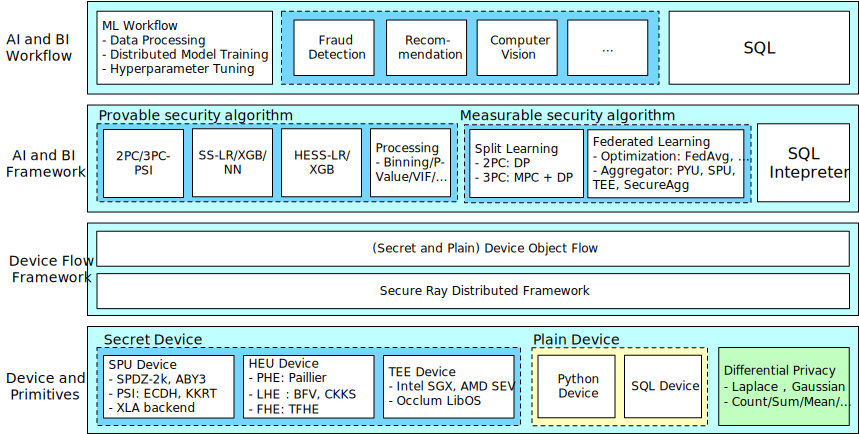

    

---

<a href="./README.zh-CN.md">简体中文</a>｜<a href="./README.md">English</a>

SecretFlow is a unified framework for privacy-preserving data intelligence and machine learning. To achieve this goal,
it provides:

- An abstract device layer consists of plain devices and secret devices which encapsulate various cryptographic protocols.
- A device flow layer modeling higher algorithms as device object flow and DAG.
- An algorithm layer to do data analysis and machine learning with horizontal or vertical partitioned data.
- A workflow layer that seamlessly integrates data processing, model training, and hyperparameter tuning.

    

## Documentation

- [SecretFlow](https://www.secretflow.org.cn/docs/secretflow)
  - [Getting Started](https://www.secretflow.org.cn/docs/secretflow/getting_started)
  - [User Guide](https://www.secretflow.org.cn/docs/secretflow/user_guide)
  - [API Reference](https://www.secretflow.org.cn/docs/secretflow/api)
  - [Tutorial](https://www.secretflow.org.cn/docs/secretflow/tutorial)

## SecretFlow Related Projects

- [Kuscia](https://github.com/secretflow/kuscia): A lightweight privacy-preserving computing task orchestration framework based on K3s.
- [SCQL](https://github.com/secretflow/scql): A system that allows multiple distrusting parties to run joint analysis without revealing their private data.
- [SPU](https://github.com/secretflow/spu): A provable, measurable secure computation device, which provides computation ability while keeping your private data protected.
- [HEU](https://github.com/secretflow/heu): A high-performance homomorphic encryption algorithm library.
- [YACL](https://github.com/secretflow/yacl): A C++ library that contains cryptography, network and io modules which other SecretFlow code depends on.

## Install

Please check [INSTALLATION.md](./docs/getting_started/installation.md)

## Deployment

Please check [DEPLOYMENT.md](./docs/getting_started/deployment.md)

## Learn PETs

We also provide a curated list of papers and SecretFlow's tutorials on Privacy-Enhancing Technologies (PETs).

Please check [AWESOME-PETS.md](./docs/awesome-pets/awesome-pets.md)

## Contributing

- Contributor Rewards: Thank you for contributing to SecretFlow! All contributors will receive: A SecretFlow Open Source Contributor Certificate & An exclusive SecretFlow T-shirt 📌 [Apply Now](https://studio.secretflow.com/activity/fhelc1w2nmx0g0n/detail)

### Good First Issues
We have a list of [good first issues](https://github.com/orgs/secretflow/projects/12/). This is a great place for newcomers and beginners alike to get started, gain experience, and get familiar with our contribution process.

### Contribution Map
We also welcome community collaboration on [more advanced initiatives](https://github.com/orgs/secretflow/projects/11/)! Whether you're refining features, optimizing workflows, or proposing new ideas – there are opportunities for contributors of all skill levels to shape SecretFlow's future.

## Benchmarks

Please check [OVERALL_BENCHMARK.md](./docs/developer/benchmark/overall_benchmark.md)

## Disclaimer

Non-release versions of SecretFlow are prohibited from using in any production environment due to possible bugs, glitches, lack of functionality, security issues or other problems.
