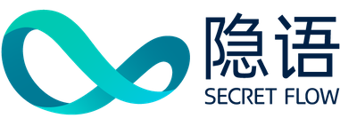

<div align="center">
    
</div>

---

SecretFlow is a unified framework for privacy preserving data intelligence and machine learning. To achieve this goal,
it provides:

- An abstract device layer with plain devices and secret devices which encapsulate various cryptographic protocols.
- A device flow layer which modeling higher algorithms as device object flow and DAG.
- An algorithm layer to do data analysis and machine learning in horizontal or vertical data partition.
- A workflow layer that seamlessly integrates data processing, model training, hyperparameter tuning.

<div align="center">
    
</div>

## Install

For users who want to try SecretFlow, you can install the current release
from pypi. Note that it requires python version >
=3.8, you can create a virtual environment with conda if not satisfied.

```sh
pip install -U secretflow
```

Try you first SecretFlow program

```python
>>> import secretflow as sf
>>> sf.init(['alice', 'bob', 'carol'], num_cpus=8, log_to_driver=True)
>>> dev = sf.PYU('alice')
>>> import numpy as np
>>> data = dev(np.random.rand)(3, 4)
>>> data
<secretflow.device.device.pyu.PYUObject object at 0x7fdec24a15b0>
>>> sf.reveal(data)
array([[0.98313141, 0.49663851, 0.47700297, 0.79132457],
       [0.16881197, 0.83516845, 0.09842819, 0.4015694 ],
       [0.33930415, 0.07568802, 0.88075431, 0.45873773]])
```

## Contribution guide

For developers who want to contribute to SecretFlow, you can set up environment with the following instruction.

```sh
git clone https://github.com/secretflow/secretflow.git
conda create -n secretflow python=3.8
conda activate secretflow
pip install -r dev-requirements.txt -r requirements.txt
```
