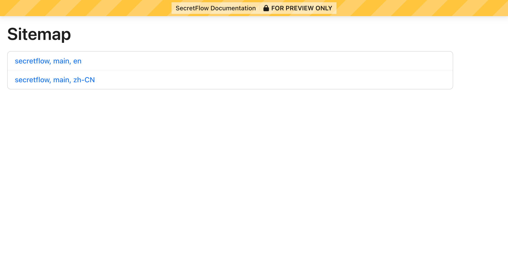
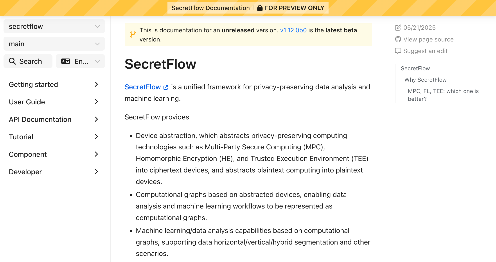
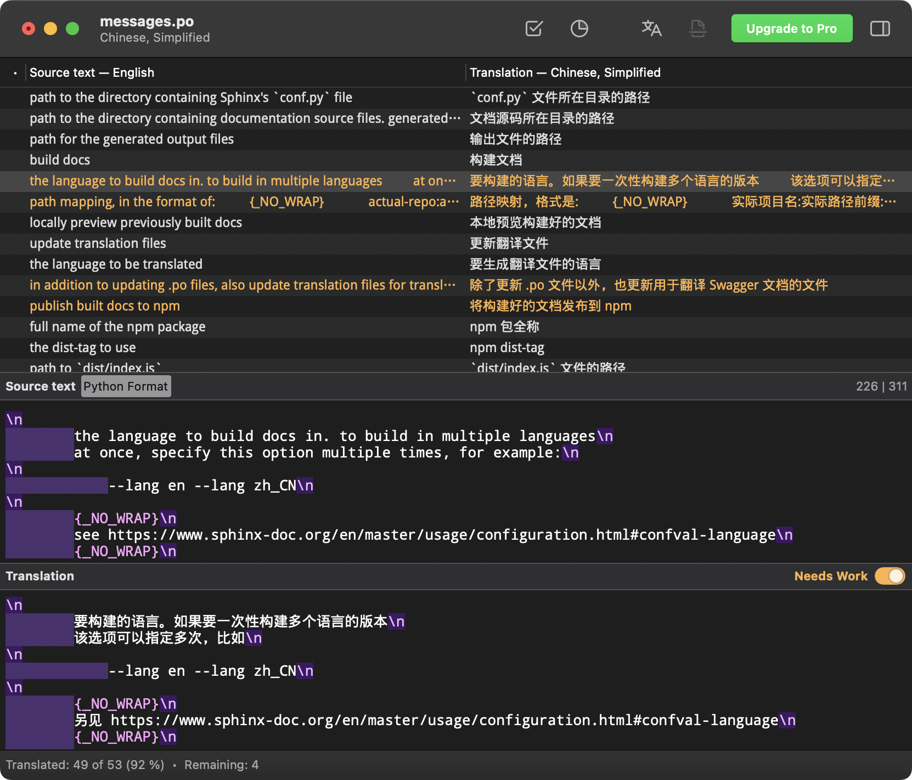

# Contributing docs | 文档贡献指南 <!-- omit from toc -->

- [tl;dr](#tldr)
- [Prerequisites](#prerequisites)
- [Setting up](#setting-up)
- [Building docs](#building-docs)
- [Previewing docs](#previewing-docs)
- [Translations](#translations)
  - [Updating translation files](#updating-translation-files)
  - [Translating](#translating)
  - [Previewing translated docs](#previewing-translated-docs)
- [API docs](#api-docs)
- [Auto-generated docs](#auto-generated-docs)
- [Cleaning up](#cleaning-up)
- [Reporting issues](#reporting-issues)
- [前置条件](#前置条件)
- [环境准备](#环境准备)
- [构建文档](#构建文档)
- [预览文档](#预览文档)
- [更新翻译](#更新翻译)
  - [同步翻译文件](#同步翻译文件)
  - [进行翻译](#进行翻译)
  - [预览翻译](#预览翻译)
- [API 文档](#api-文档)
- [自动生成的文档](#自动生成的文档)
- [文件清理](#文件清理)
- [报告问题](#报告问题)

> [!TIP]
>
> Command line examples in this guide assume your working directory to be [docs/](./).

## tl;dr

```sh
python -m pip install -r requirements.txt
secretflow-doctools update-translations --lang zh_CN
secretflow-doctools build --lang en --lang zh_CN
secretflow-doctools preview
```

## Prerequisites

This project uses [Sphinx] to build documentation. You will need:

- [Python] >= 3.10

## Setting up

Run:

```sh
python -m pip install -r requirements.txt
```

This will:

- Install the [required dependencies for building docs](./requirements.txt)

> [!TIP]
>
> Refer to [../CONTRIBUTING.md](../CONTRIBUTING.md) and
> [getting_started/installation.md](getting_started/installation.md) for information on
> setting up your Python environment.
>
> You may also use other package managers such as [uv] or [mamba].

## Building docs

[`secretflow-doctools`] is a command-line utility for building docs for SecretFlow
projects.

To build docs, run:

```sh
secretflow-doctools build --lang en --lang zh_CN
```

This will build both the English (`en`) and the Simplified Chinese (`zh_CN`) versions of
the documentation.

You should be able to see the following output:

```log
SUCCESS  to preview, run: secretflow-doctools preview -c .
```

> [!TIP]
>
> If you are getting a "command not found" error, you might not have activated the
> correct environment by running `source .venv/bin/activate`. Please review
> [Setting up](#setting-up).

## Previewing docs

The utility features a documentation previewer. You will be able to visualize how your
changes will eventually appear on our [website].

To preview the docs that was built, run:

```sh
secretflow-doctools preview
```

This will start the server. You should be able to see the following output:

```
 * Running on http://127.0.0.1:5000
```

Navigate to <http://127.0.0.1:5000> on your browser (the port number may be different),
you should be able to see a page similar to the following:

<figure>
  
</figure>

Click on a version to see the preview. You should be able to see a page similar to the
following:

<figure>
  
</figure>

> [!TIP]
>
> You may leave the preview server running. When you run the build command again,
> refresh the page to see updated content.

## Translations

### Updating translation files

After updating source docs, you should also update the corresponding translation files.

> [!IMPORTANT]
>
> If your updates involve rewriting existing texts, you MUST update translation files,
> otherwise some translated paragraphs may fall back to showing the original text.

Run:

```sh
secretflow-doctools update-translations --lang zh_CN
# `--lang zh_CN` sets the target language to Chinese (i.e. you are translating into Chinese)
```

This will:

- Scan source text for changes
- Update the translation files under [locales/](locales/) such that they become in-sync
  again

If there are updates, you should be able to see output similar to the following, and see
changes in source control:

```
Update: locales/zh_CN/LC_MESSAGES/index.po +1, -0
...
SUCCESS  finished updating translation files
```

### Translating

This project uses [GNU gettext][gettext] to translate docs during build. Translation
files are under [locales/](locales/).

Paths to the [translation files (PO files)][gettext-po] mirror their source document
counterparts. For example:

|              |                                                                                                                            |
| :----------- | :------------------------------------------------------------------------------------------------------------------------- |
| Source texts | [**getting_started/installation**.md](getting_started/installation.md)                                                     |
| Translations | [locales/zh_CN/LC_MESSAGES/**getting_started/installation**.po](locales/zh_CN/LC_MESSAGES/getting_started/installation.po) |

PO files have the following syntax:

```gettext
msgid "Hello, world!"
msgstr "你好，世界！"
```

`msgid` comes from source docs, which will be used to lookup translations during build,
and you should not modify them.

`msgstr` is the translation. Please update these.

> [!TIP]
>
> [Poedit] is a free and open-source graphical editor for gettext PO files and is highly
> recommended.
>
> <figure>
>   
> </figure>

> [!IMPORTANT]

- `msgstr` may contain inline markups, such as bolded text or links. Translations should
  retain such markups. You should ensure the markup syntax is consistent with the source
  document:

  ```diff
    msgid "This is a `link <https://example.org/>`_."
  - msgstr "这是一个 [链接](https://example.org/) 。"
  + msgstr "这是一个 `链接 <https://example.org/>`_ 。"
  ```

- You may notice a `fuzzy` label after
  [updating translation files](#updating-translation-files):

  ```diff
    #: ../../topics/ccl/usage.rst:9
  + #, fuzzy
  - msgid "What is SCQL CCL? Please read :doc:`/topics/ccl/intro`."
  + msgid "What is SCQL CCL? Please read :doc:`/topics/ccl/intro` first."
    msgstr "什么是 SCQL CCL？请参阅 :doc:`/topics/ccl/intro`。"
  ```

  `fuzzy` indicates that a source paragraph is updated but only slightly. You should
  revise `fuzzy` translations, and then remove the `fuzzy` label.

  `fuzzy` entries will still appear in the output even if they not updated in time,
  albeit the displayed content is then slightly different from source text.

- You may notice `.mo` files under [locales/](locales/). These are binary files
  autogenerated during builds and are not editable. The files to edit are `.po` files.

### Previewing translated docs

After updating translations, [build docs](#building-docs) again to preview them.

## API docs

API docs are auto-generated from Python modules using [`sphinx-apidoc`]. Generated files
are under [source/](source/). To do so, run:

```sh
make apidoc
# see Makefile for actual command
```

> [!IMPORTANT]
>
> For API docs to display correctly, **the corresponding Python modules must be
> importable at build time.** That is, `from secretflow import ...` must not throw.
> Essentially, this means that dependencies must be installed and C/C++ modules must be
> compiled, if applicable.
>
> Note that the generated files are gitignored. In CI, **make sure to generate API docs
> prior to [building](#building-docs).**
>
> During local development, generating API docs is optional.

## Auto-generated docs

In addition to API docs, the following contents are also auto-generated:

- Component docs: generated using [update_comp_list.py](component/update_comp_list.py).

To generate these docs, run:

```sh
make autogenerated
# see Makefile for actual command
```

> [!IMPORTANT]
>
> Note that the generated files are NOT gitignored. **You should run this step whenever
> there are updates to code, and commit the changes.**

## Cleaning up

The above tasks generate temporary files under [\_build](./_build/). To clean up these
files, run:

```sh
secretflow-doctools clean
```

## Reporting issues

If commands or previews aren't working as expecting, please file an issue at
<https://github.com/secretflow/doctools/issues>.

For project-specific questions, please file an issue in this repository instead.

> [!NOTE]
>
> To help with troubleshooting, set the `LOGURU_LEVEL=DEBUG` environment variable to see
> debug logs.
>
> `secretflow-doctools` invokes other programs. When `LOGURU_LEVEL=DEBUG` is set,
> logging will contain the full commands being run:
>
> | Command                                   | Delegates to     |
> | :---------------------------------------- | :--------------- |
> | `secretflow-doctools build`               | [`sphinx-build`] |
> | `secretflow-doctools update-translations` | [`sphinx-intl`]  |

---

> [!TIP]
>
> 下文的示例命令建议在[本目录 (docs)](./) 下执行。

## 前置条件

本项目使用 [Sphinx] 作为文档框架。你需要：

- [Python] >= 3.10

## 环境准备

执行：

```sh
python -m pip install -r requirements.txt
```

这将会：

- 安装[文档构建所需要的依赖](./requirements.txt)

> [!TIP]
>
> 关于 Python 环境初始化的相关信息，请参考 [../CONTRIBUTING.md](../CONTRIBUTING.md) 以及
> [getting_started/installation.md](getting_started/installation.md)。
>
> 你也可以使用 [uv], [mamba] 等其他的依赖管理工具。

## 构建文档

[`secretflow-doctools`] 是针对隐语项目文档构建的辅助工具，它协助开发者在本地构建并
且[预览](#预览文档)文档。

执行：

```sh
secretflow-doctools build --lang en --lang zh_CN
```

这将会构建英文版 `en` 以及中文版 `zh_CN` 文档。

如果一切正常，你应当能看到以下输出：

```log
SUCCESS  to preview, run: secretflow-doctools preview -c .
```

> [!TIP]
>
> 如果提示 `secretflow-doctools` 命令未找到，你可能没有执行 `source .venv/bin/activate`
> 以激活正确的 Python 环境；请参考[环境准备](#环境准备)中的指引。

如果想要只构建某个语言的文档，可以调整 `--lang` 选项。

## 预览文档

工具提供了本地预览的能力，帮助开发者验证文档在**发布到[隐语官网][website]后的显示效
果**。

执行：

```sh
secretflow-doctools preview
```

这将会在本地启动一个预览服务器。你应当能看到以下输出：

```
 * Running on http://127.0.0.1:5000
```

用浏览器访问 <http://127.0.0.1:5000> （或其它端口号），你应当能看到类似下图的页面，其中
将会列出在本地构建好的文档版本：

<figure>
  
</figure>

点击一个版本即可打开对应预览，你应当能看到类似下图的页面：

<figure>
  
</figure>

> [!TIP]
>
> 你可以保持预览服务器一直开启：在重新构建文档后，刷新页面即可看到更新的内容。

## 更新翻译

### 同步翻译文件

当你更新了文档原文（无论是新增、修改还是删除），你需要同时更新对应的翻译文件。

> [!IMPORTANT]
>
> 如果你的变更是对现有文本进行修改，请务必同步翻译文件，否则现有翻译可能会失效，发布后可
> 能会出现中英文夹杂的情况。

执行：

```sh
secretflow-doctools update-translations --lang zh_CN
# 其中 --lang zh_CN 代表目标语言是中文（翻译成中文）
```

这将会：

- 扫描文档原文的文本内容
- 更新 [locales/](locales/) 目录下的翻译文件，使得它们和原文维持同步

如果有更新，你应当能看到类似下文的输出，并且在版本控制中看到文件修改：

```
Update: locales/zh_CN/LC_MESSAGES/index.po +1, -0
...
SUCCESS  finished updating translation files
```

### 进行翻译

本项目使用 [GNU gettext][gettext] 来配置文档内容的多语言版本。翻译用文件全部位于
[locales/](locales/) 目录下。

[翻译文件（PO 文件）][gettext-po]的路径与文档原文是**一对一**的关系，示例：

|      |                                                                                                                            |
| :--- | :------------------------------------------------------------------------------------------------------------------------- |
| 原文 | [**getting_started/installation**.md](getting_started/installation.md)                                                     |
| 翻译 | [locales/zh_CN/LC_MESSAGES/**getting_started/installation**.po](locales/zh_CN/LC_MESSAGES/getting_started/installation.po) |

翻译文件的格式如下：

```gettext
msgid "Hello, world!"
msgstr "你好，世界！"
```

`msgid` 来自文档原文，**将会用于在构建时通过原文索引到翻译，因此请勿修改。**

`msgstr` 是翻译后的文本，请修改这一字段。

> [!TIP]
>
> [Poedit] 是一个用于编辑 PO 文件的自由开源软件。可以尝试使用它来进行翻译。
>
> <figure>
>   
> </figure>

> [!IMPORTANT]
>
> 以下是翻译的一些注意事项：

- `msgstr` 中可能会包含样式标记（比如字体加粗、链接等），在翻译文本中，标记应当与原文一
  致：

  ```diff
    msgid "This is a `link <https://example.org/>`_."
  - msgstr "这是一个 [链接](https://example.org/) 。"
  + msgstr "这是一个 `链接 <https://example.org/>`_ 。"
  ```

- 在[同步翻译文件](#同步翻译文件)后，你可能会留意到一些翻译条目被加上了 `fuzzy` 的标记，
  比如：

  ```diff
    #: ../../topics/ccl/usage.rst:9
  + #, fuzzy
  - msgid "What is SCQL CCL? Please read :doc:`/topics/ccl/intro`."
  + msgid "What is SCQL CCL? Please read :doc:`/topics/ccl/intro` first."
    msgstr "什么是 SCQL CCL？请参阅 :doc:`/topics/ccl/intro`。"
  ```

  `fuzzy` 意味着 `gettext` 判断原文有轻微变化，需要人工校对。你应当更新翻译，然后将
  `fuzzy` 标记去掉。

  `fuzzy` 条目的意义在于构建后不会失效，也就是说，即使没有及时更新翻译，旧翻译也能继续显
  示（不过会稍微与原文不一致）。

- 你可能会在 [locales/](locales/) 目录下找到后缀为 `.mo` 的文件，这些文件时构建时产生的
  二进制文件，它们无法被修改也无需关注，你应当修改后缀为 `.po` 的文件。

### 预览翻译

在更新了翻译文件之后，重新[执行文档构建](#构建文档)然后[预览文档](#预览文档)，即可看到翻
译后的显示效果。

## API 文档

API 文档使用 [`sphinx-apidoc`] 根据 Python 模块自动生成。生成的文件位于
[source/](source/) 目录下。要生成 API 文档，执行：

```sh
make apidoc
# 详细命令见 Makefile
```

> [!IMPORTANT]
>
> API 文档要正确渲染，**对应的 Python 模块必须在文档构建时可以正确引用。** 也就是说
> ，`from secretflow import ...` 不能抛出异常，意味着依赖有被安装，以及 C/C++ 模块有被构
> 建。
>
> 生成的文件会被 gitignore。在 CI 中构建文档时，**请在[构建步骤](#构建文档)前先执行这一
> 步骤。**
>
> 本地开发时，本步骤非必需。

## 自动生成的文档

除了 API 文档以外，以下内容通过自定义脚本生成：

- 组件文档；使用 [update_comp_list.py](component/update_comp_list.py) 自动生成。

要更新组件文档，执行：

```sh
make autogenerated
# 详细命令见 Makefile
```

> [!IMPORTANT]
>
> 生成的文件**不会**被 gitignore。当相关代码有更新时，请执行这一步骤，并且提交产生的变更
> 。

## 文件清理

以上流程会产生额外的临时文件，这些文件全部位于 [\_build](./_build/) 目录下。如果需要清理
，可以执行：

```sh
secretflow-doctools clean
```

## 报告问题

如果在以上过程中遇到报错、预览无法显示等问题，可以提交问题到
<https://github.com/secretflow/doctools/issues>。

文档内容及本项目代码的相关问题请提交到本项目的 Issues 中。

> [!NOTE]
>
> 为协助排查问题，你可以设置 `LOGURU_LEVEL=DEBUG` 环境变量来让文档工具输出更多日志。
>
> `secretflow-doctools` 会调用其他工具，在 `LOGURU_LEVEL=DEBUG` 时，日志会在每个步骤打印
> 完整的命令行指令：
>
> |                                           |                  |
> | :---------------------------------------- | :--------------- |
> | `secretflow-doctools build`               | [`sphinx-build`] |
> | `secretflow-doctools update-translations` | [`sphinx-intl`]  |

[`secretflow-doctools`]: https://github.com/secretflow/doctools
[`sphinx-apidoc`]: https://www.sphinx-doc.org/en/master/man/sphinx-apidoc.html
[`sphinx-build`]: https://www.sphinx-doc.org/en/master/man/sphinx-build.html
[`sphinx-intl`]: https://www.sphinx-doc.org/en/master/usage/advanced/intl.html
[gettext-po]: https://www.gnu.org/software/gettext/manual/html_node/PO-Files.html
[gettext]: https://www.gnu.org/software/gettext/
[mamba]: https://mamba.readthedocs.io/en/latest/
[Poedit]: https://poedit.net/
[Python]: https://www.python.org/
[Sphinx]: https://www.sphinx-doc.org/en/master/tutorial/index.html
[uv]: https://docs.astral.sh/uv/
[venv]: https://docs.python.org/3/library/venv.html
[website]: https://www.secretflow.org.cn/
