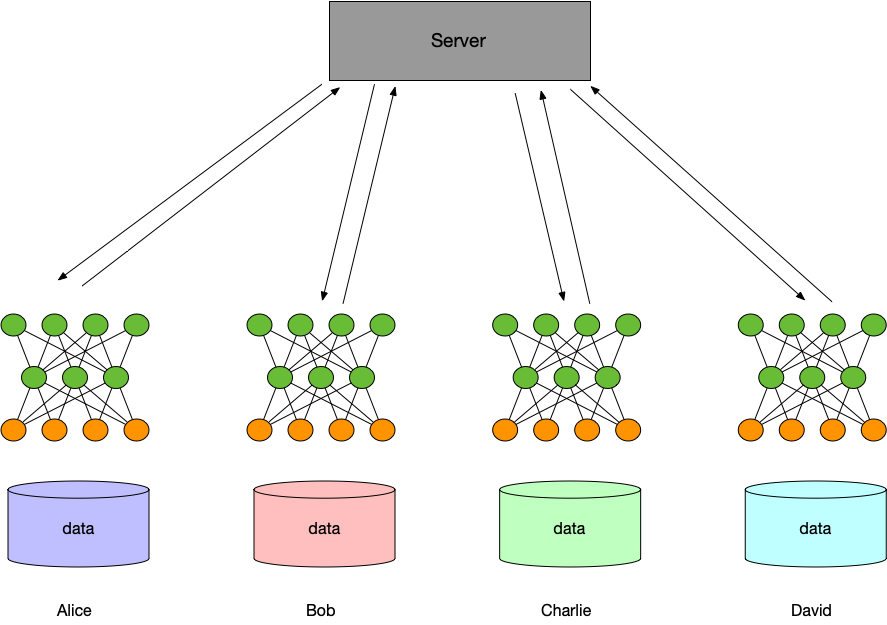

Horizontal Federated Learning
==============================

What is Horizontal Federated Learning
-------------------------------------

The federated learning here refers specifically to the federated learning of horizontal scenarios. 
This mode applies to the situation where each participant has the same business but different customer groups are reached. 
In this case, samples from various parties can be combined to train a joint model with better performance. 
For example, in the medical scene, each hospital has its own unique patient group, 
and hospitals in different regions almost do not overlap each other, 
but their examination records for medical records (such as images, blood tests, etc.) are of the same type.

One training step of federated learning:

1. Each participant downloads the latest model from the server.
2. Each participant uses its own local data to train the model, and uploads encrypted updates to the server.
3. The server aggregates the encrypted updates uploaded by all parties, and updates model parameters with the aggregated updates.
4. The server returns the updated model to each participant.
5. Each participant updates their local model, and prepare the next training step.

.. toctree::
   :maxdepth: 1

   fl_model
   tree.md
