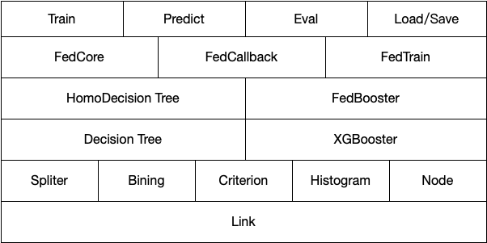

# Horizontally Federated XGBoost
Horizontally Federated XGBoost currently supports the construction of horizontal scene tree boosting models

In the horizontal federated learning scenario, the data is partitioned horizontally according to the sample, that is, the data schema of each participant is consistent and has the same columns and types.

## Introduction to XGBoost
Official doc: [XGBoost tutorials](https://xgboost.readthedocs.io/en/latest/tutorials/index.html)  
In the horizontal federated learning scenario, each party has data in the same feature space, but the sample space is different from each other, which can be understood as a sampling of the overall data (maybe non-iid), the horizontal tree model, which needs to be in this setting, Build a joint tree model to complete the modeling.
|role|detail|
|---|---|
|client|The client has its own data sample, and also has the label corresponding to the data sample. Each client has the same feature space. Multiple clients jointly train the joint model without revealing the local sample data of any party. The clients share the same trained joint model|
|server|It is used to aggregate the histograms (sum_of gradiant & sum_of hessian) reported by each client. The server obtains each histogram and builds a global histogram, calculates the best split according to the global histogram, and broadcasts it to each client to complete an iteration. Since gradient and hessian may leak some information of the original data, the server side can only complete the histogram aggregation through secure aggregation. The server side can only get the globally calculated histogram, and cannot get any local histogram.|

### Local XGBoost Training Process


### HomoBoost Training Process

### HomoBoost Module Dependency

### HomoBoost Whole Training Process

## Algorithm Process 
Data input: HdataFrame, XGBoost supports converting Pandas.DataFrame directly into DMatrix
1. Use federate binning globally to calculate equal-frequency buckets as the basis for subsequent splits.
2. Construct mock data of the same sample space on the server side to synchronize the training process of server and client
3. Process callback_before_iteration
4. Input the data into each Client XGBoost engine to calculate g & h  
   Initiate the homo_boost task; build FedBooster (iterate n iterations for tree model iterations)  
    1. Handle callback_before_iteration  
    1. Calculate grad and hess through the XGBoost engine; build a tree model through federated and add it to the Fedboost model. The point of interaction between the XGBoost engine and our federated tree building module - a standard XGBoost model.  
    1. Handle callback_after_iteration (such as early stop, evaluation, etc.）  
5. Input the current g and h into the federate decision tree module, initiate the homo_boost task; build FedBooster (iterate n iterations to do tree model iterations)  
    1. Perform data reassign and assign it to the node to be split  
    1. Calculate sum_of_grad and sum_of_hess according to the previously calculated binning buckets  
    1. Send to the server side, the server side performs secure aggregation, selects the split information,and sends it back to the client side.  
    1. Update the split, then return 1  
6. After the current tree split is completed, return to the tree structure, each client and server will have a complete current tree structure, convert the tree structure to the XGBoost standard RegTree format, and add it to the XGBoost standard model file.
7. Process callback_after_iteration (such as early stop, evaluation, etc.)
8. `xgboost.load_model` (the standard model file just generated), enter the next iteration


## Sample Code
```python
from secretflow.data.horizontal import read_csv
from secretflow.security.aggregation import SecureAggregator
from secretflow.security.compare import SPUComparator
from secretflow.utils.simulation.datasets import load_dermatology
from secretflow.ml.boost.homo_boost import SFXgboost
import secretflow as sf

# In case you have a running secretflow runtime already.
sf.shutdown()

sf.init(['alice', 'bob', 'charlie'], address='local')
alice, bob, charlie = sf.PYU('alice'), sf.PYU('bob'), sf.PYU('charlie')

aggr = SecureAggregator(charlie, [alice, bob])
spu = sf.SPU(sf.utils.testing.cluster_def(['alice', 'bob']))
comp = SPUComparator(spu)
data = load_dermatology(parts=[alice, bob], aggregator=aggr,
                        comparator=comp)
data.fillna(value=0, inplace=True)
params = {
         # XGBoost parameter tutorial
         # https://xgboost.readthedocs.io/en/latest/parameter.html
         'max_depth': 4, # max depth
         'eta': 0.3, # learning rate
         'objective': 'multi:softmax', # objection function，support "binary:logistic","reg:logistic","multi:softmax","multi:softprob","reg:squarederror"
         'min_child_weight': 1, # The minimum value of weight
         'lambda': 0.1, # L2 regularization term on weights (xgb's lambda)
         'alpha': 0, # L1 regularization term on weights (xgb's alpha)
         'max_bin': 10, # Max num of binning
         'num_class':6, # Only required in multi-class classification
         'gamma': 0, # Same to min_impurity_split,The minimux gain for a split
         'subsample': 1.0, # Subsample rate by rows
         'colsample_bytree': 1.0, # Feature selection rate by tree
         'colsample_bylevel': 1.0, # Feature selection rate by level
         'eval_metric': 'merror',  # supported eval metric：
                                    # 1. rmse
                                    # 2. rmsle
                                    # 3. mape
                                    # 4. logloss
                                    # 5. error
                                    # 6. error@t
                                    # 7. merror
                                    # 8. mlogloss
                                    # 9. auc
                                    # 10. aucpr
         # Special params in SFXgboost
         # Required
         'hess_key': 'hess', # Required, Mark hess columns, optionally choosing a column name that is not in the data set
         'grad_key': 'grad', # Required，Mark grad columns, optionally choosing a column name that is not in the data set
         'label_key': 'class', # Required，ark label columns, optionally choosing a column name that is not in the data set
}

bst = SFXgboost(server=charlie, clients=[alice, bob])
bst.train(data, data, params=params, num_boost_round = 6)

```

## Tutorial

Please check this simple [tutorial](../../../tutorial/Federated_Xgboost.ipynb).
