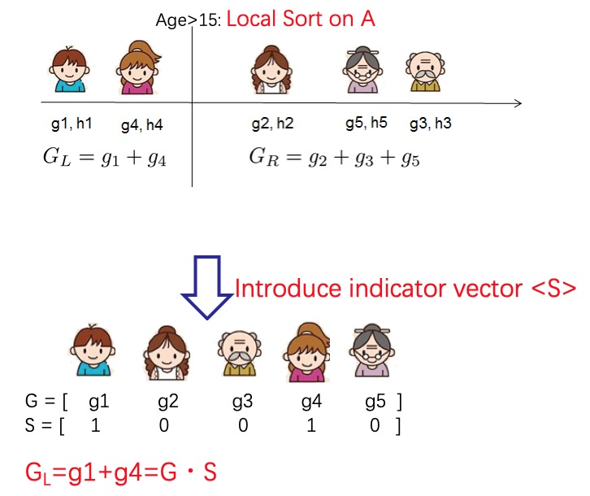

Decision Trees
==============

With the help of Secret Sharing, a secure multi-party computation technique,
SecretFlow implements provably secure gradient boosting model
:py:meth:`~secretflow.ml.boost.ss_xgb_v.model.Xgb`
to support both regression and binary classification machine learning tasks.

Dataset Settings
----------------
vertically partitioned dataset:

- samples are aligned among the participants
- different participant obtains different features
- one participant owns the label

.. image:: resources/v_dataset.png

XGBoost Training Algorithm
--------------------------
Algorithm details can be found in `the official documents <https://xgboost.readthedocs.io/en/stable/tutorials/model.html>`_.
The main process of building a single tree is as follows:

- Statistics calculating: calculate the first-order gradient :math:`g_{i}` and second-order gradient :math:`h_{i}`
  for each sample with current prediction and label, according to the definition of loss function.

- Node splitting: enumerates all possible split candidates and choose the best one with the maximal gain.
  A split candidate is consisted of a split feature and a split value, which divides the samples in current node
  :math:`I` into two child nodes :math:`I_{L}` and :math:`I_{R}`, according to their feature values. Then, a split
  gain is computed with the following formula:

  .. image:: resources/gain_formula.png
      :height: 120px
      :width: 992px
      :scale: 50 %

  where :math:`\lambda` and :math:`\gamma` are the regularizers for the leaf number and leaf weights respectively.
  In this way, we can split the nodes recursively until the leaf.

- Weight calculating: calculate the weights of leaf nodes with the following formula:

  .. image:: resources/weight_formula.png
      :height: 138px
      :width: 382px
      :scale: 45 %

Regression and classification share the same training process except:

1. they employs different loss functions, i.e. MSE for regression and Logloss for classification.
2. classification executes an extra sigmoid function to transform the prediction into a probability.

SS-XGB Training
---------------
SS-XGB :py:meth:`~secretflow.ml.boost.ss_xgb_v.model.Xgb` use secret sharing to compute the split gain and leaf weights.

In order to implement a secure joint training, we replace all the computations with secret sharing protocols,
e.g. Addition, Multiplication, etc. In addition, we have to take special care to accumulate the gradients
without leaking out the feature partial order of samples.

This problem can be solved by introducing an indicator vector 𝑆.

The samples to be accumulated is marked as 1 in 𝑆 and 0 otherwise. To preserve privacy, the indicator vector also
transformed to secret shares. In this way, the sum of the gradients of the samples can be computed as the inner
product of the indicator vector and the gradient vector, which can be securely computed by secret sharing protocols.

Similarly, the indicator trick can be used to hide the instance distribution on nodes. Refer to our paper
`Large-Scale Secure XGB for Vertical Federated Learning <https://arxiv.org/pdf/2005.08479.pdf>`_
for more details about SS-XGB algorithm and security analysis.

Example
--------

A local cluster(Standalone Mode) needs to be initialized as the running environment for this example.
See `Deployment <../../getting_started/deployment.html>`_ and refer to the 'Cluster Mode'.

For more details about the APIs, see :py:meth:`~secretflow.ml.boost.ss_xgb_v.model.Xgb`

.. code-block:: python

    import sys
    import time
    import logging

    import spu
    import numpy
    import secretflow as sf
    from secretflow.ml.boost.ss_xgb_v import Xgb
    from secretflow.device.driver import wait, reveal
    from secretflow.data import FedNdarray, PartitionWay

    from sklearn.metrics import roc_auc_score

    # init log
    logging.basicConfig(stream=sys.stdout, level=logging.INFO)

    # init all nodes in local Standalone Mode.
    sf.init(['alice', 'bob', 'carol'], address='local')

    # init PYU, the Python Processing Unit, process plaintext in each node.
    alice = sf.PYU('alice')
    bob = sf.PYU('bob')
    carol = sf.PYU('carol')

    # init SPU, the Secure Processing Unit,
    #           process ciphertext under the protection of a multi-party secure computing protocol
    spu = sf.SPU(sf.utils.testing.cluster_def(['alice', 'bob', 'carol']))

    # read data in each party
    def read_x(start, end, is_training=True, train_split_factor=0.8)->numpy.ndarray:
        from sklearn.datasets import load_breast_cancer
        x = load_breast_cancer()['data']
        length = x.shape[0]
        if is_training:
            train_data = x[:int(length * train_split_factor), start:end]
            logging.info(f"load train data, the number of samples: {train_data.shape[0]}")
            return train_data
        else:
            test_data = x[int(length * train_split_factor):, start:end]
            logging.info(f"load test data, the number of samples: {test_data.shape[0]}")
            return test_data

    def read_y(is_training=True, train_split_factor=0.8)->numpy.ndarray:
        from sklearn.datasets import load_breast_cancer
        y = load_breast_cancer()['target']
        length = y.shape[0]
        if is_training:
            train_label = y[:int(length * train_split_factor)]
            logging.info(f"load train label, the number of samples: {train_label.shape[0]}")
            return train_label
        else:
            test_label = y[int(length * train_split_factor):]
            logging.info(f"load test label, the number of samples: {test_label.shape[0]}")
            return test_label

    #split train set and test set, you can set the value of train_split_factor as you like.
    train_split_factor = 0.8
    # alice / bob / carol each hold one third of the features of the train data
    v_train_data = FedNdarray(
        partitions={
            alice: alice(read_x)(0, 10, is_training=True, train_split_factor=train_split_factor),
            bob: bob(read_x)(10, 20, is_training=True, train_split_factor=train_split_factor),
            carol: carol(read_x)(20, 30, is_training=True, train_split_factor=train_split_factor),
        },
        partition_way=PartitionWay.VERTICAL,
    )
    # Y label belongs to alice
    v_train_label = FedNdarray(
        partitions={alice: alice(read_y)(is_training=True, train_split_factor=train_split_factor)},
        partition_way=PartitionWay.VERTICAL,
    )
    # wait IO finished
    wait([p.data for p in v_train_data.partitions.values()])
    wait([p.data for p in v_train_label.partitions.values()])

    # run SS-XGB
    xgb = Xgb(spu)
    start = time.time()
    params = {
        # for more detail, see Xgb API doc
        'num_boost_round': 5,
        'max_depth': 5,
        'learning_rate': 0.1,
        'sketch_eps': 0.08,
        'objective': 'logistic',
        'reg_lambda': 0.1,
        'subsample': 1,
        'colsample_bytree': 1,
        'base_score': 0.5,
    }
    model = xgb.train(params, v_train_data, v_train_label)
    logging.info(f"train time: {time.time() - start}")

    # Do predict
    start = time.time()
    # alice / bob / carol each hold one third of the features of the test data
    v_test_data = FedNdarray(
        partitions={
            alice: alice(read_x)(0, 10, is_training=False, train_split_factor=train_split_factor),
            bob: bob(read_x)(10, 20, is_training=False, train_split_factor=train_split_factor),
            carol: carol(read_x)(20, 30, is_training=False, train_split_factor=train_split_factor),
        },
        partition_way=PartitionWay.VERTICAL,
    )
    wait([p.data for p in v_test_data.partitions.values()])
    # Now the result is saved in the spu by ciphertext
    spu_yhat = model.predict(v_test_data)
    # reveal for auc test.
    yhat = reveal(spu_yhat)
    logging.info(f"predict time: {time.time() - start}")
    y = read_y(is_training=False, train_split_factor=train_split_factor)
    logging.info(f"auc: {roc_auc_score(y, yhat)}")