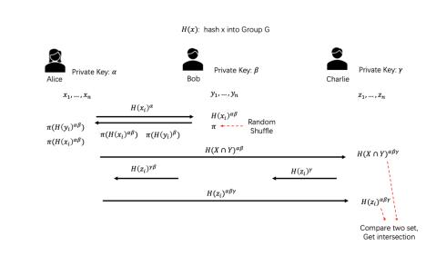
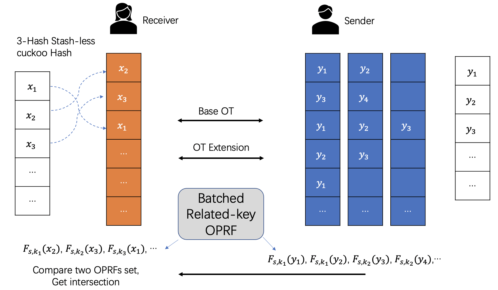
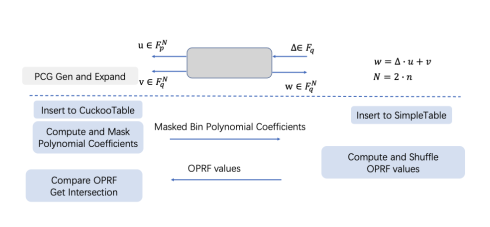

Private Set Intersection(PSI)
=============================

SecretFlow SPU implements the following PSI protocols,

- Semi-honest ECDH-based two-party PSI protocol [HFH99]_
- Semi-honest ECDH-based three-party PSI protocol
- Semi-honest OT-based two-party PSI protocol [KKRT16]_
- Semi-honest OT-based two-party PSI protocol (with improved communication efficiency) [BC22]_

As a general rule, OT-based PSI protocols are (significantly) faster but require more communication 
than Diffie-Hellman-based PSI protocols. 
In some scenarios, communication cost is overwhelmingly more important than computation cost.

ECDH-PSI (2P)
-------------

The semi-honest DH-PSI protocol is due to Huberman, Franklin, and Hogg [HFH99]_, 
but with roots as far back as Meadows [Mea86]_. It is a semi-honest protocol that
requires exponentiations in a Diffie-Hellman group proportional to the number of items in the sets.

DH-PSI protocol based on the Decisional Diffie-Hellman assumption:

- Agree on a group G, with a generator g.
- The assumption: for random a,b,c cannot distinguish :math:`(g^a, g^b, g^{ab})` from :math:`(g^a, g^b, g^c)`

Several candidate groups are widely used, such as subgroups of the multiplication group of a finite
field and elliptic curve groups. In practice, carefully chosen elliptic curves like
Curve25519 [Ber06]_ offer a good balance between security and performance.

.. figure:: ./resources/dh_psi.svg

Note that at the beginning of ECDH-PSI protocol, we assume the input data from both Alice and Bob are 
shuffled.

Protocol:

1. For each element :math:`x_i` in its set, Alice applies the hash function and then exponentiates it 
   using its key :math:`\alpha`, thus computing :math:`{H(x_i)}^\alpha` . Alice sends 
   :math:`{\{H(x_i)\}^\alpha}_{i=1}^{n_1}` to Bob.

2. For each element :math:`{H(x_i)}^\alpha`  received from Alice in the previous step, Bob exponentiates 
   it using its key :math:`\beta`, computing :math:`{H(x_i)}^{\alpha\beta}`. 
   Bob sends :math:`{\{\{H(x_i)\}^{\alpha\beta}\}}_{i=1}^{n_1}` to Alice.

3. For each element :math:`y_i` in its set, Bob applies the hash function and then exponentiates it 
   using its key :math:`\beta`, thus computing :math:`{H(y_i)}^\beta` . 
   Bob sends the set :math:`{\{H(y_i)\}^\beta}_{i=1}^{n_2}` to Alice.

4. For each element :math:`{H(y_i)}^\beta`  received from Bob in the previous step, Alice exponentiates 
   it using its key :math:`\alpha`, computing :math:`{H(y_i)}^{\beta\alpha}` .   

5. Alice compares two set :math:`{\{\{H(x_i)\}^{\alpha\beta}\}}_{i=1}^{n_1}` 
   and :math:`{\{\{H(y_i)\}^{\beta\alpha}\}}_{i=1}^{n_2}` and gets intersection.

The Elliptic Curve groups, supported in secretflow SPU PSI moudule.

+-------------+------------------------+------------------------------------------------------+
| EC group    | Reference              | CryptoLib                                            |
+=============+========================+======================================================+
| Curve25519  | [Ber06]_               | `LibSoidum <https://doc.libsodium.org/>`_            |
|             |                        +------------------------------------------------------+
|             |                        | [ipp-crypto]_ (Intel® CPU support AVX-512 IFMA)      |
+-------------+------------------------+------------------------------------------------------+
| Secp256k1   | [SEC2-v2]_             | `OpenSSL <https://www.openssl.org>`_                 |
+-------------+------------------------+------------------------------------------------------+
|   SM2       | GBT.32918.1-2016       | `OpenSSL <https://www.openssl.org>`_                 |
|             +------------------------+                                                      |
|             | ISO/IEC 14888-3:2018   |                                                      |
+-------------+------------------------+------------------------------------------------------+
|   FourQ     | [FourQ]_               | `FourQlib <https://github.com/microsoft/FourQlib>`_  |
+-------------+------------------------+------------------------------------------------------+

ECDH-PSI (3P)
-------------

We implement our own three-party PSI protocol based on ECDH. Note that our implementation has known
leakage, please use at your own risk.

Assume Alice, Bob, Charlie (receiver) want to perform 3P PSI, in addition to the final output, our 
protocol leaks the intersection size of Alice's data and Bob's data to Charlie.

Note that at the beginning of ECDH-PSI protocol, we assume the input data from both Alice and Charlie are 
shuffled (It's not necessary to shuffle Bob's set).

Protocol:

1. For i-th element in its set, Alice calculates :math:`H(x_i)^\alpha` and sends to Bob.

2. For i-th element, Bob calculates :math:`H(x_i)^{\alpha\beta}` and 
   :math:`H(y_i)^\beta`, then random shuffles and sends them to Alice.

3. For i-th element, Alice calculates :math:`H(y_i)^{\alpha\beta}` and gets the intersection of 
   :math:`H(x_i)^{\alpha\beta} \cap H(y_i)^{\alpha\beta}` (we denote the intersection as 
   :math:`I^{\alpha\beta}`), then sends :math:`I^{\alpha\beta}` to Charlie.

4. For i-th element, Charlie sends :math:`H(z_i)^{\gamma}` to Bob, Bob calculates and sends to 
   Alice :math:`H(z_i)^{\beta\gamma}`, finally Alice calculates and sends to 
   Charlie :math:`H(z_i)^{\alpha\beta\gamma}`.

5. Charlie calculates :math:`I^{\alpha\beta\gamma}` and compares :math:`I^{\alpha\beta\gamma}` with
   :math:`H(z_i)^{\alpha\beta\gamma}`.

KKRT16-PSI
----------

[KKRT16]_ is semi-honest OT-based PSI, based on OT Extension, BaRK-OPRF and CuckooHash. 
[KKRT16]_ is the first PSI protocol requiring only one minute for the case of larger sets 
( :math:`2^{24}` items each) of long strings (128 bits). 

We use 3-way stash-less CuckooHash proposed in [PSZ18]_.

Protocol:

1. Sender and Receiver Agree on CuckooHash :math:`h_1,h_2,h_3: {\{0,1\}}^{*} \rightarrow [m]`
2. Receiver insert each x into bin :math:`h_1(x)`, :math:`h_2(x)` or :math:`h_3(x)`
3. Sender insert each y into bin :math:`h_1(y)`, :math:`h_2(y)` and :math:`h_3(y)`
4. Run BaRK-OPRF, Receiver get :math:`F_{s,k_i}(x)`,Sender get :math:`F_{s,k_i}(y)`, for :math:`bin_i`
5. Sender sends all :math:`{F_{s,k_i}(y)}` values to Receiver
6. Receiver compares two BaRK-OPRFs sets and gets intersection.

BC22 PCG-PSI
------------

Pseudorandom Correlation Generator (PCG), is a primitive introduced in the work of Boyle et
al. [BCG+19b]_, [BCGI18]_, [SGRR19]_, [BCG+19a]_, [CIK+20]_. The goal of PCG is to compress long sources
of correlated randomness without violating security. 

Boyle et al. have designed multiple concretely efficient PCGs
for specific correlations, such as vector oblivious linear evaluation (VOLE) or batch oblivious linear
evaluation (BOLE). These primitives are at the heart of modern secure computation protocols with low
communication overhead.The VOLE functionality allows a receiver to learn a secret linear combination
of two vectors held by a sender and it was constructed (with sublinear communication) under variants
of the syndrome decoding assumption.

[BC22]_ use PCG speeding up private set intersection protocols, minimizing computation and communication.
We implement semi-honest version psi in [BC22]_ and use PCG/VOLE from [WYKW21]_ . [BC22]_ PSI protocol 
require only 30 seconds for the case of larger sets ( :math:`2^{24}` items each) of long strings (128 bits), 
and reduce 1/3 communication than [KKRT16]_.

1. Sender and Receiver agree on :math:`(3,2)`-Generalized CuckooHash :math:`h_1,h_2: {\{0,1\}}^{*} \rightarrow [N]`

2. Receiver insert each x into bin :math:`h_1(x)` or :math:`h_2(x)`

3. Sender insert each y into bin :math:`h_1(y)` and :math:`h_2(y)`

4. Run PCG/VOLE from [WYKW21]_, :math:`w_i = \Delta * u_i + v_i`,  Sender get :math:`w_i` and :math:`\Delta`, 
   Receiver get :math:`u_i` and :math:`v_i`, for each :math:`bin_i`

5. Receiver send Masked Bin Polynomial Coefficients to Sender, and receive BaRK-OPRF values

6. Sender sends all BaRK-OPRF values for each :math:`{\{y_i\}}_{i=1}^{n_2}` to Receiver

7. Receiver compares two BaRK-OPRFs sets and gets intersection.

Tutorial
--------

Please check :ref:`/tutorial/PSI_On_SPU.ipynb` for details. 

Reference
------------

.. [BCGI18] E. Boyle, G. Couteau, N. Gilboa, and Y. Ishai. Compressing vector OLE. In ACM CCS 2018,
   pages 896-912. ACM Press, October 2018.

.. [BCG+19a] E. Boyle, G. Couteau, N. Gilboa, Y. Ishai, L. Kohl, P. Rindal, and P. Scholl. Efficient two-round
   OT extension and silent non-interactive secure computation. In ACM CCS 2019, pages 291–308.
   ACM Press, November 2019.

.. [BCG+19b] E. Boyle, G. Couteau, N. Gilboa, Y. Ishai, L. Kohl, P. Rindal, and P. Scholl. 
   Efficient two-round OT extension and silent non-interactive secure computation. In ACM CCS 2019,
   pages 291–308. ACM Press, November 2019.

.. [BC22] Private Set Intersection from Pseudorandom Correlation Generators

.. [Ber06] Daniel J. Bernstein. Curve25519: new diffie-hellman speed records. In In Public
   Key Cryptography (PKC), Springer-Verlag LNCS 3958, page 2006, 2006. (Cited on page 4.)

.. [CIK+20] G. Couteau, Y. Ishai, L. Kohl, E. Boyle, P. Scholl, and N. Gilboa. Efficient pseudorandom
   correlation generators from ring-lpn. Springer-Verlag, 2020.   

.. [FourQ] Costello, C., Longa, P.: Fourq: four-dimensional decompositions on a q-curve over the mersenne prime. 
    Cryptology ePrint Archive, Report 2015/565 (2015), https://eprint.iacr.org/2015/565

.. [HFH99] Bernardo A. Huberman, Matt Franklin, and Tad Hogg. Enhancing privacy and trust in electronic
   communities. In ACM CONFERENCE ON ELECTRONIC COMMERCE. ACM, 1999.

.. [ipp-crypto] https://github.com/intel/ipp-crypto/ 

.. [KKRT16] V. Kolesnikov, R. Kumaresan, M. Rosulek, and N. Trieu. Efficient batched oblivious PRF with
    applications to private set intersection. In ACM CCS 2016, pages 818-829. ACM Press, October 2016.

.. [Mea86] C. Meadows. A more efficient cryptographic matchmaking protocol for use in the absence of a
   continuously available third party. In 1986 IEEE Symposium on Security and Privacy, pages 134-134, April 1986.

.. [PSZ18] B. Pinkas, T. Schneider, and M. Zohner. Scalable private set intersection based on ot extension.
   ACM Transactions on Privacy and Security (TOPS), 21(2):1-35, 2018.

.. [SEC2-v2] Standards for Efficient Cryptography (SEC) <http://www.secg.org/sec2-v2.pdf>

.. [SGRR19] P. Schoppmann, A. Gascón, L. Reichert, and M. Raykova. Distributed vector-OLE: Improved
    constructions and implementation. In ACM CCS 2019, pages 1055-1072. ACM Press, November 2019.

.. [WYKW21] C. Weng, K. Yang, J. Katz, and X. Wang. Wolverine: fast, scalable, and communication-efficient
   zero-knowledge proofs for boolean and arithmetic circuits. In 2021 IEEE Symposium on Security
   and Privacy (SP), pages 1074-1091. IEEE, 2021.

