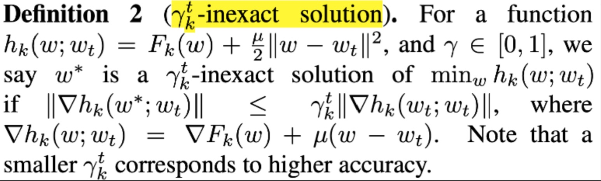
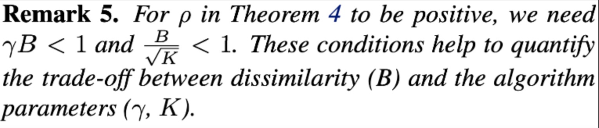
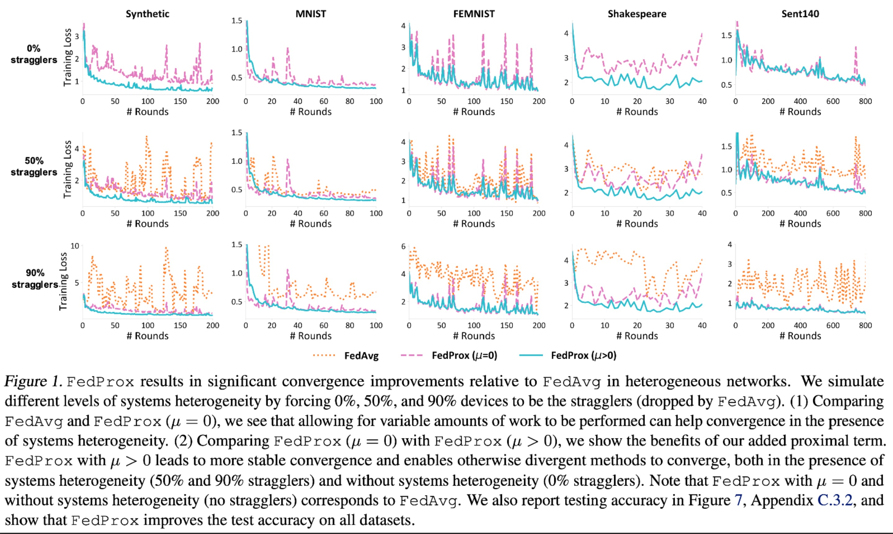

# Strategy: FedProx
## FedAvg v.s FedProx
|  Heterogeneity   | FedAvg  |  FedProx  |
|  ----  | ----  |  ---  |
| data heterogeneity  | FedAvg does not guarantee fit for non-iid data |  FedProx can guarantee the fitting rate for non-iid data: by changing the objective function of the overall optimization, based on an assumption of distribution difference, a convergence proof is obtained  |
| device heterogeneity  | FedAvg does not take into account the heterogeneity of different devices, such as differences in computing power; for each device, the same workload is scheduled |  FedProx supports local training for each device with different workloads: adjust the accuracy requirements for local training per device by setting a different "γ-inexact" parameter for each device in each round |
## Fit
Add Proximal Term to the objective function
=F_k(w)&plus;\frac{\mu}{2}||w-w^t||^2)

): For a set of parameters w, the loss obtained by training k local data on device k  
: The initial model parameters sent by the server to device k in the t-th round of training  
: a hyperparameter  
: proxy term, which limits the difference between the optimized w and the  released in the t round, so that the updated w of each device k is equal to Do not differ too much between them to help fit  
## Different training requirements for each device: γ-inexact

FedAvg requires that each device is fully optimized for E epochs during training locally;
Due to equipment heterogeneity, FedProx hopes to put forward different optimization requirements for each equipment k in each round t, and does not require all equipment to be completely optimized;
, the higher the value, the looser the constraints, that is, the lower the training completion requirements for equipment k; on the contrary, when , the parameters are required the training update is 0, requiring the local model to fully fit;
With the help of , the training volume per round of each device can be adjusted according to the computing resources of the device;
## Requirements for parameter selection in Convergence analysis
When the selected parameters meet the following conditions, the expected value of the convergence rate of the model can be bound
### Parameter conditions
<!-- $$\rho^t=(\frac{1}{\mu}-\frac{\gamma^tB}{\mu}-\frac{B(1+\gamma^t\sqrt(2))}{ \overline\mu\sqrt(K)}-\frac{LB(1+\gamma^t)}{\overline\mu\mu} - \frac{L(1+\gamma^t)^2B^2} {2\mu^2}-\frac{LB^2(1+\gamma^t)^2}{\mu^2K}(2\sqrt{2K}+2))$$ -->
)}{&space;\overline\mu\sqrt(K)}-\frac{LB(1&plus;\gamma^t)}{\overline\mu\mu}&space;-&space;\frac{L(1&plus;\gamma^t)^2B^2}&space;{2\mu^2}-\frac{LB^2(1&plus;\gamma^t)^2}{\mu^2K}(2\sqrt{2K}&plus;2)))

There are three groups of parameters to set: K, , ;
Where K is the number of client devices selected in the t round, ), ,  is the hyperparameter for setting the proxy term. **B is a value used to assume the upper limit of the current participation data distribution difference, not sure how to get it**

### fitting rate
Convergence can be proven if the parameters are set to meet the above requirements

### Sufficient and non-essential conditions for parameter selection

  There is a tradeoff between  and . For example, the larger  is, the greater the difference in data distribution, the smaller the  must be, and the higher the training requirements for each device;

  ## Experiment 1: Effectiveness of proximal term and inexactness

  ## Summarize
  The existence of  and  is more theoretical, in practice, the workload of the device can be determined directly according to the device resources

  ## Implementation
1. The proxy term for data non-iid has been implemented;
2. The inexactness for device heterogeneity needs to be realized;

  ## Reference
  [Federated Optimization in Heterogeneous Networks](https://arxiv.org/pdf/1812.06127.pdf)