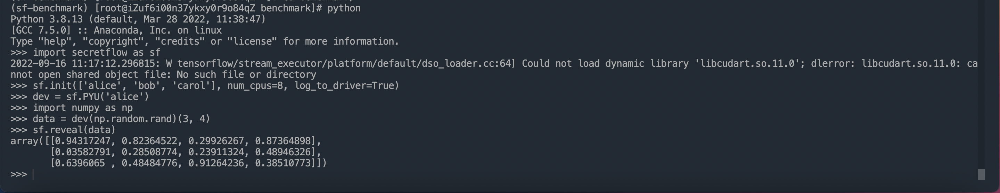
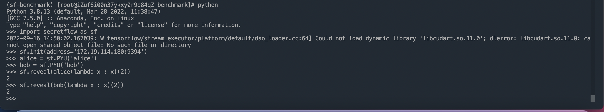
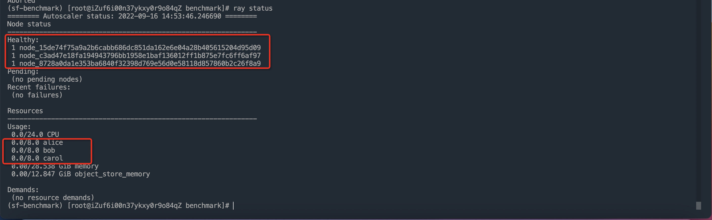

# 隐语 PSI Benchmark 白皮书

> This tutorial is only available in Chinese.

## 导语

为了方便大家快速了解隐语 PSI 的 Benchmark，我们设计了 10 分钟上手手册，包含了亮点介绍、SecretFlow 集群的易用搭建、Benchmark 脚本、两方和三方 PSI 的 Benchmark，希望能够帮助用户快速了解隐语 PSI。

## 隐语 PSI 亮点

隐私集合求交（Private Set Intersection，简写为：PSI）是一类特定的安全多方计算（Multi-Party Computation, 即 MPC）问题，其问题可以简单理解为：Alice 输入集合 X，Bob 输入集合 Y，双方执行 PSI 协议可以得到 X 和 Y 的交集，同时不在交集范围中的数据是受保护的，即 Alice 和 Bob 无法学习到除了交集以外的任何数据。

PSI 协议有很多分类方法，按照底层依赖的密码学技术分类，主要包括：

- 基于公钥密码的 PSI 方案，包括：基于判定型密钥交换（Decisional Diffie-Hellman, DDH）的 PSI 方案和基于 RSA 盲签名的 PSI 方案；
- 基于不经意传输（Oblivious Transfer, OT）的 PSI 方案；
- 基于通用 MPC 的 PSI 方案，例如基于混淆电路（Garbled Circuit, GC）的 PSI 方案；
- 基于同态加密（Homomorphic Encryption, HE）的 PSI 方案。

PSI 协议按照参与方的数量进行分类，可分为：

- 两方 PSI：参与方为 2 个；
- 多方 PSI：参与方>2 个。

PSI 协议按照所假设的安全模型分类，可分为：

- 半诚实模型的 PSI；
- 恶意模型的 PSI。

PSI 协议按照设参与方的数据量差异，可分为：

- 平衡 PSI：参与方的数据量差异不大；
- 非平衡 PSI：参与方的数据量差异巨大，例如百万 vs 10 亿。

SecretFlow SPU 实现了半诚实模型下的两方和三方 PSI 协议，计算安全强度是 128-bit，统计安全强度是 40-bit。

- 两方 PSI 协议：
  - 基于 DDH 的 PSI 协议
    - 基于 DDH 的 PSI 协议相对简单易于理解和实现，依赖的密码技术已被广泛论证，通信量低，但计算量较大。
    - 隐语实现了基于椭圆曲线(Elliptic Curve)群的 DDH PSI 协议，支持的椭圆曲线类型包括：Curve25519,FourQ,SM2,Secp256k1 等。
  - 基于 OT 扩展的 KKRT16
    - KKRT16 是第一个千万规模($2^{24}$)数据量求交时间在 1 分钟之内的 PSI 方案，通信量较大；
    - 隐语实现了 KKRT16 协议，并参考了进年来的性能优化和安全改进方案，例如：stash-less CuckooHash，[GKWW20]中 FixedKey AES 作为 correlation-robust 哈希函数。
  - 基于 PCG 的 RR22
    - RR22 PSI 依赖的 PCG(Pseudorandom Correlation Generator)方案是近年来 mpc 方向的研究热点，相比 KKRT16 在计算量和通信两方面都有了很大改进，从成本(monetary cost)角度更能满足实际业务需求。PCG 实现依赖了近年来发展迅速的 Silent-Vole 原语，隐语在自研的底层密码库[YACL](https://github.com/secretflow/yacl)中已经实现了 Silent-Vole 相关原语。
- 三方 PSI 协议：

  - 基于 DDH 的三方 PSI 协议
    - 隐语自研了基于 ECDH 的三方 PSI 协议.**注意我们实现的这个协议会泄漏两方交集大小**，请自行判断是否满足使用场景的安全性。

- 非平衡 PSI 协议：
  - 基于 ECDH-OPRF 的非平衡 PSI 协议
    - 隐语实现并开源了基于 ECDH-OPRF 的非平衡 PSI(Unbalanced PSI)协议，在数据量非平衡场景下能得到更好的性能。
    - 具体来讲：与 ECDH-PSI 对比，ECDH-PSI 需要在大数据集上进行两次加密操作；隐语实现的非平衡 PSI 只在大数据集上进行一次加密操作。所以在大数据集与小数据集的体量相差非常大的时候，总体计算量和运行时间大约仅是 ECDH-PSI 的$50\%$。
    - 非平衡 PSI 还把协议分成离线和在线（offline/online）两个阶段，在提前执行离线（offline）阶段，得到离线数据缓存的情形下，在线阶段只需少量时间即可得到交集结果。

## 复现方式

### 一、测试机型环境

- Python：3.10
- pip: >= 19.3
- OS: CentOS 7
- SecretFlow: 1.6.1b0
- CPU/Memory: 推荐最低配置是 8C16G
- 硬盘：500G

### 二、安装 conda

使用 conda 管理 python 环境，如果机器没有 conda 需要先安装，步骤如下：

```
sudo apt-get install wget
wget https://repo.anaconda.com/miniconda/Miniconda3-latest-Linux-x86_64.sh
```

#### 详细步骤

```
#sudo apt-get install wget
wget https://repo.anaconda.com/miniconda/Miniconda3-latest-Linux-x86_64.sh
#安装
bash Miniconda3-latest-Linux-x86_64.sh
# 一直按回车然后输入yes
please answer 'yes' or 'no':
>>> yes
# 选择安装路径, 文件名前加点号表示隐藏文件
Miniconda3 will now be installed into this location:
>>> ~/.miniconda3
# 添加配置信息到 ~/.bashrc文件
Do you wish the installer to initialize Miniconda3 by running conda init? [yes|no]
[no] >>> yes
#运行配置信息文件
source ~/.bashrc
#测试是否安装成功
conda --version
```


### 三、安装 secretflow

```
# 创建干净的python环境
conda create -n sf-benchmark python=3.10

# 进入benchmark 环境
conda activate sf-benchmark

# 安装secretflow
pip install -U secretflow

# 创建一个sf-benchmark目录
mkdir sf-benchmark
cd sf-benchmark
```

验证安装是否成功
root 目录下输入 python 然后回车；

```
>>> import secretflow as sf
>>> sf.init(['alice', 'bob', 'carol'], address='local')
>>> dev = sf.PYU('alice')
>>> import numpy as np
>>> data = dev(np.random.rand)(3, 4)
>>> sf.reveal(data)
```

如下图所示就代表环境搭建成功了


### 四、创建节点并启动集群

配置示例使用集群模式仿真模式，其它模式请参考 secretfow 部署文档。

#### 创建 ray header 节点

创建 ray header 节点，选择一台机器为主机，在主机上执行如下命令，ip 替换为主机的内网 ip，命名为 alice，端口选择一个空闲端口即可
注意：192.168.0.1 ip 为 mock 的，请替换为实际的 ip 地址

```
RAY_DISABLE_REMOTE_CODE=true \
ray start --head --node-ip-address="192.168.0.1" --port="9394" --resources='{"alice": 8}' --include-dashboard=False
```

#### 创建从属节点

创建从属节点，在 bob 机器执行如下命令，ip 依然填 alice 机器的内网 ip，命名为 bob，端口不变

```
RAY_DISABLE_REMOTE_CODE=true \
ray start --address="192.168.0.1:9394" --resources='{"bob": 8}'
```

创建从属节点，在 carol 机器执行如下命令，ip 依然填 alice 机器的内网 ip，命名为 carol，端口不变

```
RAY_DISABLE_REMOTE_CODE=true \
ray start --address="192.168.0.1:9394" --resources='{"carol": 8}'
```

#### 验证节点是否启动

在 python 中测试节点是否启动成功，任意选一台机器输入 python，执行下列代码，参数中 address 为头节点(alice)的地址，拿 alice 机器来验证，每输入一行下列代码回车一次：

```
>>> import secretflow as sf
>>> sf.init(['alice','bob'], address='192.168.0.1:9394')
>>> alice = sf.PYU('alice')
>>> bob = sf.PYU('bob')
>>> sf.reveal(alice(lambda x : x)(2))
>>> sf.reveal(bob(lambda x : x)(2))
```

如下图就代表节点创建成功了

同时我们也可以通过 ray status 去看节点的状态，前提是先进入 sf 环境（conda activate sf-benchmark）


#### 生成数据

把[generate_psi.py](./resources/generate_psi.py)脚本传到 alice 机器的 root 目录下，执行如下代码

```
# 生成三份一千万数据,默认交集50%
python3 generate_psi.py 10000000 10000000

# 生成三份一亿数据
python3 generate_psi.py 100000000 100000000
```

把生成的 psi_1.csv cp 到 benchmark 目录下，再通过 scp 的命令把 psi_2.csv/psi_3.csv 分别移到 bob 的 benchmark 目录下跟 carol 的 benchark 目录下

#### 限制宽带/延迟

```
#100Mbps 10ms
 tc qdisc add dev eth0 root handle 1: tbf rate 100mbit burst 256kb latency 800ms
 tc qdisc add dev eth0 parent 1:1 handle 10: netem delay 10msec limit 8000

清除限制
tc qdisc del dev eth0 root
查看已有配置
tc qdisc show dev eth0
```

#### 平衡 PSI Benchmark 脚本

支持的平衡 PSI 协议列表：

- PROTOCOL_ECDH
- PROTOCOL_KKRT
- PROTOCOL_RR22
- PROTOCOL_ECDH_3PC

```
import sys
import time
import logging

from absl import app
import spu
import secretflow as sf

# init log
logging.basicConfig(stream=sys.stdout, level=logging.INFO)

# SPU settings
cluster_def = {
    'nodes': [
        # <<< !!! >>> replace <192.168.0.1:12945> to alice node's local ip & free port
        {'party': 'alice', 'address': '192.168.0.1:12945', 'listen_address': '0.0.0.0:12945'},
        # <<< !!! >>> replace <192.168.0.2:12946> to bob node's local ip & free port
        {'party': 'bob', 'address': '192.168.0.2:12946', 'listen_address': '0.0.0.0:12946'},
        # <<< !!! >>> if you need 3pc test, please add node here, for example, add carol as rank 2
        # {'party': 'carol', 'address': '127.0.0.1:12347'},
    ],
    'runtime_config': {
        'protocol': spu.ProtocolKind.SEMI2K,
        'field': spu.FieldType.FM128,
    },
}


def main(_):

    # sf init
    # <<< !!! >>> replace <192.168.0.1:9394> to your ray head
    sf.init(['alice','bob'], address='192.168.0.1:9394')
    alice = sf.PYU('alice')
    bob = sf.PYU('bob')
    carol = sf.PYU('carol')

    # <<< !!! >>> replace path to real parties local file path.
    input_path = {
        alice: '/data/psi_1.csv',
        bob: '/data/psi_2.csv',
        # if run with `PROTOCOL_ECDH_3PC`, add carol
        # carol: '/data/psi_3.csv',
    }
    output_path = {
        alice: '/data/psi_output.csv',
        bob: '/data/psi_output.csv',
        # if run with `PROTOCOL_ECDH_3PC`, add carol
        # carol: '/data/psi_output.csv',
    }
    select_keys = {
        alice: ['id'],
        bob: ['id'],
        # if run with `PROTOCOL_ECDH_3PC`, add carol
        # carol: ['id'],
    }
    spu = sf.SPU(cluster_def)

    # prepare data
    start = time.time()

    reports = spu.psi(
        keys=select_keys,
        input_path=input_path,
        output_path=output_path,
        receiver='alice',  # if `broadcast_result=False`, only receiver can get output file.
        protocol='PROTOCOL_KKRT', # psi protocol
        disable_alignment=True,  # will cost ext time if set False
        broadcast_result=False,  # will cost ext time if set True
    )
    print(f"psi reports: {reports}")
    logging.info(f"cost time: {time.time() - start}")

    sf.shutdown()


if __name__ == '__main__':
    app.run(main)
```

#### 非平衡 PSI Benchmark 脚本

支持的非平衡 PSI 协议列表：

- ECDH_OPRF_UB_PSI

##### 离线阶段脚本

```python
import os
import sys
import time
import logging
import multiprocess
​
from absl import app
import spu
import secretflow as sf
#import random
​
# init log
logging.basicConfig(stream=sys.stdout, level=logging.DEBUG)
​
​
# SPU settings
cluster_def = {
    'nodes': [
        # <<< !!! >>> replace <192.168.0.1:17268> to alice node's local ip & free port
        {'party': 'alice', 'address': '192.168.0.1:17268', 'listen_address': '0.0.0.0:17268'},
        # <<< !!! >>> replace <192.168.0.2:17269> to bob node's local ip & free port
        {'party': 'bob', 'address': '192.168.0.2:17269', 'listen_address': '0.0.0.0:17269'},
    ],
    'runtime_config': {
        'protocol': spu.ProtocolKind.SEMI2K,
        'field': spu.FieldType.FM128,
    },
}
​
link_desc = {
    'recv_timeout_ms': 3600000,
}

def main(_):
    # sf init
    # <<< !!! >>> replace <192.168.0.1:9394> to your ray head
    sf.shutdown()
    sf.init(['alice','bob'],address='192.168.0.1:9394',log_to_driver=True,omp_num_threads=multiprocess.cpu_count())
​
    # init log
    logging.basicConfig(stream=sys.stdout, level=logging.DEBUG)
​
    alice = sf.PYU('alice')
    bob = sf.PYU('bob')

    offline_input_path = {
        alice: 'dummyalice.csv',
        bob: '/root/benchmark/unbalanced_200000w.csv',
    }
    select_keys = {
        alice: ['id'],
        bob: ['id'],
    }
    spu = sf.SPU(cluster_def, link_desc)
​
    # offline
    print("=====offline phase====")
    start = time.time()
​
    offline_output_path = {
        alice: "/data/unbalanced_2000w_out.csv",
        bob: "/data/unbalanced_200000w_out.csv",
    }
​
    offline_preprocess_path = "/root/benchmark/offline_out/offline_psi0107.csv"
    secret_key = "000102030405060708090a0b0c0d0e0ff0e0d0c0b0a090807060504030201000"
    secret_key_path = "/root/benchmark/secret_key.bin"
    with open(secret_key_path, 'wb') as f:
            f.write(bytes.fromhex(secret_key))
​
    reports = spu.psi_csv(
        key=select_keys,
        input_path=offline_input_path,
        output_path=offline_output_path,
        receiver='alice',  # if `broadcast_result=False`, only receiver can get output file.
        protocol='ECDH_OPRF_UB_PSI_2PC_OFFLINE',        # psi protocol
        precheck_input=False,  # will cost ext time if set True
        sort=False,  # will cost ext time if set True
        broadcast_result=False,  # will cost ext time if set True
        bucket_size=10000000,
        curve_type="CURVE_FOURQ",
        preprocess_path=offline_preprocess_path,
        ecdh_secret_key_path=secret_key_path,
    )
    #print(f"psi reports: {reports}")
    logging.info(f"offline psi reports: {reports}")
    logging.info(f"cost time: {time.time() - start}")
​
    sf.shutdown()
​
​
if __name__ == '__main__':
    app.run(main)

```

##### 在线阶段脚本

```python

import os
import sys
import time
# import random
import logging
import multiprocess
​
from absl import app
import spu
import secretflow as sf
​
# init log
logging.basicConfig(stream=sys.stdout, level=logging.DEBUG)
​
# SPU settings
cluster_def = {
    'nodes': [
        # <<< !!! >>> replace <192.168.0.1:17268> to alice node's local ip & free port
        {'party': 'alice', 'address': '192.168.0.1:17268', 'listen_address': '0.0.0.0:17268'},
        # <<< !!! >>> replace <192.168.0.2:17269> to bob node's local ip & free port
        {'party': 'bob', 'address': '192.168.0.2:17269', 'listen_address': '0.0.0.0:17269'},
    ],
    'runtime_config': {
        'protocol': spu.ProtocolKind.SEMI2K,
        'field': spu.FieldType.FM128,
    },
}
​
link_desc = {
    'recv_timeout_ms': 3600000,
}

def main(_):
    # sf init
    # <<< !!! >>> replace <192.168.0.1:9394> to your ray head
    sf.shutdown()
    sf.init(['alice','bob'],address='192.168.0.1:9394',log_to_driver=True,omp_num_threads=multiprocess.cpu_count())
​
    # init log
    logging.basicConfig(stream=sys.stdout, level=logging.DEBUG)
​
    alice = sf.PYU('alice')
    bob = sf.PYU('bob')
​
    # <<< !!! >>> replace path to real parties local file path.
    online_input_path = {
        alice: '/root/benchmark/unbalanced_2000w.csv',
        bob: 'dummy.bob.csv',
    }
    output_path = {
        alice: '/data/unbalanced_20000wvs2000w.csv',
        bob: '/data/unbalanced_20000wvs2000w.csv',
    }
    select_keys = {
        alice: ['id'],
        bob: ['id'],
    }
    spu = sf.SPU(cluster_def, link_desc)

    offline_preprocess_path = "/root/benchmark/offline_out/offline_psi0107.csv"
    secret_key_path = "/root/benchmark/secret_key.bin"
​
    # online
    print("=====online phase====")
    start = time.time()
​
    reports = spu.psi_csv(
        key=select_keys,
        input_path=online_input_path,
        output_path=output_path,
        receiver='alice',  # if `broadcast_result=False`, only receiver can get output file.
        protocol='ECDH_OPRF_UB_PSI_2PC_ONLINE', # psi protocol
        precheck_input=True,  # will cost ext time if set True
        sort=True,  # will cost ext time if set True
        broadcast_result=False,  # will cost ext time if set True
        bucket_size=100000000,
        curve_type="CURVE_FOURQ",
        preprocess_path=offline_preprocess_path,
        ecdh_secret_key_path=secret_key_path,
    )
​
    #print(f"psi reports: {reports}")
    logging.info(f"online psi reports: {reports}")
    logging.info(f"cost time: {time.time() - start}")
​
    sf.shutdown()
​
​
if __name__ == '__main__':
    app.run(main)
```

### 五、Benchmark 报告

我们分别在不同的带宽、数据量、机器配置设定下测量了 PSI 协议的性能。其中：

- 隐语标准：带宽设定分别为 LAN、100Mbps/10ms； 数据量涵盖 1 千万、1 亿、10 亿。
- 信通院标准：带宽设定分别为 LAN、100Mbps/50ms，数据量涵盖 1 亿（标准测试）和 10 亿（大规模测试）。

> 时间单位默认为秒，m 表示分钟，h 表示小时。

#### 隐语测试标准下的 Benchmark

<table>
  <tr>
    <th>机器配置</th>
    <th>算法参数</th>
    <th>协议</th>
    <th>网络配置</th>
    <th>1kw~1kw</th>
    <th>1亿~1亿</th>
    <th>10亿~10亿</th>
  </tr>
  <tr>
    <td rowspan="16">32C64G</td>
    <td rowspan="2">receiver='alice',<br>protocol='PROTOCOL_ECDH',<br>curve_type='CURVE_FOURQ',<br>precheck_input=False,<br>sort=False,<br>broadcast_result=False,</td>
    <td rowspan="2">ECDH-PSI-2PC<br/> (FourQ)</td>
    <td>LAN</td>
    <td>73</td>
    <td>723</td>
    <td>7491 <br> (2.08 h)</td>
  </tr>
  <tr>
    <td>100Mbps/10ms</td>
    <td>74</td>
    <td>729</td>
    <td>7387 <br> (2.06 h)</td>
  </tr>
  <tr>
    <td rowspan="2">receiver='alice',<br>protocol='PROTOCOL_ECDH',<br>curve_type='CURVE_25519',<br>precheck_input=False,<br>sort=False,<br>broadcast_result=False,</td>
    <td rowspan="2">ECDH-PSI-2PC <br/>(CURVE_25519)</td>
    <td>LAN</td>
    <td>110</td>
    <td>1129</td>
    <td> 11377 <br> (3.16 h)</td>
  </tr>
  <tr>
    <td>100Mbps/10ms</td>
    <td>115</td>
    <td>1142</td>
    <td>11504 <br> (3.19 h)</td>
  </tr>
  <tr>
    <td rowspan="2">receiver='alice',<br>protocol='PROTOCOL_ECDH_3PC',<br>curve_type='CURVE_FOURQ',<br>precheck_input=False,<br>sort=False,<br>broadcast_result=False,</td>
    <td rowspan="2">ECDH-PSI-3PC <br/> (FourQ)</td>
    <td>LAN</td>
    <td>123</td>
    <td>1170</td>
    <td>13097 <br> (3.63 h)</td>
  </tr>
  <tr>
    <td>100Mbps/10ms</td>
    <td>155</td>
    <td>1499</td>
    <td>17041 <br> (4.7 h)</td>
  </tr>
  <tr>
    <td rowspan="2">receiver='alice',<br>protocol='PROTOCOL_ECDH_3PC',<br>curve_type='CURVE_25519',<br>precheck_input=False,<br>sort=False,<br>broadcast_result=False,</td>
    <td rowspan="2">ECDH-PSI-3PC (CURVE_25519)<br>(3个参与方持有相同数据的50%，最后交集占比50%)</td>
    <td>LAN</td>
    <td>203</td>
    <td>2017</td>
    <td>22717 <br> (6.16 h)</td>
  </tr>
  <tr>
    <td>100Mbps/10ms</td>
    <td>239</td>
    <td>2349</td>
    <td>25807 <br> (7.2 h)</td>
  </tr>
  <tr>
    <td rowspan="2">receiver='alice',<br>protocol='PROTOCOL_KKRT',<br>precheck_input=False,<br>sort=False,<br>broadcast_result=False,</td>
    <td rowspan="2">PROTOCOL_KKRT<br>(百万分桶)</td>
    <td>LAN</td>
    <td>56</td>
    <td>558</td>
    <td>5970 <br> (1.61 h)</td>
  </tr>
  <tr>
    <td>100Mbps/10ms</td>
    <td>144</td>
    <td>1393</td>
    <td>14295 <br> (3.97 h)</td>
  </tr>
  <tr>
    <td rowspan="2">receiver='alice',<br>protocol='RR22_FAST_PSI_2PC',<br>precheck_input=False,<br>sort=False,<br>broadcast_result=False,</td>
    <td rowspan="2">RR22_FAST_PSI_2PC<br>(百万分桶)</td>
    <td>LAN</td>
    <td>28</td>
    <td>273</td>
    <td>3176 <br> (0.88 h)</td>
  </tr>
  <tr>
    <td>100Mbps/10ms</td>
    <td>63</td>
    <td>575</td>
    <td>6025<br> (1.6 h)</td>
  </tr>
  <tr>
    <td rowspan="2">receiver='alice',<br>protocol='RR22_LOWCOMM_PSI_2PC',<br>precheck_input=False,<br>sort=False,<br>broadcast_result=False,</td>
    <td rowspan="2">RR22_LOWCOMM_PSI_2PC<br>(百万分桶)</td>
    <td>LAN</td>
    <td>31</td>
    <td>317</td>
    <td>3614<br>(1.00 h)</td>
  </tr>
  <tr>
    <td>100Mbps/10ms</td>
    <td>53</td>
    <td>481</td>
    <td>5310<br>(1.47 h)</td>
  </tr>
  <tr>
    <td rowspan="2">receiver='alice',<br>protocol='RR22_MALICIOUS_PSI_2PC',<br>precheck_input=False,<br>sort=False,<br>broadcast_result=False,</td>
    <td rowspan="2">RR22_MALICIOUS_PSI_2PC<br>(百万分桶)</td>
    <td>LAN</td>
    <td>23</td>
    <td>232</td>
    <td>1791<br>(0.49 h)</td>
  </tr>
  <tr>
    <td>100Mbps/10ms</td>
    <td>82</td>
    <td>705</td>
    <td>6840<br>(1.9 h)</td>
  </tr>
  <tr>
    <td rowspan="16">16C32G</td>
    <td rowspan="2">receiver='alice',<br>protocol='PROTOCOL_ECDH',<br>curve_type='CURVE_FOURQ',<br>precheck_input=False,<br>sort=False,<br>broadcast_result=False,</td>
    <td rowspan="2">ECDH-PSI-2PC <br/>(FourQ)</td>
    <td>LAN</td>
    <td>96</td>
    <td>991</td>
    <td>2.82 h</td>
  </tr>
  <tr>
    <td>100Mbps/10ms</td>
    <td>97</td>
    <td>991</td>
    <td>2.79 h</td>
  </tr>
  <tr>
    <td rowspan="2">receiver='alice',<br>protocol='PROTOCOL_ECDH',<br>curve_type='CURVE_25519',<br>precheck_input=False,<br>sort=False,<br>broadcast_result=False,</td>
    <td rowspan="2">ECDH-PSI-2PC <br/>(CURVE_25519)</td>
    <td>LAN</td>
    <td>170</td>
    <td>1730</td>
    <td>4.8 h</td>
  </tr>
  <tr>
    <td>100Mbps/10ms</td>
    <td>179</td>
    <td>1790</td>
    <td>5.02 h</td>
  </tr>
  <tr>
    <td rowspan="2">receiver='alice',<br>protocol='PROTOCOL_ECDH_3PC',<br>curve_type='CURVE_FOURQ',<br>precheck_input=False,<br>sort=False,<br>broadcast_result=False,</td>
    <td rowspan="2">ECDH-PSI-3PC <br/>(FourQ)</td>
    <td>LAN</td>
    <td>174</td>
    <td>1687</td>
    <td>5.4 h</td>
  </tr>
  <tr>
    <td>100Mbps/10ms</td>
    <td>209</td>
    <td>2007</td>
    <td>6.5 h</td>
  </tr>
  <tr>
    <td rowspan="2">receiver='alice',<br>protocol='PROTOCOL_ECDH_3PC',<br>curve_type='CURVE_25519',<br>precheck_input=False,<br>sort=False,<br>broadcast_result=False,</td>
    <td rowspan="2">ECDH-PSI-3PC (CURVE_25519)<br>(3个参与方持有相同数据的50%，最后交集占比50%)</td>
    <td>LAN</td>
    <td>346</td>
    <td>3456</td>
    <td>10.6 h</td>
  </tr>
  <tr>
    <td>100Mbps/10ms</td>
    <td>383</td>
    <td>3781</td>
    <td>11.7 h</td>
  </tr>
  <tr>
    <td rowspan="2">receiver='alice',<br>protocol='PROTOCOL_KKRT',<br>precheck_input=False,<br>sort=False,<br>broadcast_result=False,</td>
    <td rowspan="2">PROTOCOL_KKRT<br>(百万分桶)</td>
    <td>LAN</td>
    <td>55</td>
    <td>565</td>
    <td>2.05 h</td>
  </tr>
  <tr>
    <td>100Mbps/10ms</td>
    <td>147</td>
    <td>1435</td>
    <td>4.34 h</td>
  </tr>
  <tr>
    <td rowspan="2">receiver='alice',<br>protocol='RR22_FAST_PSI_2PC',<br>precheck_input=False,<br>sort=False,<br>broadcast_result=False,</td>
    <td rowspan="2">RR22_FAST_PSI_2PC<br>(百万分桶)</td>
    <td>LAN</td>
    <td>31</td>
    <td>273</td>
    <td>1.17 h</td>
  </tr>
  <tr>
    <td>100Mbps/10ms</td>
    <td>69</td>
    <td>628</td>
    <td>2.06 h</td>
  </tr>
  <tr>
    <td rowspan="2">receiver='alice',<br>protocol='RR22_LOWCOMM_PSI_2PC',<br>precheck_input=False,<br>sort=False,<br>broadcast_result=False,</td>
    <td rowspan="2">RR22_LOWCOMM_PSI_2PC<br>(百万分桶)</td>
    <td>LAN</td>
    <td>31</td>
    <td>308</td>
    <td>1.37 h</td>
  </tr>
  <tr>
    <td>100Mbps/10ms</td>
    <td>58</td>
    <td>545</td>
    <td>1.87 h</td>
  </tr>
  <tr>
    <td rowspan="2">receiver='alice',<br>protocol='RR22_MALICIOUS_PSI_2PC',<br>precheck_input=False,<br>sort=False,<br>broadcast_result=False,</td>
    <td rowspan="2">RR22_MALICIOUS_PSI_2PC<br>(百万分桶)</td>
    <td>LAN</td>
    <td>23</td>
    <td>184</td>
    <td>0.57 h</td>
  </tr>
  <tr>
    <td>100Mbps/10ms</td>
    <td>86</td>
    <td>737</td>
    <td>2.05 h</td>
  </tr>
  <tr>
    <td rowspan="16">8C16G</td>
    <td rowspan="2">receiver='alice',<br>protocol='PROTOCOL_ECDH',<br>curve_type='CURVE_FOURQ',<br>precheck_input=False,<br>sort=False,<br>broadcast_result=False,</td>
    <td rowspan="2">ECDH-PSI-2PC<br/> (FourQ)</td>
    <td>LAN</td>
    <td>145</td>
    <td>1453</td>
    <td>4.12 h</td>
  </tr>
  <tr>
    <td>100Mbps/10ms</td>
    <td>147</td>
    <td>1470</td>
    <td>4.14 h</td>
  </tr>
  <tr>
    <td rowspan="2">receiver='alice',<br>protocol='PROTOCOL_ECDH',<br>curve_type='CURVE_25519',<br>precheck_input=False,<br>sort=False,<br>broadcast_result=False,</td>
    <td rowspan="2">ECDH-PSI-2PC<br/> (CURVE_25519)</td>
    <td>LAN</td>
    <td>302</td>
    <td>3021</td>
    <td>8.4 h</td>
  </tr>
  <tr>
    <td>100Mbps/10ms</td>
    <td>302</td>
    <td>3025</td>
    <td>8.4 h</td>
  </tr>
  <tr>
    <td rowspan="2">receiver='alice',<br>protocol='PROTOCOL_ECDH_3PC',<br>curve_type='CURVE_FOURQ',<br>precheck_input=False,<br>sort=False,<br>broadcast_result=False,</td>
    <td rowspan="2">ECDH-PSI-3PC<br/> (FourQ)</td>
    <td>LAN</td>
    <td>277</td>
    <td>2700</td>
    <td>8.4 h</td>
  </tr>
  <tr>
    <td>100Mbps/10ms</td>
    <td>313</td>
    <td>3059</td>
    <td>9.5 h</td>
  </tr>
  <tr>
    <td rowspan="2">receiver='alice',<br>protocol='PROTOCOL_ECDH_3PC',<br>curve_type='CURVE_25519',<br>precheck_input=False,<br>sort=False,<br>broadcast_result=False,</td>
    <td rowspan="2">ECDH-PSI-3PC <br/> (CURVE_25519)<br>(3个参与方持有相同数据的50%，最后交集占比50%)</td>
    <td>LAN</td>
    <td>633</td>
    <td>6298</td>
    <td>19 h</td>
  </tr>
  <tr>
    <td>100Mbps/10ms</td>
    <td>672</td>
    <td>6661</td>
    <td>20.18 h</td>
  </tr>
  <tr>
    <td rowspan="2">receiver='alice',<br>protocol='PROTOCOL_KKRT',<br>precheck_input=False,<br>sort=False,<br>broadcast_result=False,</td>
    <td rowspan="2">PROTOCOL_KKRT<br>(百万分桶)</td>
    <td>LAN</td>
    <td>59</td>
    <td>570</td>
    <td>2.0 h</td>
  </tr>
  <tr>
    <td>100Mbps/10ms</td>
    <td>148</td>
    <td>1441</td>
    <td>4.3 h</td>
  </tr>
  <tr>
    <td rowspan="2">receiver='alice',<br>protocol='RR22_FAST_PSI_2PC',<br>precheck_input=False,<br>sort=False,<br>broadcast_result=False,</td>
    <td rowspan="2">RR22_FAST_PSI_2PC<br>(百万分桶)</td>
    <td>LAN</td>
    <td>31</td>
    <td>277</td>
    <td>1.19 h</td>
  </tr>
  <tr>
    <td>100Mbps/10ms</td>
    <td>70</td>
    <td>636</td>
    <td>2.08 h</td>
  </tr>
  <tr>
    <td rowspan="2">receiver='alice',<br>protocol='RR22_LOWCOMM_PSI_2PC',<br>precheck_input=False,<br>sort=False,<br>broadcast_result=False,</td>
    <td rowspan="2">RR22_LOWCOMM_PSI_2PC<br>(百万分桶)</td>
    <td>LAN</td>
    <td>35</td>
    <td>319</td>
    <td>1.41 h</td>
  </tr>
  <tr>
    <td>100Mbps/10ms</td>
    <td>59</td>
    <td>550</td>
    <td>1.86 h</td>
  </tr>
  <tr>
    <td rowspan="2">receiver='alice',<br>protocol='RR22_MALICIOUS_PSI_2PC',<br>precheck_input=False,<br>sort=False,<br>broadcast_result=False,</td>
    <td rowspan="2">RR22_MALICIOUS_PSI_2PC<br>(百万分桶)</td>
    <td>LAN</td>
    <td>25</td>
    <td>194</td>
    <td>0.6 h</td>
  </tr>
  <tr>
    <td>100Mbps/10ms</td>
    <td>80</td>
    <td>734</td>
    <td>2.05 h</td>
  </tr>
</table>

- ECDH：对网络配置不敏感，对计算资源敏感，适合带宽较低、计算配置较高的使用场景；
- KKRT：网络设置为 100Mbps 时，带宽成为瓶颈。通常用于两方数据量均衡时，适合高带宽的使用场景；

#### 信通院测试标准下的 Benchmark

<table>
  <tr>
    <th>机器配置</th>
    <th>算法参数</th>
    <th>协议</th>
    <th>大规模<br/>（10亿~10亿）<br/>（100Mbps/50ms）</th>
    <th>标准<br/>1亿～1亿<br/>（LAN）</th>
  </tr>
  <tr>
    <td rowspan="10">32C256G</td>
    <td>"receiver='alice',<br>protocol='PROTOCOL_ECDH',<br>curve_type = 'CURVE_FOURQ',<br>precheck_input=False,<br>sort=False,<br>broadcast_result=False,</td>
    <td>ECDH-PSI-2PC<br/>(CURVE_FOURQ)</td>
    <td>7764<br/>(2.15 h)</td>
    <td>729</td>
  </tr>
  <tr>
    <td>"receiver='alice',<br>protocol='PROTOCOL_ECDH',<br>curve_type = 'CURVE_25519',<br>precheck_input=False,<br>sort=False,<br>broadcast_result=False,</td>
    <td>ECDH-PSI-2PC<br/>(CURVE_25519)</td>
    <td>11555<br/>(3.2 h)</td>
    <td>1131</td>
  </tr>
  <tr>
    <td>"receiver='alice',<br>protocol='ECDH_OPRF_UB_PSI_2PC',<br>curve_type = 'CURVE_FOURQ',<br>precheck_input=False,<br>sort=False,<br>broadcast_result=False,</td>
    <td>ECDH_OPRF_UB_PSI_2PC<br/>(非平衡)<br/>(大规模 10亿&100w=50w) <br/>(标准 1亿&10w=5w) <br/> (CURVE_FOURQ)  </td>
    <td>offline: 1428 (23m)<br/>offline: 300 (5m)</td>
     <td>offline: 139<br/>offline: 31</td>
  </tr>
  <tr>
    <td>"receiver='alice',<br>protocol='PROTOCOL_ECDH_3PC',<br>curve_type = 'CURVE_FOURQ',<br>precheck_input=False,<br>sort=False,<br>broadcast_result=False,</td>
    <td>PROTOCOL_ECDH_3PC<br/>(CURVE_FOURQ)</td>
    <td>17599<br>(4.8 h)</td>
     <td>1172</td>
  </tr>
  <tr>
    <td>"receiver='alice',<br>protocol='PROTOCOL_ECDH_3PC',<br>curve_type = 'CURVE_25519',<br>precheck_input=False,<br>sort=False,<br>broadcast_result=False,</td>
    <td>PROTOCOL_ECDH_3PC<br/>(CURVE_25519)</td>
    <td>26220<br>(7.28 h)</td>
     <td>2022</td>
  </tr>
  <tr>
    <td>"receiver='alice',<br>protocol='PROTOCOL_ECDH_3PC',<br>curve_type = 'CURVE_FOURQ',<br>precheck_input=False,<br>sort=False,<br>broadcast_result=False,</td>
    <td>PROTOCOL_ECDH_3PC<br/>(非平衡)<br/>  (大规模 10亿&10亿&100万=50) <br/>(标准 1亿&1亿&10万=5)<br/>(CURVE_FOURQ)</td>
    <td>12441<br>(3.45 h)</td>
     <td>894</td>
  </tr>
  <tr>
    <td>"receiver='alice',<br>protocol='PROTOCOL_KKRT',<br>precheck_input=False,<br>sort=False,<br>broadcast_result=False,</td>
    <td>PROTOCOL_KKRT<br/> (百万分桶)</td>
    <td>30963<br>(8.6 h)</td>
     <td>554</td>
  </tr>
  <tr>
    <td>"receiver='alice',<br>protocol='RR22_FAST_PSI_2PC',<br>precheck_input=False,<br>sort=False,<br>broadcast_result=False,</td>
    <td>RR22_FAST_PSI_2PC<br/> (百万分桶)</td>
    <td>6236<br>(1.7 h)</td>
     <td>280</td>
  </tr>
  <tr>
    <td>"receiver='alice',<br>protocol='RR22_LOWCOMM_PSI_2PC',<br>precheck_input=False,<br>sort=False,<br>broadcast_result=False,</td>
    <td>RR22_LOWCOMM_PSI_2PC<br/> (百万分桶)</td>
    <td>5659<br>(1.57 h)</td>
     <td>323</td>
  </tr>
  <tr>
    <td>"receiver='alice',<br>protocol='RR22_MALICIOUS_PSI_2PC',<br>precheck_input=False,<br>sort=False,<br>broadcast_result=False,</td>
    <td>RR22_MALICIOUS_PSI_2PC<br/> (百万分桶)</td>
    <td>14847<br>(4.12 h)</td>
     <td>203</td>
  </tr>
</table>
