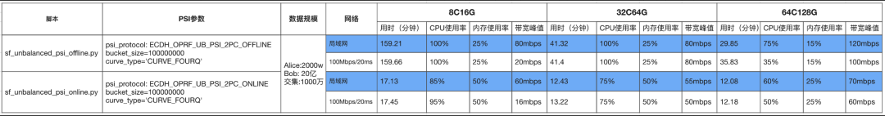
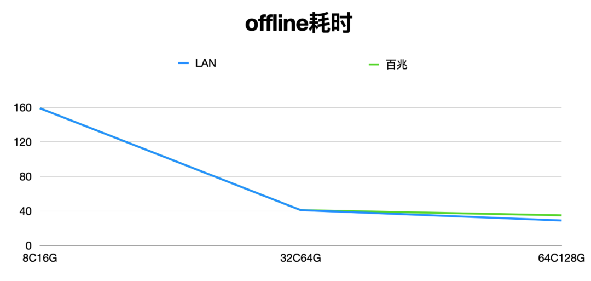
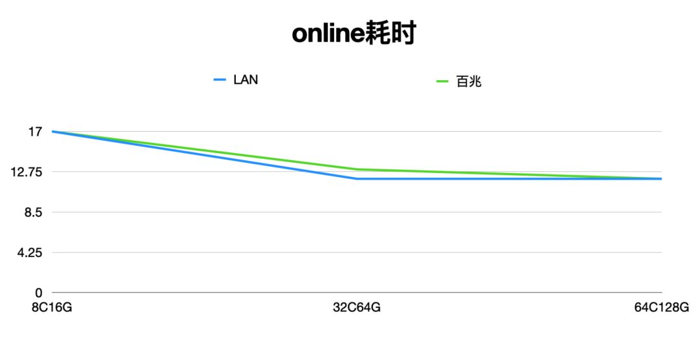
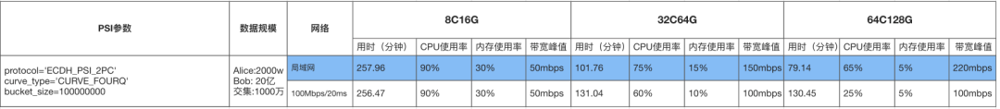
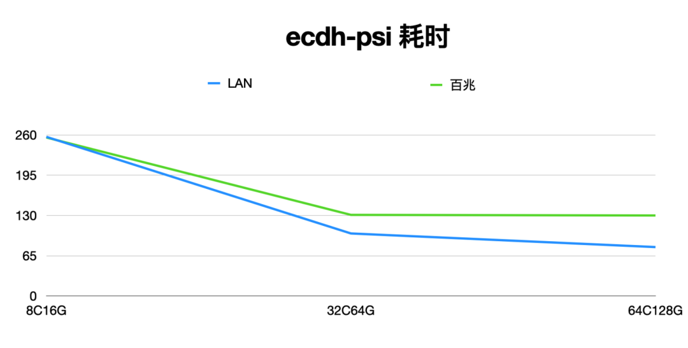

# 隐语非平衡(Unbalanced) PSI Benchmark白皮书

> This tutorial is only available in Chinese.

## 导语
去年10月份，隐语发布了PSI的性能数据，引起了内部和外部用户的广泛关注，具体协议包括：ecdh/kkrt16/bc22协议，这些协议更适合双方数据量差别不大的场景，可以称为平衡PSI（Balanced PSI）。

现实中的隐私求交场景中，有时多双方数据量级差异很大，例如：百万vs十亿，2千万vs 20亿。针对这种场景，隐语实现并开源了专门的非平衡PSI(Unbalanced PSI)协议，能得到更好的性能。具体来讲：与ecdh-psi对比，ecdh-psi在大数据集上进行两次加密操作。隐语实现的非平衡PSI只在大数据集上进行一次加密操作，在大数据集与小数据集的体量相差非常大的时候，总体计算量和运行时间大约是ecdh-psi的1/2。非平衡PSI还把协议分成离线和在线（offline/online）两个阶段，在提前执行离线（offline）缓存的情形下，在线阶段只需10多分钟即可完成在线（online）协议，得到交集结果。

本文给出隐语非平衡PSI(Unbalanced PSI)协议的具体测试环境、步骤、和数据，方便大家了解协议的使用方法和性能数据，便于大家更好的了解隐语非平衡PSI，满足大家的业务需求。

## 测试方法和步骤

### 一、测试机型

- Python：3.10
- pip: >= 19.3
- OS: CentOS 7
- CPU/Memory: 推荐最低配置是 8C16G
- 硬盘：500G

二、安装conda
使用conda管理python环境，如果机器没有conda需要先安装，步骤如下：
```
#sudo apt-get install wget
wget https://repo.anaconda.com/miniconda/Miniconda3-latest-Linux-x86_64.sh
​
#安装
bash Miniconda3-latest-Linux-x86_64.sh
​
# 一直按回车然后输入yes
please answer 'yes' or 'no':
>>> yes
​
# 选择安装路径, 文件名前加点号表示隐藏文件
Miniconda3 will now be installed into this location:
>>> ~/.miniconda3
​
# 添加配置信息到 ~/.bashrc文件
Do you wish the installer to initialize Miniconda3 by running conda init? [yes|no]
[no] >>> yes
​
#运行配置信息文件或重启电脑
source ~/.bashrc
​
#测试是否安装成功，有显示版本号表示安装成功
conda --version
```

### 三、安装secretflow

```
conda create -n sf-benchmark python=3.10
​
conda activate sf-benchmark
​
pip install -U secretflow
```

### 四、创建节点并启动集群
创建ray header节点
创建ray header节点，选择一台机器为主机，在主机上执行如下命令，ip替换为主机的内网ip，命名为alice，端口选择一个空闲端口即可
注意：192.168.0.1 ip为mock，请替换为实际的ip地址
```
RAY_DISABLE_REMOTE_CODE=true \
ray start --head --node-ip-address="192.168.0.1" --port="9394" --resources='{"alice": 8}' --include-dashboard=False
```

创建从属节点
创建从属节点，在bob机器执行如下命令，ip依然填alice机器的内网ip，命名为bob，端口不变
```
RAY_DISABLE_REMOTE_CODE=true \
ray start --address="192.168.0.1:9394" --resources='{"bob": 8}'
```


### 五、数据要求
Alice方：2000万
Bob方：20亿
交集：1000万

### 六、Benchmark脚本
脚本分为offline和online，offline用于对大数据方的setup、online对小数据的执行基于ecdh的oprf协议。
详细的Unbalanced psi解读可参考：非平衡隐私集合求交(Unbalanced PSI)协议介绍

#### offline脚本：

```
import os
import sys
import time
import logging
import multiprocess
​
from absl import app
import spu
import secretflow as sf
#import random
​
# init log
logging.basicConfig(stream=sys.stdout, level=logging.DEBUG)
​
​
# SPU settings
cluster_def = {
    'nodes': [
        # <<< !!! >>> replace <192.168.0.1:17268> to alice node's local ip & free port
        {'party': 'alice', 'address': '192.168.0.1:17268', 'listen_address': '0.0.0.0:17268'},
        # <<< !!! >>> replace <192.168.0.2:17269> to bob node's local ip & free port
        {'party': 'bob', 'address': '192.168.0.2:17269', 'listen_address': '0.0.0.0:17269'},
    ],
    'runtime_config': {
        'protocol': spu.spu_pb2.SEMI2K,
        'field': spu.spu_pb2.FM128,
    },
}
​
link_desc = {
    'recv_timeout_ms': 3600000,
}

def main(_):
    # sf init
    # <<< !!! >>> replace <192.168.0.1:9394> to your ray head
    sf.shutdown()
    sf.init(['alice','bob'],address='192.168.0.1:9394',log_to_driver=True,omp_num_threads=multiprocess.cpu_count())
​
    # init log
    logging.basicConfig(stream=sys.stdout, level=logging.DEBUG)
​
    alice = sf.PYU('alice')
    bob = sf.PYU('bob')

    offline_input_path = {
        alice: 'dummyalice.csv',
        bob: '/root/benchmark/unbalanced_200000w.csv',
    }
    select_keys = {
        alice: ['id'],
        bob: ['id'],
    }
    spu = sf.SPU(cluster_def, link_desc)
​
    # offline 
    print("=====offline phase====")
    start = time.time()
​
    offline_output_path = {
        alice: "/data/unbalanced_2000w_out.csv",
        bob: "/data/unbalanced_200000w_out.csv",
    }
​
    offline_preprocess_path = "/root/benchmark/offline_out/offline_psi0107.csv"
    secret_key = "000102030405060708090a0b0c0d0e0ff0e0d0c0b0a090807060504030201000"
    secret_key_path = "/root/benchmark/secret_key.bin"
    with open(secret_key_path, 'wb') as f:
            f.write(bytes.fromhex(secret_key))
​
    reports = spu.psi_csv(
        key=select_keys,
        input_path=offline_input_path,
        output_path=offline_output_path,
        receiver='alice',  # if `broadcast_result=False`, only receiver can get output file.
        protocol='ECDH_OPRF_UB_PSI_2PC_OFFLINE',        # psi protocol
        precheck_input=False,  # will cost ext time if set True
        sort=False,  # will cost ext time if set True
        broadcast_result=False,  # will cost ext time if set True
        bucket_size=10000000,
        curve_type="CURVE_FOURQ",
        preprocess_path=offline_preprocess_path,
        ecdh_secret_key_path=secret_key_path,
    )
    #print(f"psi reports: {reports}")
    logging.info(f"offline psi reports: {reports}")
    logging.info(f"cost time: {time.time() - start}")
​
    sf.shutdown()
​
​
if __name__ == '__main__':
    app.run(main)
```

#### online脚本：
```
import os
import sys
import time
# import random
import logging
import multiprocess
​
from absl import app
import spu
import secretflow as sf
​
# init log
logging.basicConfig(stream=sys.stdout, level=logging.DEBUG)
​
# SPU settings
cluster_def = {
    'nodes': [
        # <<< !!! >>> replace <192.168.0.1:17268> to alice node's local ip & free port
        {'party': 'alice', 'address': '192.168.0.1:17268', 'listen_address': '0.0.0.0:17268'},
        # <<< !!! >>> replace <192.168.0.2:17269> to bob node's local ip & free port
        {'party': 'bob', 'address': '192.168.0.2:17269', 'listen_address': '0.0.0.0:17269'},
    ],
    'runtime_config': {
        'protocol': spu.spu_pb2.SEMI2K,
        'field': spu.spu_pb2.FM128,
    },
}
​
link_desc = {
    'recv_timeout_ms': 3600000,
}

def main(_):
    # sf init
    # <<< !!! >>> replace <192.168.0.1:9394> to your ray head
    sf.shutdown()
    sf.init(['alice','bob'],address='192.168.0.1:9394',log_to_driver=True,omp_num_threads=multiprocess.cpu_count())
​
    # init log
    logging.basicConfig(stream=sys.stdout, level=logging.DEBUG)
​
    alice = sf.PYU('alice')
    bob = sf.PYU('bob')
​
    # <<< !!! >>> replace path to real parties local file path.
    online_input_path = {
        alice: '/root/benchmark/unbalanced_2000w.csv',
        bob: 'dummy.bob.csv',
    }
    output_path = {
        alice: '/data/unbalanced_20000wvs2000w.csv',
        bob: '/data/unbalanced_20000wvs2000w.csv',
    }
    select_keys = {
        alice: ['id'],
        bob: ['id'],
    }
    spu = sf.SPU(cluster_def, link_desc)

    offline_preprocess_path = "/root/benchmark/offline_out/offline_psi0107.csv"
    secret_key_path = "/root/benchmark/secret_key.bin"
​
    # online 
    print("=====online phase====")
    start = time.time()
​
    reports = spu.psi_csv(
        key=select_keys,
        input_path=online_input_path,
        output_path=output_path,
        receiver='alice',  # if `broadcast_result=False`, only receiver can get output file.
        protocol='ECDH_OPRF_UB_PSI_2PC_ONLINE', # psi protocol
        precheck_input=True,  # will cost ext time if set True
        sort=True,  # will cost ext time if set True
        broadcast_result=False,  # will cost ext time if set True
        bucket_size=100000000,
        curve_type="CURVE_FOURQ",
        preprocess_path=offline_preprocess_path,
        ecdh_secret_key_path=secret_key_path,
    )
​
    #print(f"psi reports: {reports}")
    logging.info(f"online psi reports: {reports}")
    logging.info(f"cost time: {time.time() - start}")
​
    sf.shutdown()
​
​
if __name__ == '__main__':
    app.run(main)

```

## Unbalanced PSI Benchmark报告

备注：目前是小数据方到大数据方的交集结果，如果大数据方到小数据方的交集结果online运行时间会增加一倍 








解读：
- Unbalanced PSI的offline阶段，大数据方对大数据集(20亿)进行加密并发送(截取12B)到小数据方，加密（ecc点乘）可以进行并发计算，CPU的核数增大可以提高性能。可以看到性能数据基本和CPU的核数成线性关系，网络带宽消耗不大。
- Unbalanced PSI的online阶段，可以划分为两部分子阶段，对小数据集数据执行ecdh-oprf得到小数据集的加密结果；小数据集加密结果和offline阶段的到大数据集加密数据进行比较的到交集。总体计算量和传输量不大，运行时间在10几分钟左右。

Balanced PSI Benchmark报告
为了方便大家对比，同等硬件资源和数据规模下，对平衡PSI做了性能测试，报告如下：





解读：
Balanced PSI 跑20亿*2000万规模数据时，在8C16G资源下CPU成为瓶颈，机器资源提升到64C128G后LAN 环境 79分钟完成任务执行。

## 参考文章：
1.[非平衡隐私集合求交(Unbalanced PSI)协议介绍](http://mp.weixin.qq.com/s?__biz=MzA5NTQ0MTI4OA==&mid=2456914836&idx=1&sn=a82e36185a50f8437f4eab402a36ed7b&chksm=873a7373b04dfa6512bdfbbfbb051144cdd04c45f911077f46e5aef2e087018db57fa02d6c44&scene=21#wechat_redirect)

2.[隐语 balanced psi Benchmark 白皮书](psi_benchmark.md)
