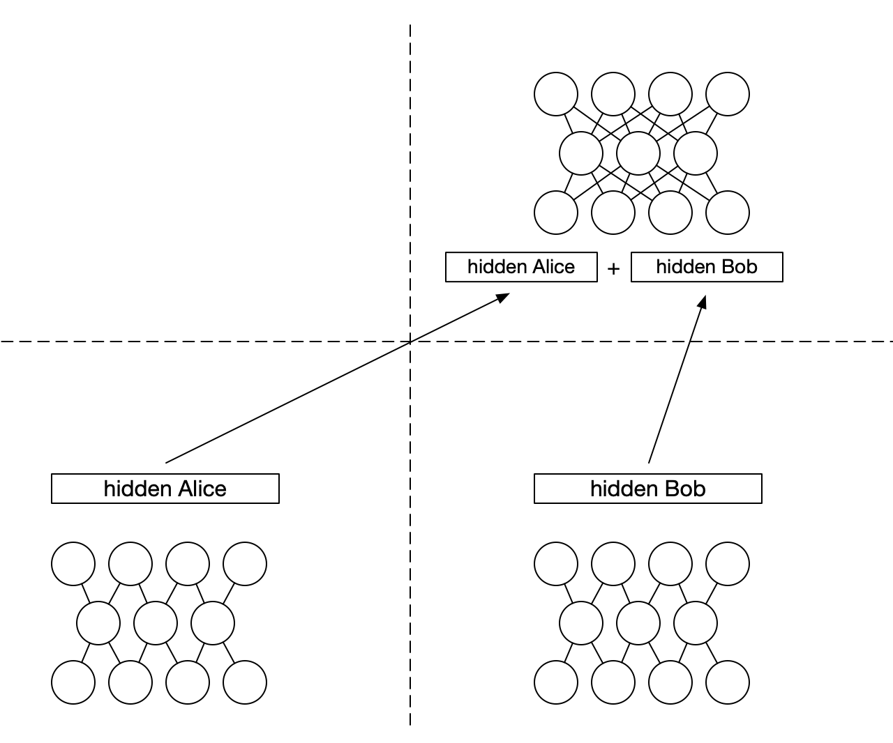
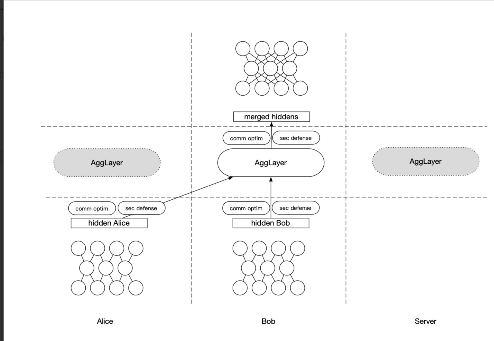
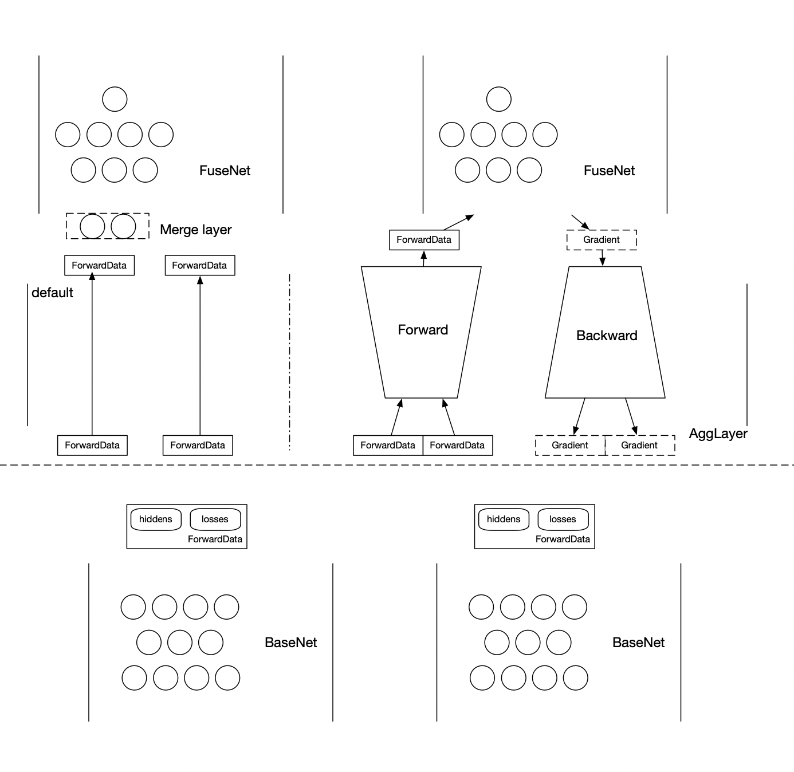

# AggLayer设计文档
AggLayer是隐语联邦学习模块为了增强垂直场景Split learning提出的安全增强模块。
拆分学习的范式决定了多方之间需要进行大量的数据交互，存在潜在的数据泄露风险。需要框架有能力能够保护这部分数据的隐私。
隐语框架一大特性是明密文混合编程，这给了我们可能性去可信密态设备来进行安全加固。

看完本篇教程你将了解:
- AggLayer是什么
- 为什么需要Agglayer
- AggLayer架构设计
- 如何使用AggLayer

**关键词**: 拆分学习，隐私保护，明密文编程
## AggLayer是什么？
AggLayer是隐语拆分学习中的一个功能模块，功能覆盖隐私保护和通信管理。用来管理basenet和fusenet之间交互的部分。
- 隐私保护：在水平联邦学习中有一个安全聚合的概念，在不泄露原始数据的情况下对数据进行聚合和处理。我们将安全聚合迁移到拆分学习，基于隐语的可信密态计算设备，就有了AggLayer。
- 通信管理：在拆分学习中数据传输也是一个很关键的部分，AggLayer会从SLModel中接管数据传输的过程，可以简化训练部分的逻辑的同时，可以把通信部分都收进AggLayer。包括量化、稀疏化等优化策略。

## 为什么需要Agglayer
拆分学习的embedding是裸传的，直接传给有label方来完成fusenet的计算。但是embedding和gradients中的信息量是很大的，需要一种可扩展的机制来解决通信的安全性和通信量问题。
可以统一有server和无server两种拆分学习。
在拆分学习的攻击范式中，有很多攻击方法都需要获取到某一方输出的embedding，或者梯度。增加AggLayer之后，会破坏掉这种攻击范式，减少某一方私有信息的泄露，提升安全性。


## AggLayer架构设计
原有的拆分学习范式

原有方案中没有agglayer这一层，embedding是basenet输出后直接交给有label方，完成后续计算。在这种模式中，我们的聚合逻辑是交给fusenet去做的，明文聚合。聚合逻辑是和fusenet耦合在一起的，所以老的范式中只支持无server的拆分学习。
agglayer设计
我们可以把agglayer交给某一方来做，这一方可以是明文的PYU，也可以是密态的TEEU。

甚至我们的聚合层是一个虚拟的多方设备


# AggLayer接口设计
```python
class AggLayer(object):
    """
    The aggregation layer is situated between Basenet and Fusenet and is responsible for feature fusion, communication compression, and other intermediate layer logic.
    Attributes:
        device_agg: The party do aggregation,it can be a PYU,SPU,etc.
        parties: List of all parties.
        device_y: The party which has fusenet
        agg_method: Aggregation method must inherit from agg_method.AggMethod
        backend: tensorflow or torch
        compressor: Define strategy tensor compression algorithms to speed up transmission.

    """
```
- device_agg：用户可以使用明文PYU来进行聚合，也可以使用SPU，TEEU等。
- parties: 与slmodel共享参与方列表
- device_y: fusenet所在的设备,agglayer完成聚合后，数据流向方。
- agg_method: 聚合方法,继承`agg_method.AggMethod`,可使用内置的builtin方法，也可以进行自定义，自定义用户需要定义清楚forward过程， backward可以进行自动推导得到。
- backend: 框架后端，tensorflow or torch，用于聚合后恢复tensor的类型。

```python
class AggMethod(ABC):
    """Base class of aggregation method for AggLayer
    The object of subclass will be passed into AggLayer for use.
    custum aggmethod should inherit this class, and override 'forward' and 'backward' will use autograd to generated
    Since aggmethod can support secure computation and plaintext computation, please use jax-numpy for development
    """
```
AggMethod是用来定义在聚合方（device-y）上如何进行聚合的逻辑。是AggLayer中最重要的部分。我们提供了三种built-in的聚合方法，分别是Average，Sum，Concat。同时提供了用户自定义的接口。
自定义方法：
- 用户可以根据自己的需要使用`jax.numpy`定义forward和backward的过程。
- 用户可以继承agg_method.AggMethod使用jax.numpy来进行forward的定义，框架会自动推导出backward过程。

为了方便密文设备正确使用agg_method来进行聚合，框架要求用户使用`jax.numpy`来进行forward过程的定义。

### AggLayer中的逻辑链路
- 默认分支：
我们的agglayer为了兼容前序版本的代码，默认的逻辑会直接跳过agglayer，直接把hidden data传给fusenet。旧代码无需修改。由定义在fusenet内部需要定义聚合逻辑，将由定义好的聚合逻辑来进行处理，有label方仍将收到原始的embedding输入（可以通过dp来进行保护）。agglayer不做聚合操作，只负责数据传输。包括压缩，稀疏化等。
- 安全聚合分支：
安全聚合分支将会通过定义的forward过程对hidden feature进行加密，传输，以及聚合逻辑。对backward进行传输解密，反向对gradients进行分拆。这个时候有label方将只会接收到在device_y上使用AggMethod方法聚合过的结果，不会拿到原始的embedding。在fusenet的输入为agglayer的输出聚合结果。


## Agglayer的使用教程

那么如何在隐语的拆分学习中使用AggLayer呢
首先我们来看一下SLModel的接口,从接口可以看出，用户如果想使用agglayer只需要提供`agg_method`即可，其他的参数会和slmodel的参数复用。
默认`agg_method` 为None，agglayer会使用默认分支。如果`agg_method`不为None，agglayer会使用用户提供的方法来进行聚合。
```python
class SLModel:
    def __init__(
        self,
        base_model_dict: Dict[Device, Callable[[], 'tensorflow.keras.Model']] = {},
        device_y: PYU = None,
        model_fuse: Callable[[], 'tensorflow.keras.Model'] = None,
        dp_strategy_dict: Dict[Device, DPStrategy] = None,
        random_seed: int = None,
        backend: str = "tensorflow",
        strategy='split_nn',
        agg_method: AggMethod = None,
        **kwargs,
    ):
        self.device_y = device_y
        self.dp_strategy_dict = dp_strategy_dict
        self.simulation = kwargs.pop('simulation', False)
        self.device_agg = kwargs.pop('device_agg', None)
        self.compressor = kwargs.pop('compressor', None)
        self.base_model_dict = base_model_dict
        self.backend = backend
        self.num_parties = len(base_model_dict)
        self.agglayer = AggLayer(
            device_agg=self.device_agg if self.device_agg else self.device_y,
            parties=list(base_model_dict.keys()),
            device_y=self.device_y,
            agg_method=agg_method,
            backend=backend,
            compressor=self.compressor,
        )
```

### 默认分支
默认分支可以按照之前你的使用习惯，无需考虑agg_method的存在。
我们来看一个例子
定义模型，默认分支的fusemodel需要定义聚合逻辑
```python
def create_fuse_model(input_dim, output_dim, party_nums, input_num, name='fuse_model'):
    def create_model():
        from tensorflow import keras
        from tensorflow.keras import layers

        # ====================在模型中定义如何进行聚合===============
        input_layers = []
        for i in range(party_nums * input_num):
            input_layers.append(
                keras.Input(
                    input_dim,
                )
            )
        merged_layer = layers.concatenate(input_layers)
        # =======================================================
        # user define hidden process logic

        fuse_layer = layers.Dense(64, activation='relu')(merged_layer)
        output = layers.Dense(output_dim, activation='softmax')(fuse_layer)
        # Create model
        model = keras.Model(inputs=input_layers, outputs=output)
        # Compile model
        model.compile(
            loss=['categorical_crossentropy'],
            optimizer='adam',
            metrics=["accuracy"],
        )
        return model

```
在定义slmodel的时候，可以选择不传agg_method，或者传入一个None
```python
    sl_model = SLModel(
        base_model_dict=reload_base_model_dict,
        device_y=device_y,
        model_fuse=model_fuse,
        dp_strategy_dict=dp_strategy_dict,
        simulation=True,
        random_seed=1234,
        strategy="split_nn",
        agg_method=None, # 这一行业可以被注释掉
        compressor=TopkSparse(0.5),
    )
```

### 使用Agglayer
使用agglayer也很简单，只需要注意以下两点。
1. 定义slmodel时，需要传入`agg_method`。
2. fusenet定义的输入是agglayer聚合之后的输出。

定义模型：
```python
def create_fuse_model_agglayer(input_dim, output_dim, name='fuse_model'):
    def create_model():
        from tensorflow import keras
        from tensorflow.keras import layers
        #=================这里只需要按照agglayer的输出定义=============================
        input_layer = keras.Input(input_dim)
        #==========================================================================
        fuse_layer = layers.Dense(64, activation='relu')(input_layer)
        output = layers.Dense(output_dim, activation='softmax')(fuse_layer)
        # Create model
        model = keras.Model(inputs=input_layer, outputs=output)
        # Compile model
        model.compile(
            loss=['categorical_crossentropy'],
            optimizer='adam',
            metrics=["accuracy"],
        )
        return model

    return create_model
```

定义AggMethod

- 使用builtin的`agg_method`
```python
from secretflow.ml.nn.sl.agglayer.agg_method import Average, Sum, Concat
sl_model = SLModel(
    base_model_dict=reload_base_model_dict,
    device_y=device_y,
    model_fuse=model_fuse,
    dp_strategy_dict=dp_strategy_dict,
    simulation=True,
    random_seed=1234,
    strategy="split_nn",
    agg_method=Average(), # 这里也可以换成Sum或者Concat。concat需要注意fusenet的inputdim需要对应调整。
    compressor=TopkSparse(0.5),
)
```

- 使用自定义的`agg_method`
自定义agg_method需要继承`agg_method.AggMethod`
下面给出一个简单的例子，自定义的`agg_method`不需要考虑太多通用的逻辑，只需要能够解决本次的需求就可以了。
聚合需要的参数都可以定义在AggMethod类中。
**需要注意：agglayer中只做数值计算，内部不应该有参数存在。**
```python
class Custom(Method):
    def __init__(self):
        self.input = None
        self.params = None

    def forward(self, *data):
        self.input = data
        jnp_array = [jnp.array(d, dtype=jnp.float32) for d in data]  # Convert input data to float32
        concat_data = jnp.concatenate(jnp_array, axis=1)
        agg_data = jnp.dot(concat_data, concat_data.transpose())
        scalar_output = jnp.sum(agg_data)  # Calculate the sum of the aggregated data
        return scalar_output

    def backward(self, grad_output):
        grad_fun = jax.grad(self.forward,argnums=(0,1))
        gradients_tuple = grad_fun(*self.input)
        def split_array(array, index):
            result = array[:, index]
            return result

        result1 = split_array(a, slice(0, 2))
        result2 = split_array(a, slice(2, None))
        return result1,result2

```
我们的aggmethod定义了autograd的逻辑，目前仅对聚合后的shape和输入shape相同的可以autograd，其他在后续会逐渐补齐。您可先参考本例自行完成backward的逻辑。


# 总结
本文介绍了Agglayer的设计动机，原理和使用方法。AggLayer能够创新性的将安全聚合引入到拆分学习，利用明密文混合编程，使用密态设备来提升拆分学习的安全性。通过密态设备进行聚合，我们可以简化很多算法的安全设计，全面提升拆分学习的安全水位，提升可用性。