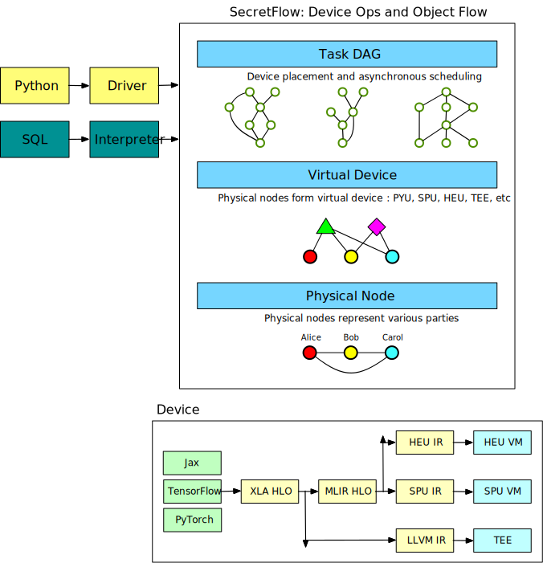
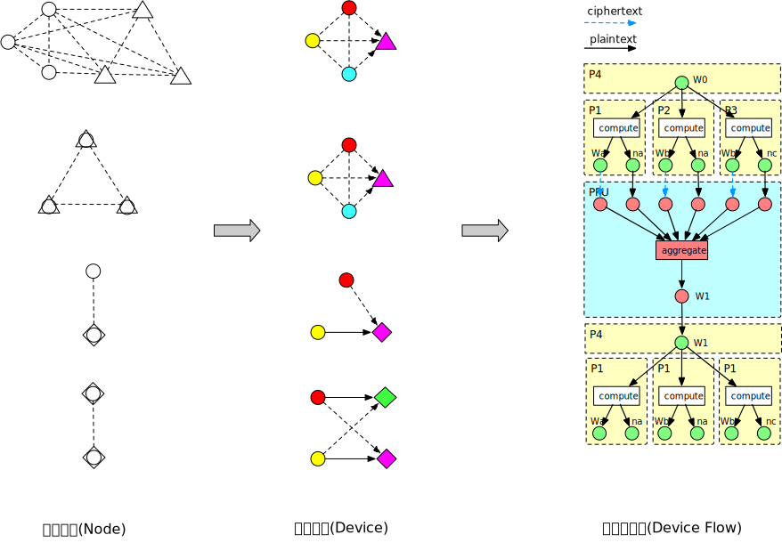
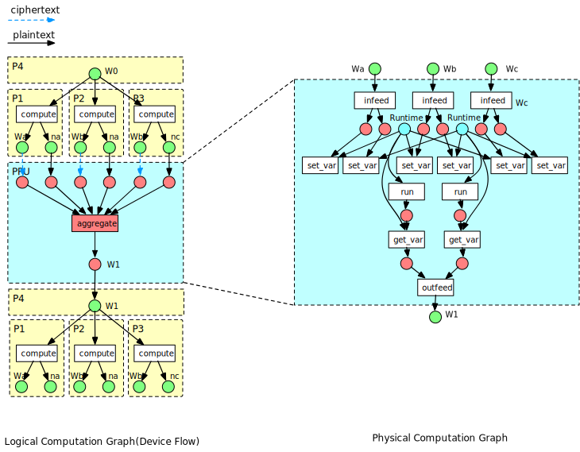

# Architecture

SecretFlow is a unified framework for privacy preserving data analysis and machine learning.



## Design Motivation

privacy-preserving computing is an emerging interdisciplinary field involving cryptography, machine learning, databases, hardware, and other fields.
Based on the practical experience over the past few years, we found that

1. No privacy-preserving computing technology is suitable for all scenarios.
2. Private computing has a high learning curve and is difficult for users from other backgrounds to use.
3. Privacy-preserving computing involves many fields and requires the cooperation of different domain experts.

The design goal of SecretFlow is to make it very easy for data scientists and machine learning developers
to use private computing techniques for data analysis and machine learning without knowing the underlying technical details.
To achieve this goal, SecretFlow provides a layer of device abstraction that abstracts Multi-Party Secure Computing (MPC),
Homomorphic Encryption (HE), and Trusted Execution Environment (TEE) into ciphertext devices.
Based on this level of abstraction, data analysis and machine learning workflows can be represented as a computational graph,
where nodes represent computations on a device and edges represent the data flow between devices.
Data flow between different types of devices requires protocol conversion.
In this regard, SecretFlow borrows from mainstream deep learning frameworks, which represent neural networks as a
computational graph consisting of on-device operators and tensor flows between devices.

SecretFlow is an open framework for developers at different levels. At the device layer, we work with experts in cryptography,
trusted hardware, hardware acceleration and other fields to continuously improve protocol security and computing performance.
At the same time, SecretFlow provides a good device interface, and the third-party privacy-preserving computing protocol can be plugged in as
a device. At the algorithm layer, a flexible programming interface is provided for machine learning, and algorithm developers
can easily define their own algorithms.

## Device

The devices of the SecretFlow are divided into physical devices and logical devices. The physical device is the physical machine
of each participant in the privacy-preserving computing, and the logical device is composed of one or more physical devices. A logical device
supports a specific set of computing operators (Device Ops) and has its own specific data representation (Device Object).
Logical devices are divided into two types: plaintext and ciphertext. The former performs unilateral local computation,
while the latter performs multi-party private computation.

The runtime of a logical device is responsible for memory management, data transmission, operator scheduling and other responsibilities,
and runs on one or more physical devices. There is no one-to-one relationship between logical devices and physical devices,
and a physical device may belong to multiple logical devices at the same time. On the same set of physical devices, different logical devices
can be virtualized according to different privacy protocols and participation combinations.



The following table is a list of devices currently supported by SecretFlow:

| Device         | Type       | Runtime            | Ops          | Protocol      | Frontend                 | Status  |
|----------------|------------|--------------------|--------------|---------------|--------------------------|---------|
| PYU            | Plaintext  | Python Interpreter | —            | —             | Python                   | Release |
| SPU            | Ciphertext | SPU VM             | PSI, XLA HLO | SPDZ-2k, ABY3 | JAX, TensorFlow, PyTorch | Alpha   |
| HEU(PHEU Mode) | Ciphertext | PHEU Runtime       | Add          | Paillier      | Numpy                    | Alpha   |
| HEU(FHEU Mode) | Ciphertext | HEU VM             | XLA HLO      | TFHE          | JAX, TensorFlow, PyTorch | WIP     |
| TEE            | Ciphertext | TEE Runtime        | XLA HLO      | Intel SGX     | JAX, TensorFlow, PyTorch | WIP     |

### Programmability

Logic devices are programmable which users can customize computing logic, and each device provides a protocol-independent programming interface to the user.
On one device, users can define anything from simple matrix operations, to full deep model training, and even arbitrary execution logic, depending on the computing ability provided by the device.

For the plaintext device PYU, its front-end is python, and users can schedule any python function to execute on it through `@device`. These functions are serialized, transported, deserialized by `cloudpickle` and executed by the target device's python interpreter.

For ciphertext devices SPU, HEU, TEE, their front end can be any framework that supports [XLA](https://www.tensorflow.org/xla/architecture), such as JAX, TensorFlow, PyTorch.
Similarly, users can also dispatch functions based on these front-end to a specified device for execution through `@device`.

> Currently, we recommend that you use JAX as the front end. And before using JAX, we strongly recommend that you must read the following documents.
>
> - <https://jax.readthedocs.io/en/latest/notebooks/quickstart.html>
> - <https://jax.readthedocs.io/en/latest/notebooks/thinking_in_jax.html>
> - <https://jax.readthedocs.io/en/latest/notebooks/Common_Gotchas_in_JAX.html> (**IMPORTANT**)

```python
import jax.numpy as jnp

dev = Device()  # maybe PYU, SPU, HEU, TEE


@device(dev)
def selu(x, alpha=1.67, lmbda=1.05):
    return lmbda * jnp.where(x > 0, x, alpha * jnp.exp(x) - alpha)


res = selu(x)  # res is a DeviceObject
```

The user-defined function is first converted into XLA HLO Computation, and XLA performs device-independent code optimization and analysis, and sends it to the back-end device.
The back-end device further performs code optimization and analysis, and generates the final executable code. Executable code or interpreted by the device's virtual machine (SPU, HEU)
, or directly executed by hardware (TEE). Using XLA HLO as IR allows us to reuse XLA front-end and device-independent code optimizations, while making the back-end implementation more concise and clean.

For the ciphertext device HEU, it only supports a limited set of calculations, so a set of predefined operators such as `__add__`, `__mul__`, etc. are provided, and users cannot customize programming through `@device`.

```python
x, y = HEUObject(), PYUObject()
z = x + y  # add
z = x * y  # mul
z = x @ y  # matmul
```

For more details on logical devices, please refer to the design documentation for each device.

### Protocol Conversion

The user performs programming on the logical device and constructs a logical computation graph, where the nodes represent a
segment of functions or operators on the device, and the edges represent the flow of device objects.
The logical computation graph is further divided into subgraphs by the device, and the edge between the
two subgraphs represents the flow of objects across the device. At this time, protocol conversion is required.
`DeviceObject.to` is used to convert to the target device object. Any new device should provide the corresponding conversion function and insert it into the object conversion table.

The following table is the translation table for each logical device object:

|     | PYU         | SPU           | HEU             | TEE                 |
|-----|-------------|---------------|-----------------|---------------------|
| PYU |             | share         | encrypt         | encrypt             |
| SPU | reconstruct |               | encrypt+add     | reconstruct+encrypt |
| HEU | decrypt     | minus+decrypt |                 | decrypt+encrypt     |
| TEE | decrypt     | decrypt+share | decrypt+encrypt |                     |

## Communication and Scheduling

The user builds a logical calculation graph based on the device, so how do we execute this calculation graph?
Since logical devices are mapped to one or more physical devices, we need to correctly schedule operators on
logical devices to their corresponding physical devices, and handle the data transmission relationship
between these physical devices. There is no doubt that we need a distributed graph execution engine to solve these problems.

So what kind of distributed graph execution engine do we need? Here's what SecretFlow's requirements:

- **Fine-grained heterogeneous computing**: In a logical computing graph, there are computing tasks with different granularities, ranging from simple data processing (second level) to complex multi-party training (several hours to tens of hours). At the same time, physical nodes have different hardware environments, such as CPU, GPU, TEE, FPGA, etc.
- **Flexible computing model**: In horizontal and vertical scenarios, for different workflows such as data processing and model training, it supports multiple parallel models, such as data parallelism, model parallelism, and hybrid parallelism.
- **Dynamic execution**: In the federated learning scenario, the data size, bandwidth latency, and machine performance of different institutions may vary greatly, which results in the efficiency of the synchronous mode being limited by the slowest worker nodes. Therefore, we want to support asynchronous training mode, which requires the graph execution engine to have dynamic execution capabilities.

We comprehensively evaluate several popular distributed frameworks in the industry

- [Dask](http://distributed.dask.org/en/stable/)
- [Ray](https://docs.ray.io/en/latest/)
- [TensorFlow Distributed](https://www.tensorflow.org/guide/distributed_training)
- [PyTorch Distributed](https://pytorch.org/tutorials/beginner/dist_overview.html)

In the end, we chose Ray as the distributed engine of SecretFlow, which satisfies the above requirements of SecretFlow very well.
The distributed primitives provided by Ray enable task scheduling and data transfer on logical devices to be easily mapped to physical devices.
The asynchronous scheduling and dynamic execution capabilities provided by Ray make the execution of computational graphs more flexible and efficient.



Ray is a distributed system suitable for LAN environments. To apply it to privacy-preserving computing scenarios, a lot of security
reinforcement and environment adaptation needs to be done. We are in-depth cooperation with Ant Group's Ray team to create a secure and reliable Ray framework suitable for privacy-preserving computing.

In terms of security reinforcement, we have reinforced the framework as a whole by means of identity authentication, code pre-installation, and code storage. In the future, we will also explore mechanisms such as sandbox isolation, access control, and static graphs to further strengthen Ray's security level. In terms of environment adaptation, in order to adapt to the characteristics of cross-organization network communication, we have promoted the development of related functions such as GCS gRPC communication, domain name support, and weak network disconnection handling. At the same time, we are also exploring the use of Ray ecosystem, such as Mars, Ray Datasets, Ray Train, etc., in privacy-preserving computing scenarios.

## Privacy Preserving Algorithm

The abstraction of logical devices provides great flexibility for algorithm developers. They can freely combine these devices like building blocks,
and customize computations on the devices to build their own privacy-preserving computing algorithms.

Here are some algorithms built by our device programming model:

- Logistic regression, deep learning training on SPU, HEU.
- Build [HESS-LR](https://dl.acm.org/doi/10.1145/3447548.3467210), [HESS-XGB](https://dl.acm.org/doi/10.1145/3459637.3482361) with a combination of SPU, HEU.
- In horizontal federated learning, do local training in PYU, and do gradient and weight aggregation in SPU and TEE.
- In vertical split learning, splitting a model into multiple PYUs, using differential privacy to protect forward hidden layers and reverse gradients

For the details of these algorithms, please refer to our tutorials and implementations, and look forward to your developing more interesting algorithms based on SecretFlow!
