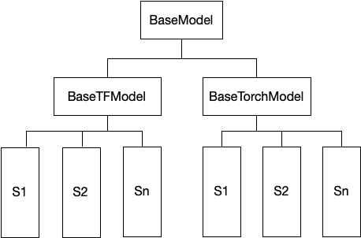

# FLModel Design
FLModel is the logical abstraction of federated learning provided by SecretFlow, and it is also a unified interface for users. FLModel encapsulates various capabilities required under the federated learning framework, including data processing, training strategies, aggregation logic, etc. SecretFlow provides a user-friendly interface, so that users can easily and quickly transfer existing plaintext computing models through the FLModel interface to quickly form federated learning capabilities through simple migration , a joint multi-party establishment of joint models with low learning cost.
## Design Principles
1. The federated logic layer provides a lingo user API, provides a unified interface, shields the underlying differences, and simplifies user learning costs
2. The use of the interface conforms to user habits. Users only need to migrate the existing code without modifying the original code.
3. Parameterized configuration of backend, strategy, sampler and other federated model configurations to simplify user experience
4. Supports Torch, Tensorflow multiple backends, and the programming experience of different backends is consistent. 
## Architecture
SecretFlow provides the FLModel module from a centralized perspective. The overall logic flow of the federation is choreographed by FLModel. FLModel determines which workers are based on the parameters, and those backends will cooperate to complete the federation calculation.


example：
```python
fed_model = FLModel(
    server=charlie,
    device_list=[alice,bob],
    model=model_def,
    aggregator=secure_aggregator,
    strategy="fed_avg_w",
    backend = "tensorflow")
```
Tell FLModel through parameters that I want to use alice, bob, and charlie for calculation, where charlie is used as server, the backend uses tensorflow for calculation, and fed_avg_w is used for federated learning strategy.
  
strategy reference: [strategy document](../design/strategy.md)
  
## model definition
The model definition in FLModel is basically the same as the plaintext. The user's original plaintext code can be migrated to FLModel through `Ctrl+C`, `Ctrl+V` to become a federated model.
eg:  
tensorflow backend
```python
def create_conv_model(input_shape, num_classes, name='model'):
    def create_model():
        from tensorflow import keras
        from tensorflow.keras import layers

        # Create model
        model = keras.Sequential(
            [
                keras.Input(shape=input_shape),
                layers.Conv2D(32, kernel_size=(3, 3), activation="relu"),
                layers.MaxPooling2D(pool_size=(2, 2)),
                layers.Conv2D(64, kernel_size=(3, 3), activation="relu"),
                layers.MaxPooling2D(pool_size=(2, 2)),
                layers.Flatten(),
                layers.Dropout(0.5),
                layers.Dense(num_classes, activation="softmax"),
            ]
        )
        # Compile model
        model.compile(
            loss='categorical_crossentropy', optimizer='adam', metrics=["accuracy"]
        )
        return model

    return create_model

num_classes = 10
input_shape = (28, 28, 1)
model_def = create_conv_model(input_shape, num_classes)
```

```python

class ConvNet(BaseModule):
    """Small ConvNet for MNIST."""

    def __init__(self):
        super(ConvNet, self).__init__()
        self.conv1 = nn.Conv2d(1, 3, kernel_size=3)
        self.fc_in_dim = 192
        self.fc = nn.Linear(self.fc_in_dim, 10)

    def forward(self, x):
        x = F.relu(F.max_pool2d(self.conv1(x), 3))
        x = x.view(-1, self.fc_in_dim)
        x = self.fc(x)
        return F.softmax(x, dim=1)
model_def = TorchModel(
            model_fn=ConvNet,
            loss_fn=nn.CrossEntropyLoss,
            optim_fn=optim_wrapper(optim.Adam, lr=5e-3),
            metrics=[
                metric_wrapper(Accuracy, num_classes=3, average='micro'),
                metric_wrapper(Precision, num_classes=3, average='micro'),
            ],
        )

```  
FLModel will send these parameters to the strategy dispatcher, and the dispatcher will pull up different instances according to these parameters. Pytorch or tensorflow will only have differences in the lowest implementation layer, and the logic layer of FLModel will be unified, and users do not need to perceive the difference. FLModel will logically ensure the consistency of pytorch and tensorflow experience.

## Demo
tensorflow backend: [Federated learning for image classification](../../tutorial/Federate_Learning_for_Image_Classification.ipynb)  
pytorch backend: [Federated learning with pytorch backend](../../tutorial/Federated_Learning_with_Pytorch_backend.ipynb)  

## API
### Fit
The fit interface is the training interface of FLModel, which supports FedHDataFrame, FedNdarray, and csv path reading.  
The return value is a history object, which contains the index details and loss changes during the training process.  
At the same time, fl_model is the result after training, and can be evaluated, predict, etc. on this basis.  
### Evaluate
Evaluate is an offline evaluation interface.   
Users can pass in the HDataFrame or FedNdarray to be evaluated by each party.
The return value will be two objects `local metrics` and `global_metrics`.
### Predict
Predict is an offline prediction interface.  
 The user passes in the HDataFrame or FedNdarray to be predicted by all parties.
The return value is a `Dict<PYU,PYUObject>`, where PYUObject is the prediction result stored on each party, and the plaintext can only be seen after the parties agree to be revealed
### Load_model
load model is the model loading interface   
model_path supports str or Dict. If it is str, the default storage location of each party is the same, and the path pointed to by str on each party.
is_test: Whether the mark is a stand-alone simulation, if it is a stand-alone simulation, a first-level device directory will be added to the model_path to show the difference
### Save_model
save model is the model storage interface
model_path supports str or Dict. If str is the default storage location of all parties, the path pointed to by str on each party.
is_test: Whether the mark is a stand-alone simulation, if it is a stand-alone simulation, a first-level device directory will be added to the model_path to show the difference


## Multiple Backend Support
+ SecretFlow provides the base class of BaseModel, which defines a set of methods required by workers in federated scenarios for FLModel to use in process orchestration.
+ Specific TorchModel and TensorFlowModel will use their own engine-specific API to implement these methods.
+ Each strategy further down will implement its own train step and other related strategies.
+ FLModel will use the strategy dispatcher to pull up specific instance workers to complete the calculation.

