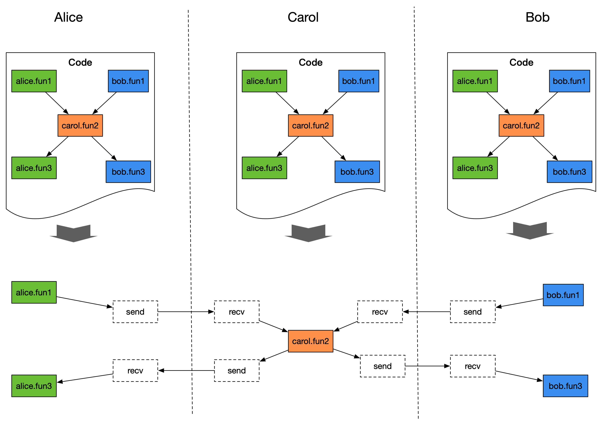
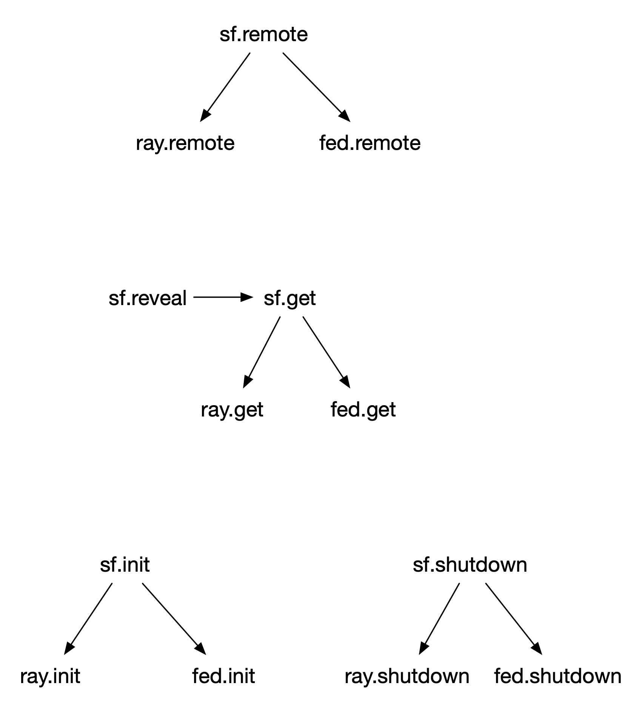

# Programming in SecretFlow

## Single-controller vs Multi-controller
Secretflow aims to provide privacy-preserving machine learning and data analysis. The scenarios it faces are naturally across-silo distributed. Providing an efficient and concise programming model is one of the main challenges SecretFlow faces.

The two common distributed programming ideas can be mainly classified into two modes.
- The first mode is what we call multi-controller. That is, developers need to write code for each participant separately, 
And usually through MPI semantics (such as all_gather, all_reduce, etc.) to communicate. 
Each participant executes its own code to complete the collaborative task. For example, SPU of SecretFlow is such a mode.
- The second mode is what we call single-controller. That is to say, the developer has a global perspective.
The code logic of each participant is written in the same code, and only one copy of the code needs to be run.
The task distribution mechanism (such as ray's remote mechanism) is used to uniformly manage the participants' execution logic. 
A typical example is ray, which provides a driver perspective with a remote mechanism, 
and users can write distributed code from a global perspective.

Both modes have their own advantages and disadvantages, and there is no absolute good or bad. 
Here are some of our experiences so far:

Multi-controller mode
- Advantages
    - Suitable for scenarios where the code logic is homogeneous.
    - Participants can review the code and decide whether to execute it.
- Disadvantages
    - Not friendly to heterogeneous code logic scenarios. Logic is scattered in different code blocks, lacking a global perspective, which may make code hard to read and understand.

Single-controller mode
- Advantages

    It is suitable for scenarios with homogeneous and heterogeneous code logic both.
- Disadvantages

    Rely on the code delivery mechanism, which may bring security vulnerabilities. On the one hand, it is difficult for participants to review codes, and on the other hand, it is difficult to prevent malicious code execution.

SecretFlow is a mixed programming framework for various scenes, that means homogeneous and heterogeneous code logic exist both. Inspired by ray, SecretFlow uses the single controller mode to write code. However, as mentioned above, the single-controller mode has potential safety hazards, and it is not easy to solve. So the question is, can we take into account both single-controller and multi-controller modes at the same time, and take advantage of each? The answer is yes, this is the programming idea to be discussed below - single controller programming, multi-controller execution.

## Multi-controller Execution
### The Principle
The key idea of multi-controller execution is that each participant runs the same code, but only executes its own part of the code.

If we regard the code logic as a DAG (directed acyclic graph), each node of the DAG represents a piece of code logic belonging to a certain participant, and the edges represent the data flow between different nodes, then the principle of multi-controller execution can be as the picture shows.

In order to achieve this goal, each node of the DAG is marked with a party. When the code is executed, the party attribute is used to determine the owner of the node and determine whether it needs to be executed.
- Situation 1

    If the node belongs to the participant, execute the node. If the input dependency of the node comes from other parties, insert the recv node to wait for receiving from other parties.

- Situation 2

    If the node does not belong to the participant, then judge whether the input dependency of the node comes from itself; if it comes from the participant, insert the send node and send it to the owner of the node.



In principle, multi-controller execution requires that the control flow of the code be deterministic. When each party executes the same code, it should generate exactly the same DAG. This is a prerequisite for the correct execution of multi-controller mode.

In order to ensure this, it also brings some requirements to programming, which will be mentioned in detail later.

### Cross-silo Communication

In the current implementation of cross-sil communication, each node of the DAG will be sequentially marked with a serial number, and send/recv will ensure the correctness of data sending and receiving according to the serial number of the node. This design is mainly to simplify cross-silo communication, but also introduces some restrictions, such as the control flow itself cannot be multi-threaded (otherwise, cross-silo distributed serial number generation will be wrong).

### Implementation
Welcome to [rayfed](https://github.com/secretflow/rayfed).

### Instructions

The usage of multi-controller execution is relatively simple. You only need to provide the communication address of each participant at the time of secretflow.init, and specify the current participant.

**Example**

For the participant alice, the startup code is as follows.

```python
import secretflow as sf

cluster_config = {
    'parties': {
        'alice': {
            'address': '127.0.0.1:10001',
        }
        'bob': {
            'address': '127.0.0.1:10002',
        },
    },
    'self_party': 'alice'
}
sf.init(cluster_config=cluster_config)
```

Correspondingly, the participant bob starts as follows.

```python
import secretflow as sf

cluster_config = {
    'parties': {
        'alice': {
            'address': '127.0.0.1:10001',
        },
        'bob': {
            'address': '127.0.0.1:10002',
        },
    },
    'self_party': 'bob'
}
sf.init(cluster_config=cluster_config)
```

### Programming Notes
The multi-controller execution mode implicitly requires that the DAG executed by each party is deterministic, which brings some programming requirements.

1. Avoid uncertainty in the control flow, that is, no matter when and where the control flow is executed, the execution graph generated by it should be consistent.
    - We cannot directly generate random numbers in the control flow, or rely on certain environmental factors (such as whether a certain file exists), we need to ensure that the driver code is deterministic. For example, in the control flow of `FLModel`, there is a practice of generating random numbers as seeds. An alternative is to have one party generate a random number and broadcast it to other parties.
2. Unittest

    There are more cases encountered in the unit tests. At present, multi-process is used to simulate multiple participants in the unit test, but since the code is executed on the same machine, more corner cases will be encountered. E.g.
    - The driver generates temporary files and then deletes them. Conflicts may occur during multi-process simulation.-> Solution: Let PYU generate/delete files.
   - The driver generates a random ndarray -> Solution: Let PYU generate and return.
   - SecretFlow has some built-in data sets, which will be written to the local cache file when downloaded. Write conflicts will occur during multi-process simulation -> Solution: introduce cross-process file locks.
   - Some unit tests will construct an exception case, and then assertRaiseException. If alice throws an exception during execution, the subsequent nodes of alice will not execute, and bob may not be able to know the exception. -> **To be resolved, rayfed does not yet have the ability to broadcast exceptions.** At present, this kind of case is temporarily commented out.
   - The spu provides a reset method, which will stop the existing spu actor, and then restart it. It is mainly used for some testcases that make an error in constructing the spu and need to clear the state of the spu. Due to the multi-process simulation execution, after the spu actor of one party stops and restarts, the spu actor of the other party may not restart, and then the old spu actor connects the new spu actor unexpectedly. -> **to be resolved** (the number of cases is less than 5)
3. `sf.remote` does not currently support the decorator mode. It will be added later. Currently, `sf.proxy` can be used to decorate classes.


## Single Controller Execution
Multi-controller execution needs to start multiple ray clusters, and debugging is more difficult than single-controller mode. For the convenience of simulation, SecretFlow still supports single-controller execution mode, that is, users can still use a ray cluster to simulate multiple participants.

**The single controller implementation remains unchanged from the original, and the code does not need any modification.**

The usage the single controller is very simple. You only need to provide the `parties` parameter when `secretflow.init`. For the specific usage method, please refer to :py:meth:`~secretflow.driver.init`.


The bottom layer of SF encapsulates two sets of primitives, ray and rayfed, which are unified into one.

