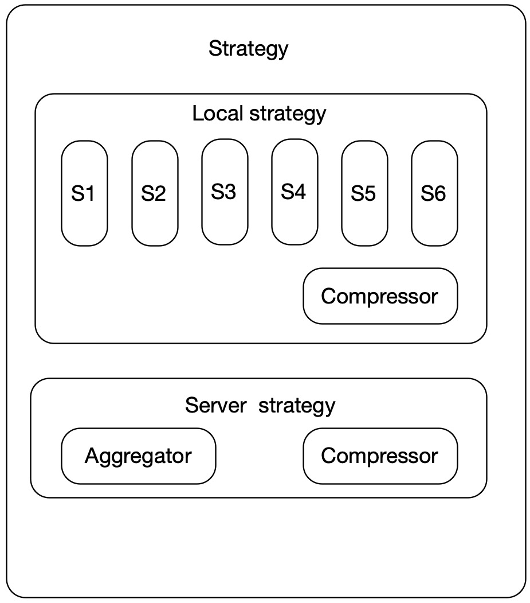

# Strategy Design
## What is Strategy?
The federated learning strategy is the key difference between federated learning and conventional distributed machine learning, and it is critical to the effect of model training. Strategy is mainly composed of two parts in federated learning. One part is the local training strategy of the local part, which includes the control of the loss function (how to align the server side, etc.), how to transmit gradients or parameters upstream; the second part is the server part, It includes how to aggregate gradients or parameters uploaded by Clients, how to update them, and how to distribute them downstream.
SecretFlow encapsulates a layer of Strategy under FLModel to control the learning strategy of the model in federated scenarios. The lingo provides Strategy Zoo, which currently supports various strategies covering Non-iid and communication optimization, and is constantly updated iteratively. Users Just pass the alias names of different strategies ("fed_avg_w", "fed_avg_g", "fed_prox", "fed_scr", etc.) to complete the call. At the same time, the Strategy framework supports the development, registration, and use of user-defined strategies.

## The positioning and characteristics of SecretFlow's Strategy
1. Pull up different Workers according to the strategy name
2. Define how to perform local calculation in Worker, which parameters (g/w) to upload after calculation, whether to compress, etc.
3. In FLModel, how to calculate on the server side is determined according to the strategy name.
4. Provide a user-friendly interface for users to develop a new strategy for the second time. Users only need to define train_step and provide aggregation logic to complete the development of the strategy. At the same time, only one line of code is required for the user to complete the registration.

## Architecture diagram
Strategy consists of three parts
+ The calculation logic of the local part of the train step, and the tensor content that needs to be transmitted
+ Compression method for upstream and downstream data transmission
+ Aggregation logic in server part

Our secretflow framework also provides a friendly advanced development interface for high-level advanced developers, which can be easily extended to new custom strategy
## Using Built-in Strategy
Using the built-in Strategy is very straightforward and simple, the user only needs to pass the name of the strategy method they want to use into "FLModel".
Currently provided strategies (continuously updated):

```python
fed_model = FLModel(
    server=charlie,
    device_list=device_list,
    model=model,
    aggregator=secure_aggregator,
    strategy="fed_avg_w", # Just pass the strategy name to strategy
    backend = "tensorflow")
```

## Custom Strategy
A custom strategy takes just a few steps
1. local train strategy
2. server aggragate strategy （not supported）
3. compressor strategy
4. register strategy
### The local strategy 
The local strategy in SecretFlow is a framework on top of fl_base, inherits all the properties and methods of BaseModel, and provides local calculation logic dedicated to a specific strategy

```python
class FedCustom(BaseTFModel):
    """
    FedAvgW: A naive implementation of FedAvg, where the clients upload their trained model
    weights to the server for averaging and update their local models via the aggregated weights
    from the server in each federated round.
    """

    def train_step(
        self,
        weights: np.ndarray,
        cur_steps: int,
        train_steps: int,
        **kwargs,
    ) -> Tuple[np.ndarray, int]:
        """Accept ps model params, then do local train

        Args:
            updates: global updates from params server
            cur_steps: current train step
            train_steps: local training steps
            kwargs: strategy-specific parameters
        Returns:
            Parameters after local training
        """
    	# Do local training

        return model_weights, num_sample
```

### compressor definition
Define strategy tensor compression algorithms to speed up transmission.
Add the strategy short name you need compress on downlink stage to COMPRESS_STRATEGY, and FLModel will control whether to perform compression when downlinking to the client after aggregation.
Client-to-server upstream stage compression can be done in your local training strategy.
```python
COMPRESS_STRATEGY = ("fed_stc", "fed_scr")


def stc_compress(compressor, server_weights, agg_updates, res):
    def _add(matrices_a: List, matrices_b: List):
        results = [np.add(a, b) for a, b in zip(matrices_a, matrices_b)]
        return results

    def _subtract(matrices_a: List, matrices_b: List):
        results = [np.subtract(a, b) for a, b in zip(matrices_a, matrices_b)]
        return results

    if res:
        agg_updates = _add(agg_updates, res)
    sparse_agg_updates = compressor(agg_updates)
    res = _subtract(agg_updates, sparse_agg_updates)
    server_weights = _add(server_weights, sparse_agg_updates)
    return server_weights, sparse_agg_updates, res
```

### register strategy

```python
@register_strategy(strategy_name='fed_custom_name', backend='tensorflow')
@proxy(PYUObject)
class PYUFedCustom(FedCustom):
    pass

```

Until now, the development of custom strategy is completed. You can pass the short name of new strategy into the strategy field of FL_Model to enable the new federated learning strategy.