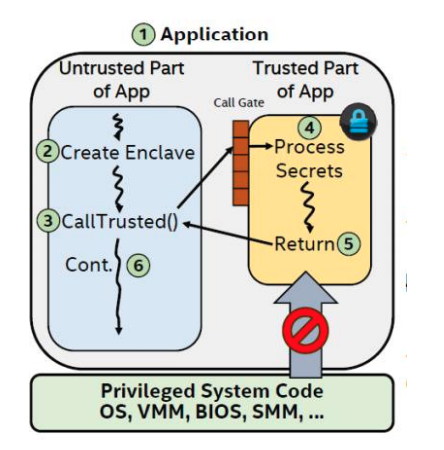
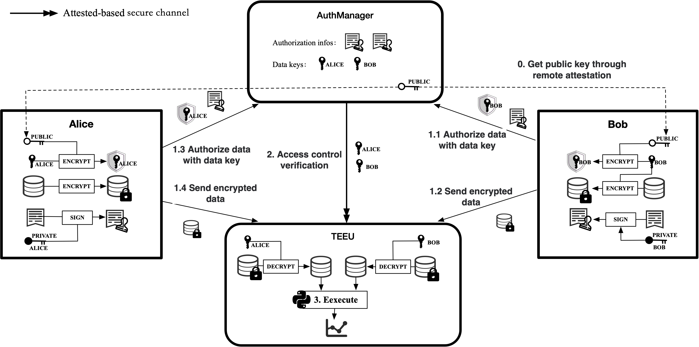
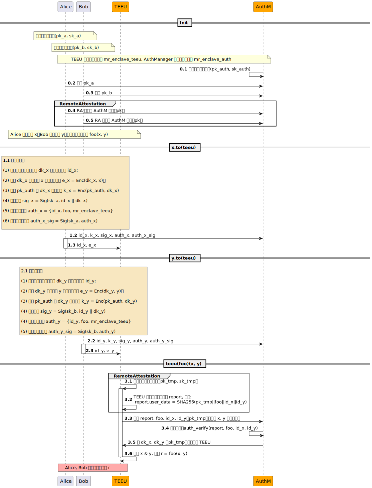
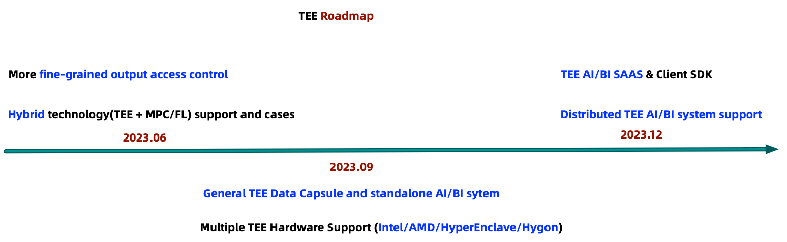

# TEEU
## Introduction to TEE
Trusted Execution Environment (TEE) is a hardware-based privacy preserving technology. It ensures the authenticity of executing code, the integrity of runtime state (such as CPU registers, memory, and sensitive I/O), and the confidentiality of code, data, and runtime state stored in memory. In addition, it should be possible to provide remote attestation to third parties to prove its reliability.

At present, there are many privacy-preserving computation techniques, such as Multi-Party secure Computing(MPC), Homomorphic Encryption(HE), Federated Learning(FL), and TEE. MPC, HE, and TEE all have relatively clear security models that can protect data privacy during computation. Among them, MPC and HE are mainly based on pure cryptography theory, which has the advantage of provable security, but due to relying on a large number of complex calculations, resulting in low computing performance, it is currently difficult to use in large-scale scenarios. TEE is a solution based on secure hardware, which has the advantages of good versatility and supports large-scale computing, but the disadvantage is that it needs to rely on hardware.

TEE itself also has a variety of implementations (such as Intel SGX, Intel TDX, Arm TrustZone, Arm CCA, AMD SEV, Hygon CSV, etc.), and its principles are slightly different. At present, SecretFlow mainly supports Intel Software Guard Extensions(SGX) 2.0, so we will take SGX as an example to briefly introduce the principle of TEE.

### SGX: Enclave
Enclave can be regarded as the secure and trusted part of a process, where the confidentiality and integrity of the running programs and data are protected by SGX. The memory which Enclave resides in is encrypted, and other system software, including the Operating System (OS), Virtual Machine Monitor (VMM), System Management Mode (SMM), and BIOS, cannot access enclave except for itself and the CPU, thus preventing malicious attacks on enclave. 

The yellow part in the diagram below represents enclave. As shown, in the standard SGX model, applications are divided into trusted and untrusted parts, with enclave being the trusted part and the code and data running outside being the untrusted part.



For a more detailed introduction to enclave, you can read [SGX Enclave](https://www.intel.com/content/dam/develop/external/us/en/documents/overview-of-intel-sgx-enclave-637284.pdf)

### SGX: Remote Attestation
Remote attestation provides a way to allow a remote user to verify the genuineness of software in a remote process.

Remote attestation can verify the following:
1. The enclave runs inside SGX;
2. The enclave runs on a system with the latest security level;
3. The enclave code

Through remote attestation, users can ensure that the enclave  is reliable and the running code has not been tampered with.

Currently SGX supports two types of remote attestation: ECDSA (Elliptic Curve Digital Signature Algorithm) attestation and Intel EPID (Intel Enhanced Privacy ID ) attestation. Among them, ECDSA needs to be used together with Intel SGX DCAP (Intel Software Guard Extensions Data Center Attestation Primitives). The third-generation Intel Xeon Scalable and some Xeon E3 processors support ECDSA attestation, and some Intel Core, Intel Xeon E, and Intel Xeon E3 processors support EPID attestation.

SecretFlow currently only supports ECDSA attestation mode.
### LibOS: Occlum
In the native SGX programming model, applications are divided into trusted (enclave) and untrusted parts. For security reasons, enclaves are not allowed to directly execute system calls. This means that for an application to run on SGX, the original code needs to be divided into trusted and untrusted parts, and the trusted part cannot make system calls. Although SGX provides a dedicated SDK to help developers write SGX programs, it is still a big burden to migrate existing applications to run on SGX, because most of the existing applications cannot be run directly and need to be modified more or less. It may even be difficult to change successfully.

Based on the above background, LibOS is used to run applications on SGX. LibOS (Library OS) provides some capabilities of the system kernel (such as file I/O, network communication) to applications in the form of libraries. Applications run in enclave with LibOS as backend. This allows existing applications to run on SGX with little or no modification. Currently, relatively mature LibOS are [Occlum]( https://github.com/occlum/occlum ), [Gramine]( https://github.com/gramineproject /gramine ) etc. SecretFlow chooses Occlum as the base LibOS.
## TEEU
TEE provides a good security model and supports large-scale high-performance computing, which is one of the indispensable routes for privacy-preserving computing. However, TEE still has the problem of high difficulty in getting started, and its ease of use has not been as simple and easy to use as non-TEE. In order to provide users with easier-to-use TEE capabilities, as well as basic privacy-preserving computing capabilities, SecretFlow has incorporated TEE into the technical route from the beginning of the design, providing TEE device as the basic device for mixed plaintext and ciphertext programming.

TEE processing Unit(TEEU) is one kind of devices in ciphertext state, which is designed to run python programs. Users can encrypt data and send it to TEEU through the interface provided by SecretFlow, so that TEEU can perform secure calculations on data in TEE. By shielding the underlying details (such as remote attestation, data encryption and transmission), and providing data access authorization control semantics, TEEU makes it as simple as possible for users to use TEE without reducing its security.

It should be noted that currently the data sent by the user to the TEEU is encrypted and only decrypted inside the TEEU for calculation, **but the final calculation result is output in plaintext.** Therefore, when using TEEU for calculation, please make sure that the plaintext of the calculation result is acceptable to you, otherwise it is recommended to use it with caution. The security and access control of calculation results will be added in subsequent versions, please continue to pay attention to our updates.
### Overall Architecture
The following figure shows the overall architecture and links of TEEU, taking Alice and Bob to use TEEU for integrated security computing as an example.
The figure describes that Alice and Bob send their respective data to TEEU, and authorize TEEU to perform specified calculations on the data (python code). Its general process can be described as:
1. The data of Alice/Bob will be sent to TEEU in encrypted form to ensure data security.
2. The data encryption key of Alice/Bob is hosted by Authority Manager(AuthManager), which is an application running in TEE and provides data access control services. In addition to providing the data encryption key to the Authority Manager, Alice/Bob will also attach the TEEU identity (MRENCLAVE) that can access the data and the calculation logic (python code) that allows execution.
3. Before TEEU executes the python code, it will access the Authority Manager to obtain the data key and the python code signature that the data is allowed to execute. Only when the received python code is consistent with the authorized python code, TEEU will finally execute the python code.

In the above process, each step is based on the remote attestation mechanism of SGX, and the running Authority Manager and TEEU are authenticated to ensure security, which will be introduced in detail later.


### Principle Introduction
The figure below is a detailed description of TEEU.



We will explain the above flow in detail using a sequence diagram.



#### init

Alice and Bob each hold a pair of public and private keys, and the secure measurement (MRENCLAVE) of AuthManager and TEEU can be calculated through the source code.

In the initialization phase, AuthManager will generate a pair of public and private keys (0.1) at startup; Alice/Bob will inject the public key into AuthManager (0.2-0.3), which will be used by AuthManager to verify the signature of data authorization; Alice/Bob will obtain the public key of AuthManager through remote attestation(0.4-0.5).

#### x.to(teeu)

1.1. Data preparation

>(1) Randomly generate encrypted data key dk_x and data identifier id_x;<br>
(2) Use dk_x to encrypt data x to obtain encrypted data: e_x = Enc(dk_x, x);<br>
(3) Use pk_auth to encrypt dk_x: k_x = Enc(pk_auth, dk_x);<br>
(4) Calculate the signature: sig_x = Sig(sk_a, id_x || dk_x);<br>
(5) Generate data authorization: auth_x = {id_x, foo, mr_enclave_teeu};<br>
(6) Sign the authorization information: sig_auth_x = Sig(sk_a, auth_x)


1.2 Send k_x, sig_x, auth_x, sig_auth_x to AuthManager

1.3 Send id_x and encrypted data e_x to TEEU

#### y.to(teeu)

The process is similar to **x.to(teeu)** (2.1-2.3)

#### teeu(foo)(x, y)

3.1. TEEU randomly generates a temporary public-private key (pk_tmp, sk_tmp), which is used as a temporary key for subsequent communication with AuthManager.

3.2. TEEU generates a remote attestation report `ra_report`, the user-defined field `ra_report.user_data` in the report is set to SHA256(pk_tmp || SHA256(foo) || id_x || id_y).

3.3. TEEU sends the report `ra_report`, the randomly generated public key `pk_tmp`, the hash of the function to be executed `SHA256(foo)`, and the ID of encrypted data x, y (`id_x`, `id_y`) to AuthManager to request the decryption key of x, y.

3.4. AuthManager will verify whether the report and the hash  of the function to be executed satisfy the authorization information of x, y (see `AuthVerify` for the verification process).

>AuthVerify<br>
(1) According to id_x, the following information k_x, sig_x, auth_x, sig_auth_x, pk_a are found.<br>
(2) Use sk_auth to decrypt k_x to get dk_x.<br>
(3) Use pk_a to verify the signature, SigVerify(pk_a, sig_x, id_x || dk_x).<br>
(4) Use pk_a to verify the signature, SigVerify(pk_a, sig_auth_x, auth_x), the combination of this step and step (3) can show that the authorization information is generated by Alice, not forged, because only Alice knows dk_x.<br>
(5) Verify that foo is in auth_x.<br>
(6) Verify ra_report and confirm whether ra_report.mr_enclave is in auth_x.<br>
(7) Repeat operations (1)-(6) for id_y.<br>

3.5. After the AuthManager passes the verification, encrypt and transmit dk_x, dk_y to TEEU with pk_tmp.

3.6. TEEU decrypts x & y, execute the function: r = foo(x, y).
### Module Introduction
#### AuthManager
How to protect user data privacy while using data reasonably? Usually start from two aspects:
1. The calculation of data is all run in the TEE environment to ensure privacy.
2. The user who uploads the data authorizes the data to ensure that only operators that meet the authorization semantics in the TEE environment can use the data.

AuthManager is just to solve data authorization, it has the following characteristics:
1. Run in the TEE environment, and the user who uploads the data performs remote attestation to ensure that the AuthManager has no malicious behavior.
2. Network communication uses signatures or mac, digital envelopes, etc. to prevent communication data from being tampered with, and supports mtls communication.
3. Flexible authorization semantics
4. The data encryption key (data key) and meta-information are managed by AuthManager. TEEU must communicate with AuthManager to verify authorization to obtain the key, ensuring that the authorization semantics cannot be bypassed

See [AuthManager]( https://github.com/SecretFlow/authmanager ) for the code of AuthManager.
##### Term
Institution (institution id): The user side that uploads data, in this case PYU.

Authorized application (application): A complete program, here is TEEU, usually measured by mr_enclave.

Authorization function (func): The function actually executed in the program, here is the python code executed by TEEU.
##### Secure communication
Digital envelope: AuthManager self-generates public and private keys, PYU uses the public key to encrypt data, and AuthManager uses the private key to decrypt data. In order to prevent the public key from being tampered with, the report data returned by AuthManager to RA contains public key information, and the public key is guaranteed to be correct through the TEE mechanism.

mtls communication: an optional function, which requires AuthManager and PYU to generate certificates before it can be used normally
##### Authorization Semantics
Granularity: authorization institution id + authorization application app (mr_enclave) + authorization function func (stateless)

Since AuthManager is here to authorize for TEEU, TEEU is not an institution, so the authorization semantics here are: authorization application app (mr_enclave) + authorization function func (stateless)
##### Storage Model
Provides the abstraction of the storage storage layer, currently supports inmemory and remote
1. inmemory: memory storage, no persistence function, encrypted by TEE memory mechanism to prevent leakage
2. remote: remote storage, persistent, http service access (but you need to deploy storage services yourself), all data needs to be encrypted before storing to prevent leakage
#### TEEU
Here TEEU refers to the SGX program that actually executes the python code.
TEEU runs in Occlum as an actor of ray, and its core function is to execute python code under the condition of guaranteeing compliance with authorization semantics.
The workflow of TEEU is relatively simple, mainly including:
1. Receive the python method and related parameters provided by the user.
2. According to the authorization semantics of AuthManager, request the encryption key of parameter data from AuthManager. If the relevant data is not authorized for use by the corresponding code, the acquisition will fail.
3. Use the data key to decrypt the data and obtain the plaintext of the data, and execute the python method.

Because TEEU runs as an SGX program, data security during execution can be ensured. At the same time, users can remotely authenticate TEEU to ensure that the TEEU code has not been tampered with.
##### Limitations
Currently, SecretFlow uses Occlum as the base LibOS，which supports python3.8 and supports running some common python libraries, but there are still some python libraries that cannot run in Occlum. For example, some programs cannot be run directly without modification, or use system calls/kernel functions that Occlum does not support for the time being.

In addition, since Occlum does not support virtual memory at present, for the program, all the requested memory will be regarded as the actual used memory, so the performance of the program running in Occlum may be different from that in the ordinary OS, such as the memory usage will increase significantly.

If you encounter an error during operation, you can contact us through issue.
### Explanation of sample code
In this section, we combine the demo code to explain what happens behind TEEU. The demo code is as follows (how to run the demo code can refer to [teeu quick start]( ../../tutorial/teeu.md )).

```python
import numpy as np

def average(data):
    return np. average(data, axis=1)

Alice = sf.PYU('Alice')
Bob = sf.PYU('Bob')
teeu = teeu('carol', mr_enclave='mr_enclave of TEEU')
a = Alice(lambda np.random.rand(4, 3))()
b = Bob(lambda np.random.rand(4, 3))()
a_teeu = a.to(teeu, allow_funcs=average)
b_teeu = b.to(teeu, allow_funcs=average)
avg_val = teeu(average)[a_teeu, b_teeu])
print(sf. get(avg_val))
```

1. Lines 7-8 construct PYU instances of two participants, Alice and Bob.
2. Line 9 constructs an instance of TEEU, which is held by the participant carol.
3. Lines 10-11 Alice and Bob respectively generate a random numpy array, where the random generation occurs locally in Alice and Bob respectively.
4. In lines 13-14, Alice and Bob respectively send their respective numpy arrays to teeu through the `to` method, allowing them to execute the average method. This step does the following:
    1. Data encryption
        1. Randomly generate encrypted data key and data id.
        2. Use the key to encrypt the data to obtain the data ciphertext.
        3. Use the private key to sign the data ciphertext, data id, etc. (use the private key of Alice/Bob)
    2. Authorization
        1. Generate authorization information, including data id, average method, TEEU measurement value (mr_enclave), etc.
        2. Sign the authorization information (using Alice/Bob's private key)
    3. Perform remote attestation on AuthManager
        1. Obtain the remote attestation report of AuthManager and verify it to ensure that AuthManager is running in a real and trusted SGX environment and the code has not been tampered with.
        2. Use the public key of AuthManager to encrypt and protect the data encryption key, authorization information, etc., and then send it to AuthManager
    4. Send the data ciphertext and data id to TEEU.
5. On line 16, TEEU executes the average method, and the input parameter is a list composed of the numpy arrays of Alice and Bob. This step does the following:
    1. TEEU temporarily randomly generates a pair of public and private keys, and generates its own remote attestation report, and the public key is attached to the report.
    2. TEEU sends Report, average method, and data id corresponding to numpy array to AuthManager, requesting to obtain the data decryption key.
    3. AuthManager performs authorization check:
        1. First verify the report of the TEEU, and check that its metric value is consistent with the metric value in the authorization information.
        2. Check that the average method is consistent with the method in the authorization information.
        3. After the above two checks are passed, the data decryption key is encrypted with the public key of TEEU and returned to TEEU
    4. TEEU uses the decryption key to decrypt the numpy array to obtain the plaintext, and executes the average method to obtain the average value after aggregation.
    5. TEEU sends the execution result to Alice and Bob.

### How to install and use new python libraries in Occlum
Currently, the TEE image provided by SecretFlow has some built-in python libraries, such as numpy. If you need to use other libraries that are not built-in, you need to install them before using them. Methods as below.
1. Start the container
```python
docker run -it --net host --privileged -v /dev/sgx_enclave:/dev/sgx/enclave -v /dev/sgx_provision:/dev/sgx/provision -name SecretFlow-tee SecretFlow/tee-occlum:latest
```
2. Install the python package
```bash
cd /root/occlum_instance
PYTHONPATH=$PWD/image/lib/python3.8/site-packages/ pip install --prefix image <python_package>
```
3. Run the code

You need to do occlum build, get new mr_enclave, and run your script. For details, please refer to the previous [tutorial](../../tutorial/teeu.md).

Hint:
- /root/occlum_instance/images is the top-level root directory when occlum is actually running. Your custom script is recommended to be placed under /root/occlum_instance/images/root/. When actually running (executing the occlum run command), the path of the script must be Fill in as `occlum run /bin/python /root/your_script.py`
- The new python program may take up more memory. If you encounter errors such as insufficient memory, you can try to expand the memory configuration. The configuration file is /root/occlum_instance/Occlum.json. Usually you only need to adjust `user_space_size` by one greater value.
- Every time you modify the content of the script or configuration file, you must first execute occlum build -f to ensure it takes effect, please pay attention.

### Roadmap

