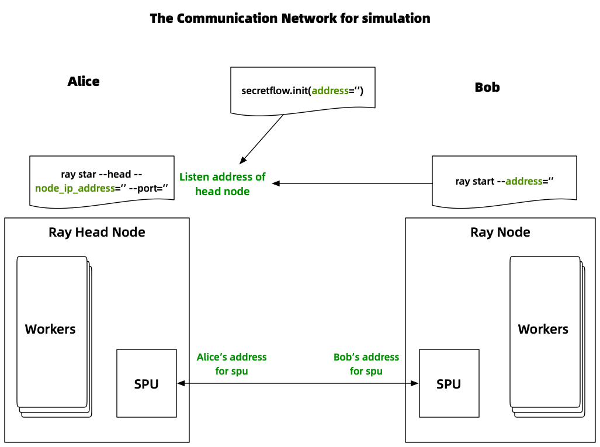
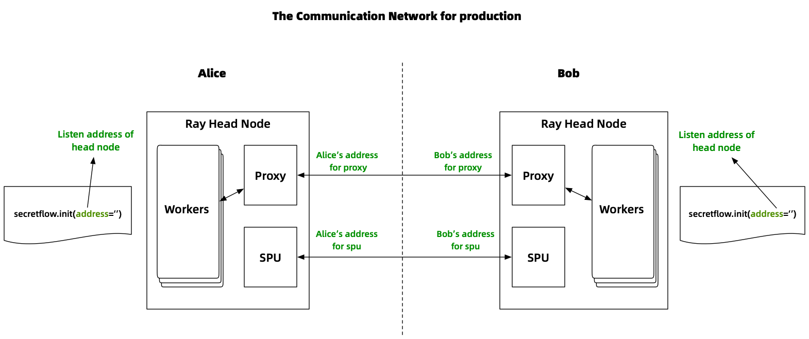

# Deployment
**SecretFlow provides two deployment options: simulation and production. The distinctions between them are outlined in the accompanying table. Please review the details thoughtfully and select the deployment approach that best suits your requirements.**

|Deployment Mode|Scenarios|How to deploy Ray|How to run code|Code difference|
|-|-|-|-|-|
|Simulation|Conducting experiments in the local network environment of a single organization.|A Ray cluster composed of simulated nodes.|Run code once on any node.|Fill `parties` parameter in `sf.init`.|
|Production|Formal production environments, such as collaboration among multiple institutions.|Each institution deploys its own independent Ray cluster.|Every institution needs to execute the code simultaneously.|Fill `cluster_config` parameter in `sf.init`, and the rest of the code is identical to that in simulation mode.|

## Pre-knowledge: about Ray
SecretFlow uses Ray as its distributed framework. A Ray cluster consists of a head node and zero or several slave nodes, for more information about Ray, please visit [Ray official website](https://docs.ray.io/).

## Deploy based on Kuscia

Kuscia is a lightweight privacy-preserving computing task orchestration framework based on K3s. It provides a unified privacy-preserving computing foundation that can abstract away heterogeneous infrastructure and protocols.

With Kuscia, you can easily manage and execute SecretFlow jobs through kubectl commands or apis without paying attention to the details of SecretFlow networking.
In addition, Kuscia supports communication security and running SecretFlow jobs concurrently.

If you need to use SecretFlow in your business, it is recommended to deploy and run SecretFlow based on Kuscia.
Please refer to Kuscia's [Quick Start](https://www.secretflow.org.cn/docs/kuscia/latest/zh-Hans/getting_started/quickstart_cn) document for details.

## Simulation
SecretFlow is designed for fast simulation on a single host or on multiple nodes with single ray cluster.

**Note**

SecretFlow with single ray cluster is for simulation only. Please refer to `production` section below for production.

---
### Standalone mode for simulation
Use `secretflow.init` directly to run secretflow in standalone mode. A ray cluster with only one node will be started, and it will automatically shut down when the program exits.

```python
>>> import secretflow as sf
>>> sf.init(parties=['alice', 'bob'], address='local')
```
### Cluster mode for simulation
In the cluster simulation mode, each Ray node simulates an participant. This is done by adding the participant name as resource tag on each Ray node, and then the calculation task of each participant is dispatched to the corresponding Ray node.
The overall communication network is as follows.



The following is an example showing how to build a cluster consisting of alice and bob on multiple nodes.

#### Start head node
Start a head node on your first machine with the tag "alice".

---
**NOTE**

1. Remember to use the real ip and port instead.

2. `{"alice": 16}` means that alice can run up to 16 workers at the same time. Just feel free to change it if you like.
---

```bash
ray start --head --node-ip-address="ip" --port="port" --resources='{"alice": 16}' --include-dashboard=False --disable-usage-stats
```

Head node starts successfully if you see "Ray runtime started." in the screen output.

Now we have a cluster with a head node only, let us start more nodes.

#### Start other nodes
Start a node with the tag "bob" on another machine. The node will connect to the head node and join the cluster.

---
**Note**

Replace `ip:port` with the `node-ip-address` and `port` of head node please.

---

```bash
ray start --address="ip:port" --resources='{"bob": 16}' --disable-usage-stats
```

The node starts successfully if you see "Ray runtime started." in the screen output.
A Ray cluster consisting of two Ray nodes has been built by now, while the head node simulates `alice` and the slave node simulates `bob`.

You can repeat the step above to start more nodes with using other parties as resources tag as you like.

#### Start SecretFlow
Now you can start SecretFlow and run your code.
The following code shows that alice and bob each execute a function that returns the input value.

---
**Tips**

1. Replace `ip:port` in `sf.init` with the `node-ip-address` and `port` of head node please.
2. If you start more nodes (such as carol, davy, etc.), remember to add the new party name in the `parties=['alice', 'bob']` parameter.

---

```python
>>> import secretflow as sf
# Replace with the `node-ip-address` and `port` of head node.
>>> sf.init(parties=['alice', 'bob'], address='ip:port')
>>> alice = sf.PYU('alice')
>>> bob = sf.PYU('bob')
>>> alice(lambda x : x)(2)
<secretflow.device.device.pyu.PYUObject object at 0x7fe932a1a640>
>>> bob(lambda x : x)(2)
<secretflow.device.device.pyu.PYUObject object at 0x7fe6fef03250>
```

#### (optional) How to shut down the cluster
In some cases you would like to shut down the cluster, the following command will help you.
Remember to run the command on all machines.

Note that all ray processors on the machine will be stopped, which means all ray
clusters will be stopped.

```bash
ray stop
```

#### (optional) How to setup an SPU in cluster mode

`SPU` consists of multi workers on different nodes.
For performance reasons, the major part of SPU is written in C++.
SPU is based on Brpc, which indicates it has a separated service mesh independent of Ray's networking.
In a word, you need to assign different ports for the SPU for now.
We are working on merging them.

A typical SPU config is as follows.

---
**Tips**

1. Replace `address` in `sf.init` with the `node-ip-address` and `port` of head node please.
2. Fill `address` of `alice` with the address which can be accessed by `bob` and choose **an unused port** different with Ray.
3. `listen_addr` of `alice` can use the same port of alice `address`.
4. Fill `address` of `bob` with the ip which can be accessed by `alice` and choose **an unused port** different with Ray.
5. `listen_addr` of `bob` can use the same port of bob `address`.

---
```python
import spu
import secretflow as sf

# Use ray head adress please.
sf.init(parties=['alice', 'bob'], address='Ray head node address')

cluster_def={
    'nodes': [
        {
            'party': 'alice',
            # Please choose an unused port.
            'address': 'ip:port of alice',
            'listen_addr': '0.0.0.0:port'
        },
        {
            'party': 'bob',
            # Please choose an unused port.
            'address': 'ip:port of bob',
            'listen_addr': '0.0.0.0:port'
        },
    ],
    'runtime_config': {
        'protocol': spu.spu_pb2.SEMI2K,
        'field': spu.spu_pb2.FM128,
        'sigmoid_mode': spu.spu_pb2.RuntimeConfig.SIGMOID_REAL,
    }
}

spu = sf.SPU(cluster_def=cluster_def)
```

For more configurations of SPU, please refer to [SPU config](https://www.secretflow.org.cn/docs/spu/en/reference/runtime_config.html)

---
**Note**

You will see the usage of setup an spu in many tutorials. But
be careful that it works only in standalone mode because `sf.utils.testing.cluster_def` use `127.0.0.1` as the default ip.

```python
>>> spu = sf.SPU(sf.utils.testing.cluster_def(['alice', 'bob', 'carol']))
```
---

### Deploy SecretFlow in a docker container with simulation mode

You may need to understand the concept of [docker network](https://docs.docker.com/network/) firstly. The two main docker networks are [host network](https://docs.docker.com/network/host/) and [bridge network](https://docs.docker.com/network/bridge/), you can click the link to read the official documentation to learn more."

SecretFlow recommends to start the container using the host network mode, and the following will explain the reasons to you.

#### (Recommended) Host network
When you start the docker container using host network (e.g. run container with `--network host`), the container will share the network of the host machine. Therefore, no special configuration is required to build a SecretFlow cluster in this case, and you can directly use the address of the host as the communication address between nodes. Refer to the preceding steps for deployment..

#### (Not recommended) Bridge network
If you start the Docker container with a bridge network, it means that the container will have an isolated network with a different IP address from the host, and containers on different bridge networks are not connected by default.
Although you can map ports to the host through port mapping, since the communication between Ray's multiple nodes is complex, involving many ports, it is easy to make mistakes and difficult to configure correctly, so we do not recommend using the bridge mode to build the simulation cluster.

If you cannot use the host network for some unavoidable reasons, we hope the following instructions will be helpful for you to deploy SecretFlow using the bridge network.

##### Scenario 1: Deploying a simulation cluster using multiple Docker containers on a single machine.

The following steps show how to start multiple containers on one machine. Since it is on the same machine, multiple containers can use the same bridge network for communication.

1. Create a bridege network

The following command creates a bridge network with network segment 192.168.0.1/24 named `sfnet`.
Note that this network segment is only an example, and you can modify the network segment address according to your own needs.

```bash
docker network create sfnet --subnet 192.168.0.1/24
```

2. Start the first container to simulate party `alice`

The following command starts the container named `secretflow0`, uses the bridege network created in the first step, and specifies the ip as 192.168.0.10.
```bash
docker run -it --network sfnet --ip 192.168.0.10 --name secretflow1 secretflow/secretflow-anolis8:latest bash
```
After the container is started successfully, then we start the head node of ray. The following command starts Ray's head node listening on port 9001 (you are free to choose an unused port).
```
ray start --head --port=9001 --resources='{"alice": 16}' --include-dashboard=False --disable-usage-stats
```

3. Start the second container to simulate party `bob`

The following command starts the container named `secretflow1`, uses the bridege network created in the first step, and specifies the ip as 192.168.0.20.
```bash
docker run -it --network sfnet --ip 192.168.0.20 --name secretflow2 secretflow/secretflow-anolis8:latest bash
```
After starting the container, we start Ray's slave node. The following command starts a slave node and connects to the head node started in the previous step.
```
ray start --address=192.168.0.10:9001 --resources='{"bob": 16}' --disable-usage-stats
```

So far we have built two Ray nodes, representing party alice and bob respectively.

4. Start SecretFlow

We start SecretFlow in the first container, the following Python code shows that SecretFlow has successfully connected to the Ray cluster.
```python
>>> import secretflow as sf
>>> sf.init(parties=['alice', 'bob'], address='192.168.0.10:9001')
2023-02-18 07:08:29,697 INFO worker.py:1352 -- Connecting to existing Ray cluster at address: 192.168.0.10:9001...
2023-02-18 07:08:29,718 INFO worker.py:1538 -- Connected to Ray cluster.
>>> # your code to run
```

5. (Optional) Start the SPU device

This step describes how to start the SPU device. Suppose the SPU uses port 9100 on alice and port 9200 on bob. (port numbers are examples only, you can choose any free port)
```python
import spu
import secretflow as sf

# Use ray head adress please.
sf.init(parties=['alice', 'bob'], address='192.168.0.10:9001')

cluster_def={
    'nodes': [
        {
            'party': 'alice',
            'address': '192.168.0.10:9100',
            'listen_addr': '0.0.0.0:9100'
        },
        {
            'party': 'bob',
            'address': '192.168.0.20:9200',
            'listen_addr': '0.0.0.0:9200'
        },
    ],
    'runtime_config': {
        'protocol': spu.spu_pb2.SEMI2K,
        'field': spu.spu_pb2.FM128,
        'sigmoid_mode': spu.spu_pb2.RuntimeConfig.SIGMOID_REAL,
    }
}

spu = sf.SPU(cluster_def=cluster_def)

# your code to run.
```

##### (Not recommended strongly) Scenario 2: Deploy a simulation cluster using multiple docker containers on multiple machines

Due to the complexity of the Ray communication protocol, including cross-node mutual access and using many ports, it's really complex and error-prone to deploy multiple containers on multiple machines using the bridge network to build a Ray cluster for simulation. Ray's official support for this is not good, so we do not recommend this deployment mode.

### Deploy SecretFlow in WSL(Windows Subsystem for Linux) with simulation mode

If you use SecretFlow in WSL2, you could deploy SecretFlow with different distributions in WSL2.


The following steps show how to deploy SecretFlow in WSL with simulation mode.
1. Install different distributions in your WSL.

You are supposed to install at least two same distributions of different versions such as Ubuntu 20.04.6 LTS and Ubuntu 22.04.2 LTS or at least two different distributions such Ubuntu and Debian.
In this example, `alice`in`Ubuntu 20.04.6 LTS` and `bob` in `Ubuntu 22.04.2 LTS`:
   - alice:

        ```bash
        (secretflow) alice@DESKTOP-SAOB7DQ:~$ lsb_release -a
        No LSB modules are available.
        Distributor ID: Ubuntu
        Description:    Ubuntu 20.04.6 LTS
        Release:        20.04
        Codename:       focal
        (secretflow) alice@DESKTOP-SAOB7DQ:~$
        ```
   - bob:

        ```bash
        (secretflow) bob@DESKTOP-SAOB7DQ:~$ lsb_release -a
        No LSB modules are available.
        Distributor ID: Ubuntu
        Description:    Ubuntu 22.04.2 LTS
        Release:        22.04
        Codename:       jammy
        (secretflow) bob@DESKTOP-SAOB7DQ:~$
        ```
2. Install SecretFlow in different distributions.

The following steps are expected to be done in different distributions to set up the development environment of SecretFlow.
   - Install Miniconda
        change your working directory to your home directory to install Miniconda.

        ```bash
        cd ~
        ```

        download Miniconda.

        ```bash
        wget https://repo.anaconda.com/miniconda/Miniconda3-latest-Linux-x86_64.sh
        ```

        install Miniconda

        ```bash
        sh Miniconda3-latest-Linux-x86_64.sh
        ```

        After the installation of Miniconda, you could remove the installation package of Miniconda.

   - Create a virtual environment for SecretFlow
        all versions of Python in different distributions should be exactly same.

        ```bash
        conda create --name secretflow python==3.8.18
        ```

   - Activate the virtual environment of SecretFlow


        ```bash
        conda activate secretflow
        ```

   - Install SecretFlow

        ```bash
        pip install -U secretflow
        ```

3. Get the IP address of your WSL.

Due to the implementation principle of WSL, different distributions in WSL share the same IP address, then we only could use it to deploy SecretFlow just in a single machine mode. Use the command `ifconfig` to get the IP address of your WSL.
if `command not found` appears, you could install `net-tools`, you could run the following command to install it in Ubuntu.

    ```bash
    apt install net-tools
    ```


A example in Ubuntu:

```bash
(secretflow) alice@DESKTOP-SAOB7DQ:~$ ifconfig
eth0: flags=4163<UP,BROADCAST,RUNNING,MULTICAST>  mtu 1500
        inet 172.23.139.91  netmask 255.255.240.0  broadcast 172.23.143.255
        inet6 fe80::215:5dff:fe23:1cd6  prefixlen 64  scopeid 0x20<link>
        ether 00:15:5d:23:1c:d6  txqueuelen 1000  (Ethernet)
        RX packets 1782122  bytes 7504258331 (7.5 GB)
        RX errors 0  dropped 0  overruns 0  frame 0
        TX packets 1077846  bytes 63011688 (63.0 MB)
        TX errors 0  dropped 0 overruns 0  carrier 0  collisions 0

lo: flags=73<UP,LOOPBACK,RUNNING>  mtu 65536
        inet 127.0.0.1  netmask 255.0.0.0
        inet6 ::1  prefixlen 128  scopeid 0x10<host>
        loop  txqueuelen 1000  (Local Loopback)
        RX packets 701234  bytes 573429022 (573.4 MB)
        RX errors 0  dropped 0  overruns 0  frame 0
        TX packets 701234  bytes 573429022 (573.4 MB)
        TX errors 0  dropped 0 overruns 0  carrier 0  collisions 0
```

The IP address ``172.23.139.91`` is what we need, let's denote it as `ray_ip`

4. Start the Ray cluster at head node.

Use `ray_ip` to start a head node on your first distribution with the tag "alice". the `ray_ip` is `172.23.139.91` here and the and we select the port  `20010` (we denote this as `ray_port`)as the port of the Ray, then the command to start the Ray cluster at the head node could be as follows:

```bash
ray start --head --node-ip-address="172.23.139.91" --port="20010" --resources='{"alice": 16}' --include-dashboard=False --disable-usage-stats
```

it's logs:

```bash
(secretflow) alice@DESKTOP-SAOB7DQ:~$ ray start --head --node-ip-address="172.23.139.91" --port="20010" --resources='{"alice": 16}' --include-dashboard=False --disable-usage-stats
Usage stats collection is disabled.

Local node IP: 172.23.139.91

--------------------
Ray runtime started.
--------------------

Next steps
  To connect to this Ray runtime from another node, run
    ray start --address='172.23.139.91:20010'

  Alternatively, use the following Python code:
    import ray
    ray.init(address='auto', _node_ip_address='172.23.139.91')

  To connect to this Ray runtime from outside of the cluster, for example to
  connect to a remote cluster from your laptop directly, use the following
  Python code:
    import ray
    ray.init(address='ray://<head_node_ip_address>:10001')

  To see the status of the cluster, use
    ray status

  If connection fails, check your firewall settings and network configuration.

  To terminate the Ray runtime, run
    ray stop
(secretflow) alice@DESKTOP-SAOB7DQ:~$
```

5. Start the Ray cluster at other nodes

Use `ray_ip` and `ray_port` to start the other nodes of the Ray cluster such distribution with the tag "bob"
Here:
- `ray_ip`:172.23.139.91
- `ray_port`:20010
then run the command:

```bash
ray start --address="172.23.139.91:20010" --resources='{"bob": 16}' --disable-usage-stats
```

it's logs:

```bash
(secretflow) bob@DESKTOP-SAOB7DQ:~$ ray start --address="172.23.139.91:20010" --resources='{"bob": 16}' --disable-usage-stats
Local node IP: 172.23.139.91

--------------------
Ray runtime started.
--------------------

To terminate the Ray runtime, run
  ray stop
(secretflow) bob@DESKTOP-SAOB7DQ:~$

```

6. Check the status of the Ray cluster.

Check the status of the Ray cluster in any node of the Ray cluster such the distribution with the tag "alice"

```bash
ray status
```

its log:

```bash
(secretflow) alice@DESKTOP-SAOB7DQ:~$ ray status
======== Autoscaler status: 2023-05-18 10:33:28.673249 ========
Node status
---------------------------------------------------------------
Healthy:
 1 node_4cb5fcb410e8b11a62bcebe5653918f0c6ae2b996e028e8e5ec22199
 1 node_d74a3ee633f939d04af3f67f7d4910c064c95a040e6998bfb706aed6
Pending:
 (no pending nodes)
Recent failures:
 (no failures)

Resources
---------------------------------------------------------------
Usage:
 0.0/24.0 CPU
 0.0/16.0 alice
 0.0/16.0 bob
 0.00/8.894 GiB memory
 0.00/4.110 GiB object_store_memory

Demands:
 (no resource demands)
(secretflow) alice@DESKTOP-SAOB7DQ:~$
```

As shown above, two nodes of the Ray cluster could be found here.

7. Start SecretFlow

We use `ray_ip` and `ray_port` to start SecretFlow in first distribution with the tag "alice", the following Python code in bash shows that SecretFlow has successfully connected to the Ray cluster. You could also run the script of the Python code directly.

```bash
(secretflow) alice@DESKTOP-SAOB7DQ:~$ python
Python 3.8.18 (default, Nov 24 2022, 15:19:38)
[GCC 11.2.0] :: Anaconda, Inc. on linux
Type "help", "copyright", "credits" or "license" for more information.
>>> import secretflow as sf
>>> sf.init(parties=['alice', 'bob'], address='172.23.139.91:20010')
2023-05-18 10:36:07,871 INFO worker.py:1352 -- Connecting to existing Ray cluster at address: 172.23.139.91:20010...
2023-05-18 10:36:07,879 INFO worker.py:1538 -- Connected to Ray cluster.
>>># your code to run
>>>
```

8. (Optional) Start the SPU device

This step describes how to start the SPU device. Suppose the SPU uses port 9100 on alice and port 9200 on bob. (port numbers are examples only, you can choose any free port).
Here:
- `ray_ip`:172.23.139.91
- `ray_port`:20010


```python
import spu
import secretflow as sf

# Use ray head adress please.
# sf.init(parties=['alice', 'bob'], address='ray_ip:ray_port')
sf.init(parties=['alice', 'bob'], address='172.23.139.91:20010')

cluster_def={
    'nodes': [
        {
            'party': 'alice',
            'address': '172.23.139.91:9100',
            'listen_addr': '0.0.0.0:9100'
        },
        {
            'party': 'bob',
            'address': '172.23.139.91:9200',
            'listen_addr': '0.0.0.0:9200'
        },
    ],
    'runtime_config': {
        'protocol': spu.spu_pb2.SEMI2K,
        'field': spu.spu_pb2.FM128,
        'sigmoid_mode': spu.spu_pb2.RuntimeConfig.SIGMOID_REAL,
    }
}

spu = sf.SPU(cluster_def=cluster_def)

# your code to run.
```

## Production

SecretFlow provides multi controller mode for production with enhanced security. (If you want to know more, welcome to read [Programming in SecretFlow](../developer/design/programming_in_secretflow.md))

A SecretFlow cluster for production consists of several ray clusters, and every party has its own ray cluster.
**Each participant must execute the code at the same time to complete the task of collaboration.**
The architecture of the production mode is shown in the figure below.



The following will guide you to deploy SecretFlow for production.

### Setup a SecretFlow cluster crossing silo


The following is an example showing how to build a cluster consisting of alice and bob for production.

---
**Note**

Please keep in mind that alice and bob should run the code simultaneously.

---

#### Start SecretFlow on the node of `alice`

`alice` starts its ray cluster firstly. Note that the command here is to start Ray's head node.
```bash
ray start --head --node-ip-address="ip" --port="port" --include-dashboard=False --disable-usage-stats
```
Head node starts successfully if you see "Ray runtime started." in the screen output.
So far, Alice's Ray cluster has been successfully built.

Then `alice` initializes SecretFlow with a cluster config and runs the code.

---
**Tips**
1. Replace `ip:port` in `sf.init` with the `node-ip-address` and `port` of head node please.
2. Fill `address` of `alice` with the address which can be accessed by `bob`. Remember to choose an unused port different with port of Ray and SPU.
3. Fill `address` of `bob` with the address which can be accessed by `alice`. Remember to choose an unused port different with port of Ray and SPU.
4. Note that `self_party` is `alice`.
5. Please note that `sf.init` does not need to provide the `parties` parameter, but needs to provide a `cluster_config` to describe the communication address and port between the two organizations.
6. To ensure `ports` of `alice` and `bob` can be accessed by each other and the firewall of the system isn't disabled, you are supposed to add the 'address' of `alice` and `bob` into the IP whitelist of each other.
7. The `telnet` command is typically used to test the accessibility of a port.
---
```python
cluster_config ={
    'parties': {
        'alice': {
            # replace with alice's real address.
            'address': 'ip:port of alice',
            'listen_addr': '0.0.0.0:port'
        },
        'bob': {
            # replace with bob's real address.
            'address': 'ip:port of bob',
            'listen_addr': '0.0.0.0:port'
        },
    },
    'self_party': 'alice'
}

sf.init(address='alice ray head node address', cluster_config=cluster_config)

# your code to run.
```

#### Start SecretFlow on the node of `bob`

`bob` starts its ray cluster firstly. Note that the command here is to start the head node of Ray, because bob needs to build a separate Ray cluster.
```bash
ray start --head --node-ip-address="ip" --port="port" --include-dashboard=False --disable-usage-stats
```
Head node starts successfully if you see "Ray runtime started." in the screen output.
So far, bob's Ray cluster has been successfully built.


Then `bob` initializes SecretFlow with a cluster config almost same as `alice` except for `self_party` and ray address and runs the code.

---
**Tips**
1. Replace `address` in `sf.init` with the `node-ip-address` and `port` of head node please. Note, here is bob’s head node address, please don’t fill in alice’s.
2. Fill `address` of `alice` with the address which can be accessed by `bob`. Remember to choose an unused port different with port of Ray and SPU.
3. Fill `address` of `bob` with the address which can be accessed by `alice`. Remember to choose an unused port different with port of Ray and SPU.
4. Note that `self_party` is `bob`.
5. Please note that `sf.init` does not need to provide the `parties` parameter, but needs to provide a `cluster_config` to describe the communication address and port between the two organizations.
6. To ensure `ports` of `alice` and `bob` can be accessed by each other and the firewall of the system isn't disabled, you are supposed to add the 'address' of `alice` and `bob` into the IP whitelist of each other.
7. The `telnet` command is typically used to test the accessibility of a port.
---

```python

cluster_config ={
    'parties': {
        'alice': {
            # replace with alice's real address.
            'address': 'ip:port of alice',
            'listen_addr': '0.0.0.0:port'
        },
        'bob': {
            # replace with bob's real address.
            'address': 'ip:port of bob',
            'listen_addr': '0.0.0.0:port'
        },
    },
    'self_party': 'bob'
}

sf.init(address='bob ray head node address', cluster_config=cluster_config)

# your code to run.
```

### How to setup SPU for production

The way to build the SPU is the same as the simulation mode, the only difference is that building the SPU also needs to be executed by multiple parties at the same time, please read the previous article for more details.

In order to avoid problems such as connection timeout caused by the startup time difference, you may need to set the `link_desc` parameter when initialize the SPU to adjust the connection-related parameters. For details, see
[SPU](../source/secretflow.device.device.rst#secretflow.device.device.spu.SPU.__init__) .

### Suggestions for production

1. Enable tls Authentication.

    SecretFlow can be configured to use TLS on cross-silo gRPC channels.

    An example for alice.
    ```python
    tls_config = {
        "ca_cert": "ca root cert of other parties (e.g. bob)",
        "cert": "server cert of alice in pem",
        "key": "server key of alice in pem",
    }

    sf.init(address='ip:port',
            cluster_config=cluster_config,
            tls_config=tls_config
    )
    ```

    An example for bob.
    ```python
    tls_config = {
        "ca_cert": "ca root cert of other parties (e.g. alice)",
        "cert": "server cert of bob in pem",
        "key": "server key of bob in pem",
    }

    sf.init(address='ip:port',
            cluster_config=cluster_config,
            tls_config=tls_config
    )
    ```

2. Enhanced serialization/deserialization.

    SecretFlow uses `pickle` in serialization/deserialization which is vulnerable. You can set `cross_silo_serializing_allowed_list` when init  SecretFlow to specify an allowlist to restrict serializable objects.
    An example could be （**You should not use this demo directly. Configure it to your actual needs.**）
    ```python
    allowed_list =  {
        "numpy.core.numeric": ["*"],
        "numpy": ["dtype"],
    }

    sf.init(address='ip:port',
            cluster_config=cluster_config,
            cross_silo_serializing_allowed_list=allowed_list
    )
    ```


