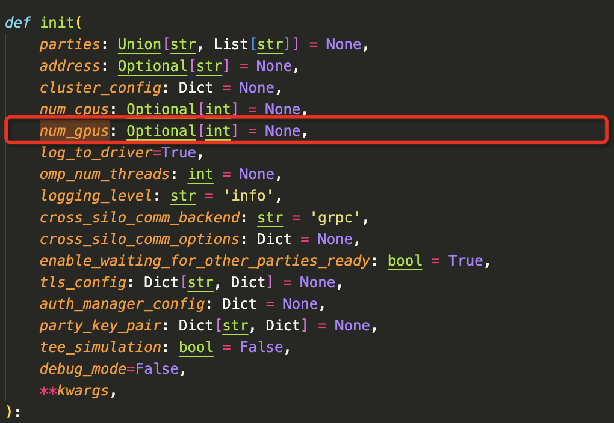
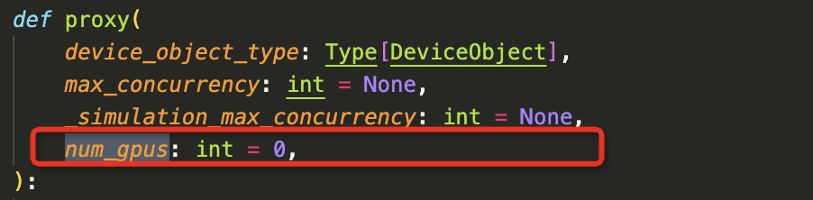
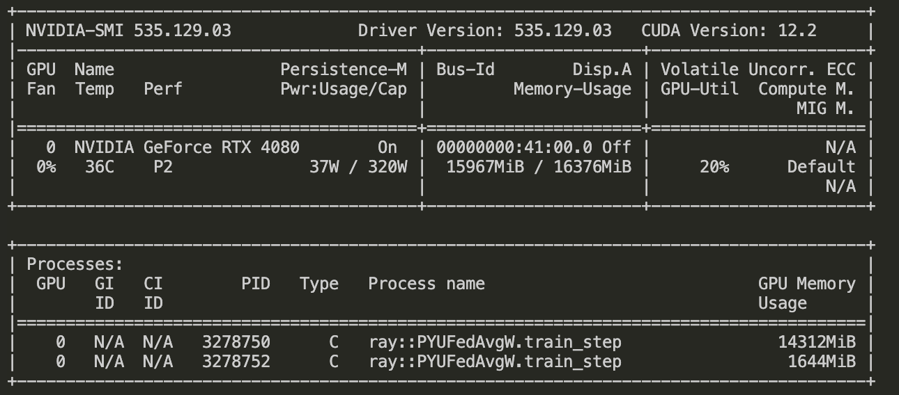

# 在隐语联邦学习中使用GPU
隐语联邦学习是一个开放的专注隐私保护的联邦学习框架，目标是帮助开发和研究人员构建和部署机器学习模型。同时在整个过程中确保数据隐私和安全。  
隐语联邦学习可以支持任意类型的神经网络模型，GPU的使用可以加快训练效率。  
本篇文档将会介绍如何在隐语环境中使用gpu来加速训练。
## 文档目标和预期读者
对GPU加速有需求的用户
### 隐语联邦学习框架概览
隐语联邦学习框架主要由两部分构成，一个是FLModel，FLModel专注面向水平场景的联邦学习建模，我们在其中重写了训练的逻辑，提供了step级别的聚合能力，提供了多种不同安全等级的聚合算法，提供了多种联邦训练策略，提供了多种后端支持。另一个是SLModel，SLModel专注面向垂直场景的联邦学习建模，在SLModel中我们提供了多种后端的统一抽象，提供了面向隐私保护的聚合层，使用MPC技术来加固联邦学习，还提供了DP模块用于数据扰动。我们提供了用于提升效率的异构拆分算法，流水线训练策略，还提供了数据稀疏化和量化策略。
### 为什么使用GPU
使用GPU（图形处理单元）可以显著提升处理计算密集型任务的效率，尤其是在涉及到大量并行处理的领域。GPU拥有数以千计的小型、高效的核心，这些核心能够同时执行大量的浮点运算，从而加速数据分析、图形处理、和机器学习任务。相比于传统的CPU，GPU更适合于执行深度学习模型的矩阵乘法和向量运算，这可以极大地缩短模型训练和推理的时间。


## 环境准备
环境要求  
**Tensorflow**：
* tensorflow==2.11.1
* cuDNN>=8.1 # 参考tensorflow官网建议
* CUDA>=11.2 # 参考tensorflow官网建议

**PyTorch**
* torch==2.1.1
* torchaudio==2.1.1
* CUDA>=11.8

本文基于的cuda版本是
`CUDA==12.2`
`cudnn==8.9`  
tensorflow和pytorch都安装gpu版本即可。  
配置完环境后执行
```
>>> tf.config.list_physical_devices('GPU')
[PhysicalDevice(name='/physical_device:GPU:0', device_type='GPU')]
```
```
>>> torch.cuda.is_available()
True
```
来验证下是否正确安装成功。
## 配置secretflow来使用GPU
机器学习引擎配置成功后，距离可以在secretflow中使用还差一步。但也已经很接近了。  
首先我们了解一个前置知识，secretflow的部署模式分为三种
- Debug_Mode
- Simulation_mode
- Production_mode  


在Debug Mode中，在上面配置好引擎环境后就可以开始玩耍了，secretflow可以直接调度到gpu资源，无需关注本文其余内容。
在Simulation和Production模式下，我们还必须将 GPU 资源的相关信息明确告知 Ray，这样 GPU 资源才能被 Ray 的工作节点（Worker）所利用。  
*Ray 参考文档*：[Ray support GPU document](https://docs.ray.io/en/latest/ray-core/tasks/using-ray-with-gpus.html)  


```
import os
import ray

ray.init(num_gpus=2)


@ray.remote(num_gpus=1)
class GPUActor:
    def ping(self):
        print("ray.get_gpu_ids(): {}".format(ray.get_gpu_ids()))
        print("CUDA_VISIBLE_DEVICES: {}".format(os.environ["CUDA_VISIBLE_DEVICES"]))


@ray.remote(num_gpus=1)
def use_gpu():
    print("ray.get_gpu_ids(): {}".format(ray.get_gpu_ids()))
    print("CUDA_VISIBLE_DEVICES: {}".format(os.environ["CUDA_VISIBLE_DEVICES"]))

```

### 隐语封装  
从ray的例子中可以看到我们需要在两个地方设置num_gpus：
- ray.init:声明可用资源
- remote参数：分配worker可用的资源。

我们在隐语中分别进行了封装


1. 我们在sf.init中增加了num_gpus的参数


2. 在proxy中封装num_gpus，这样在FLModel和SLModel的dispatcher就可以把num_gpus带到worker端，完成配置。我们在worker端只需要感知是不是要使用GPU，引擎可以获取到所有分配的gpu资源进行调度。


#### 那怎么使用呢
在`sf.init`中配置num_gpus
```python
sf.init(
    ['alice', 'bob', 'charlie'], 
    address="local",
    num_gpus=2, # 配置num_gpus资源
    log_to_driver=False,)
```
在定义FLModel和SLModel的时候传入`num_gpus`即可
```python
      fed_model = FLModel(
            device_list=device_list,
            model=model,
            aggregator=aggregator,
            backend="tensorflow",
            strategy="fed_avg_g",
            random_seed=1234,
            num_gpus=1, # 这里指定gpu_nums
            dp_strategy=dp_strategy,
        )
```
Done！  
这样在具体执行时候就可以执行的时候调用到gpu资源了。
#### 其他细节
其他的模型方面的细节，我们已经都包装好了，用户直接使用即可，无需关心。

比如:
- torch需要显示创建cuda device来进行数据流转
- torch的数据，模型需要转到cuda device来完成计算
- 指标需要转回到cpu device来进行计算
- 模型保存加载需要注意device的转换。

**Attention**：在使用模拟模式（Simulation Mode）时，需要特别注意的是，如果系统中只装有一块显卡，在分配给多个参与方时，每个参与方能够获得的资源将限制为显卡总资源的 1/n。如果不遵循这一限制，可能会导致由于资源超额分配而无法成功调度。

#### Sample code
```python
import secretflow as sf
from secretflow.data.ndarray import load
from secretflow.utils.simulation.datasets import load_mnist
from secretflow.security.aggregation import SecureAggregator
from secretflow.ml.nn import FLModel
# In case you have a running secretflow runtime already.
sf.shutdown()

sf.init(['alice', 'bob', 'charlie'], address='local', debug_mode=False, num_gpus=1)
alice, bob, charlie = sf.PYU('alice'), sf.PYU('bob'), sf.PYU('charlie')
(x_train, y_train), (x_test, y_test) = load_mnist(
    parts=[alice, bob], normalized_x=True, categorical_y=True
)

def create_conv_model(input_shape, num_classes, name='model'):
    def create_model():
        from tensorflow import keras
        from tensorflow.keras import layers

        # Create model
        model = keras.Sequential(
            [
                keras.Input(shape=input_shape),
                layers.Conv2D(32, kernel_size=(3, 3), activation="relu"),
                layers.MaxPooling2D(pool_size=(2, 2)),
                layers.Conv2D(64, kernel_size=(3, 3), activation="relu"),
                layers.MaxPooling2D(pool_size=(2, 2)),
                layers.Flatten(),
                layers.Dropout(0.5),
                layers.Dense(num_classes, activation="softmax"),
            ]
        )
        # Compile model
        model.compile(
            loss='categorical_crossentropy', optimizer='adam', metrics=["accuracy"]
        )
        return model

    return create_model
num_classes = 10
input_shape = (28, 28, 1)
model = create_conv_model(input_shape, num_classes)
device_list = [alice, bob]
secure_aggregator = SecureAggregator(charlie, [alice, bob])

fed_model = FLModel(
    server=charlie,
    device_list=device_list,
    model=model,
    aggregator=secure_aggregator,
    strategy="fed_avg_w",
    backend="tensorflow",
    num_gpus=0.5,
)

history = fed_model.fit(
    x_train,
    y_train,
    validation_data=(x_test, y_test),
    epochs=5,
    sampler_method="batch",
    batch_size=256,
    aggregate_freq=1,
)
print(history)
global_metric = fed_model.evaluate(x_test, y_test, batch_size=128)
print(global_metric)

```


## 总结
本篇文档详细介绍了如何在隐语的联邦学习框架中使用gpu，gpu在大数据和大模型的训练和推导中很重要，欢迎按照文档的介绍进行使用。