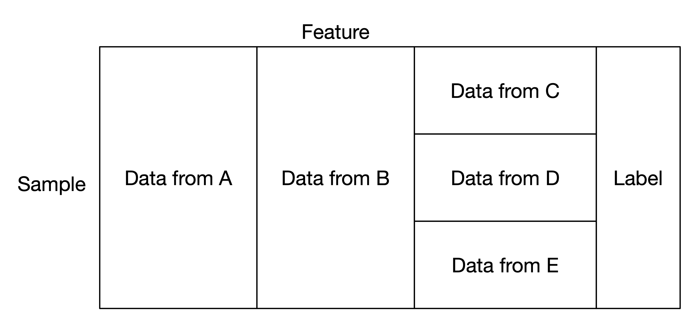

Mix Federated Learning
======================

This mode applies to the cases that some participants share the same sample ID space but differ in feature space,
where some participants share the same feature space but different in sample.

A typical mix partitioned data.

Mix Logistic Regression
-----------------------

Secretflow provides :py:class:`~secretflow.ml.linear.FlLogisticRegressionMix` for logistic regression with mix partitioned data.
You can check the tutorial to have a try.

Tutorial
~~~~~~~~

- :doc:`/tutorial/mix_lr`

