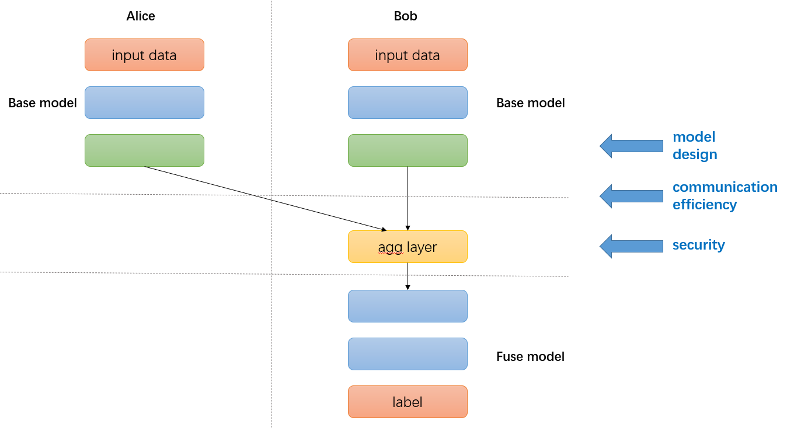

SplitRec: When Split Learning in Secretflow meets Recommandation System
=============

SplitRec is a series of optimization algorithms and strategies in split learning provided by Secretflow specifically for model training in cross-domain recommendation scenarios.

In traditional recommendation scenarios, user data is typically uploaded to a central server for model training. However, cross-domain recommendation refers to the distributed training of recommendation models with data from different domains. For example, a user watches many short videos on one platform and is recommended relevant ads on another e-commerce platform. The e-commerce platform not only wants to utilize its own data but also mining relevant information from the data on the short video platform. Additionally, due to data security concerns, the data from various platforms cannot be uploaded to a central server for centralized machine learning training. This scenario of training models with distributed data across different domains is well suited for split learning in federated learning.

In SplitRec, we provide the foundational framework for Split Learning: each party owns a portion of the model structure, and the models from all parties are combined to form a complete model. During the training process, different parties perform local forward or backward propagation calculations on their respective models and pass the computed results to the next party. Multiple parties train the joint model until convergence. Please check :doc:`/user_guide/federated_learning/vertical_federated_learning/split_learning` for details.

Another typical case of split learning is in bank marketing. Marketing is the comprehensive operation and sales activity of the banking industry to meet customer needs and achieve business goals in a constantly changing market environment. Different banks and institutions may possess different user features of the same customers. Banks would like to leverage user features from other institutions to provide more information for marketing models. We provide an demo in :doc:`/tutorial/Split_Learning_for_bank_marketing` on using our split learning framework to train a bank marketing model.

The cross-domain recommendation model cooperates user data from different domains to build a comprehensive model. Compared to data collected by traditional recommendation systems, the data in cross-domain scenarios is more extensive and diverse. However, due to the distribution of data across multiple domains, the training of such models faces challenges in terms of accuracy, efficiency, and security. The main challenges are as follows:

- Effectiveness: Can complex models like DeepFM be directly applied in the Split Learning framework?
- Efficiency: Will the communication during the forward and backward computation of each batch severely reduce training efficiency?
- Security: Can the intermediate communication data cause information leakage and security issues? 

In SplitRec, we have made significant optimizations in terms of effectiveness, efficiency, and security. You can use these optimizations refer to the following documentation, or contribute your optimization for split learning.

Effectiveness
-------------

SplitRec provides encapsulations for Split DeepFM, BST, MMoe, and other models.

.. grid:: 2
    :gutter: 2

    .. grid-item-card:: DeepFM (Tensorflow)
      :link: effectiveness/sl_rec_deepfm
      :link-type: doc

        SplitRec provides split version of DeepFM model, which combines the power of factorization machines and deep learning for recommandation. 

    .. grid-item-card:: BST (Tensorflow)
      :link: effectiveness/BST_TF
      :link-type: doc

        SplitRec provides split version of Behavior Sequence Transformer model(Tensorflow backend), which use Transformer to capture sequence infomations for recommandation.

    .. grid-item-card:: BST (PyTorch)
      :link: effectiveness/BST_Torch
      :link-type: doc

        SplitRec provides split version of Behavior Sequence Transformer model(PyTorch backend), which use Transformer to capture sequence infomations for recommandation.

    .. grid-item-card:: MMoE (Tensorflow)
      :link: effectiveness/mmoe_tf
      :link-type: doc

        SplitRec provides split version of Multi-gate Mixture-of-Experts model, which is a typical multi-task model for recommandation. 

Efficiency
-------------

SplitRec leverages the capabilities of our split learning framework, provides compression strategy and pipelined parallelism to improve training efficiency.

.. grid:: 2
    :gutter: 2

    .. grid-item-card:: Compression
      :link: efficiency/sl_compressor
      :link-type: doc

        SplitRec provides quantization, sparsity, and hybrid compression strategies to reduce communication costs.

    .. grid-item-card:: Pipeline Parallel
      :link: efficiency/sl_compressor
      :link-type: doc

        SplitRec provides pipeline parallel strategy to overlap computation and communication to accelerate training.

Security
-------------

SplitRec provides security strategies such as secure aggregation and differential privacy. It also offers typical attack methods specifically designed for split learning to validate their impact on split models. We will update relevant defense methods in the future.

.. grid:: 2
    :gutter: 2

    .. grid-item-card:: Feature Inference Attack
      :link: security/feature_inference_attack
      :link-type: doc

        SplitRec provides feature inference attack algorithm for split learning.

    .. grid-item-card:: Label Inference Attack
      :link: security/label_inference_attack
      :link-type: doc

        SplitRec provides label inference attack algorithm for split learning.

.. toctree::
   :maxdepth: 2
   :hidden:

   effectiveness/index
   efficiency/index
   security/index
