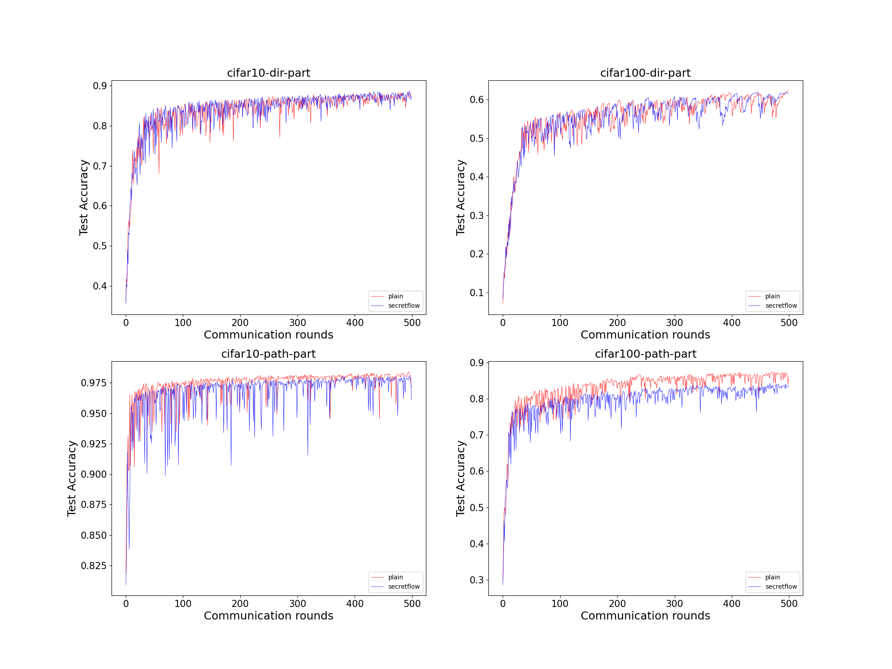

# DisPFL with Secretflow

This example implements DisPFL under secretflow.

> reffered paper: [DisPFL: Towards Communication-Efficient Personalized Federated Learning via Decentralized Sparse Training](https://arxiv.org/abs/2206.00187)

> reffered codes: [https://github.com/rong-dai/DisPFL](https://github.com/rong-dai/DisPFL)


## Experiments Introduction

The testting contains 2 datasets: `cifar10` and `cifar100`.
For each dataset, there are 2 data partition methods: `dir` partition and `pathological` partition.
All of these tests are running in both `plain mode` and `secretflow mode`.

In other words, there are total 8 experiments as follows.

| dataset  |        type         | plain mode | secretflow mode |
|:--------:|:-------------------:|:----------:|:---------------:|
| cifar10  |         dir         |     1      |        2        |
| cifar10  |    pathological     |     3      |        4        |
| cifar100 |         dir         |     5      |        6        |
| cifar100 |    pathological     |     7      |        8        |

We use following trainning parameters, only the `client_num_in_total` is different with the paper's paremeters (which is 100).

`epochs` = 5 

`comm_round` = 500

`client_num_in_total` = 5 

## Quick Start

Before starting experiments, make sure your ar in secretflow root directory as your working directory.

```commandline
cd /path/to/my/secretflow # your secretflow path
```

You can use following commands to start your experiments.

```commandline
python examples/app/h_cv/DisPFL/main_dispfl.py \
--run_type none \ # "none" for plain mode and "sf" for secretflow mode
--dataset cifar10 \ # "cifar10" for cifar10 dataset, "cifar100" for cifar100 dataset
--client_num_in_total 5 \ # the client nums
--comm_round 500 \ # the communication rounds
--partition_method dir \ # "dir" for dir type "n_cls" for path partition type.
--epochs 5 \
--model resnet18 \
--partition_alpha 0.3 --batch_size 128 --lr 0.1 --lr_decay 0.998 \
--frac 0.1 --dense_ratio 0.5 --anneal_factor 0.5 --seed 2022 --cs random --dis_gradient_check \
--different_initial 
--data_dir /path/to/my/data/ \  # your data path (can be any path for first time since it will download automatically.)
--gpu 0 # if you want to use gpu, add this and indicate which gpu you want to use.
```

You can copy following command to quickly run.
```commandline
python examples/app/h_cv/DisPFL/main_dispfl.py \
--run_type none \
--dataset cifar10 \
--client_num_in_total 5 \
--comm_round 500 \
--partition_method dir \ # "dir" for dir type "n_cls" for path partition type.
--epochs 5 \
--model resnet18 \
--partition_alpha 0.3 --batch_size 128 --lr 0.1 --lr_decay 0.998 \
--frac 0.1 --dense_ratio 0.5 --anneal_factor 0.5 --seed 2022 --cs random --dis_gradient_check \
--different_initial 
--data_dir /path/to/my/data/ \
--gpu 0 #
```

## Experiments Results

Using `examples/app/h_cv/DisPFL/utils/draw_plot.py`, we can get following result figure.




## For Quick Copy Start

```commandline
# cifar10 small test plain 
python examples/app/h_cv/DisPFL/main_dispfl.py --run_type none --model resnet18 --dataset cifar10 --client_num_in_total 3 --epochs 1 --comm_round 1 --partition_method dir --partition_alpha 0.3 --batch_size 128 --lr 0.1 --lr_decay 0.998 --frac 0.1 --dense_ratio 0.5 --anneal_factor 0.5 --seed 2022 --cs random --dis_gradient_check --different_initial --data_dir /path/to/my/data/ --gpu 0  
nohup python examples/app/h_cv/DisPFL/main_dispfl.py --run_type none --model resnet18 --dataset cifar10 --client_num_in_total 3 --epochs 1 --comm_round 1 --partition_method dir --partition_alpha 0.3 --batch_size 128 --lr 0.1 --lr_decay 0.998 --frac 0.1 --dense_ratio 0.5 --anneal_factor 0.5 --seed 2022 --cs random --dis_gradient_check --different_initial --data_dir /path/to/my/data/ --gpu 0 > small_plain.log 2>&1 & 
# cifar10 small test sf 
python examples/app/h_cv/DisPFL/main_dispfl.py --run_type sf --model resnet18 --dataset cifar10 --client_num_in_total 3 --epochs 1 --comm_round 1 --partition_method dir --partition_alpha 0.3 --batch_size 128 --lr 0.1 --lr_decay 0.998 --frac 0.1 --dense_ratio 0.5 --anneal_factor 0.5 --seed 2022 --cs random --dis_gradient_check --different_initial --data_dir /path/to/my/data/ --gpu 0 
nohup python examples/app/h_cv/DisPFL/main_dispfl.py --run_type sf --model resnet18 --dataset cifar10 --client_num_in_total 3 --epochs 1 --comm_round 1 --partition_method dir --partition_alpha 0.3 --batch_size 128 --lr 0.1 --lr_decay 0.998 --frac 0.1 --dense_ratio 0.5 --anneal_factor 0.5 --seed 2022 --cs random --dis_gradient_check --different_initial --data_dir /path/to/my/data/ --gpu 0 > small_sf.log 2>&1 & 
# cifar100 small test plain
python examples/app/h_cv/DisPFL/main_dispfl.py --run_type none --model resnet18 --dataset cifar100 --client_num_in_total 3 --epochs 1 --comm_round 1 --partition_method dir --partition_alpha 0.3 --batch_size 128 --lr 0.1 --lr_decay 0.998 --frac 0.1 --dense_ratio 0.5 --anneal_factor 0.5 --seed 2022 --cs random --dis_gradient_check --different_initial --data_dir /path/to/my/data/ --gpu 0 
# cifar100 small test sf
python examples/app/h_cv/DisPFL/main_dispfl.py --run_type sf --model resnet18 --dataset cifar100 --client_num_in_total 3 --epochs 1 --comm_round 1 --partition_method dir --partition_alpha 0.3 --batch_size 128 --lr 0.1 --lr_decay 0.998 --frac 0.1 --dense_ratio 0.5 --anneal_factor 0.5 --seed 2022 --cs random --dis_gradient_check --different_initial --data_dir /path/to/my/data/ --gpu 0 


# cifar10 production test plain
nohup python examples/app/h_cv/DisPFL/main_dispfl.py --run_type none --model resnet18 --dataset cifar10 --client_num_in_total 5 --epochs 5 --comm_round 500 --partition_method dir --partition_alpha 0.3 --batch_size 128 --lr 0.1 --lr_decay 0.998 --frac 0.1 --dense_ratio 0.5 --anneal_factor 0.5 --seed 2022 --cs random --dis_gradient_check --different_initial --data_dir /path/to/my/data/ --gpu 0 > large_plain_cifar10_500.log 2>&1 & 
#     my_part
nohup python examples/app/h_cv/DisPFL/main_dispfl.py --run_type none --model resnet18 --dataset cifar10 --client_num_in_total 5 --epochs 5 --comm_round 500 --partition_method n_cls --partition_alpha 2 --batch_size 128 --lr 0.1 --lr_decay 0.998 --frac 0.1 --dense_ratio 0.5 --anneal_factor 0.5 --seed 2022 --cs random --dis_gradient_check --different_initial --data_dir /path/to/my/data/ --gpu 0 > large_plain_cifar10_500_ncls.log 2>&1 & 

# cifar10 production test sf
nohup python examples/app/h_cv/DisPFL/main_dispfl.py --run_type sf --model resnet18 --dataset cifar10 --client_num_in_total 5 --epochs 5 --comm_round 500 --partition_method dir --partition_alpha 0.3 --batch_size 128 --lr 0.1 --lr_decay 0.998 --frac 0.1 --dense_ratio 0.5 --anneal_factor 0.5 --seed 2022 --cs random --dis_gradient_check --different_initial --data_dir /path/to/my/data/ --gpu 0 > large_sf_cifar10_500.log 2>&1 & 
#    my_part
nohup  python examples/app/h_cv/DisPFL/main_dispfl.py --run_type sf --model resnet18 --dataset cifar10 --client_num_in_total 5 --epochs 5 --comm_round 500 --partition_method n_cls --partition_alpha 2 --batch_size 128 --lr 0.1 --lr_decay 0.998 --frac 0.1 --dense_ratio 0.5 --anneal_factor 0.5 --seed 2022 --cs random --dis_gradient_check --different_initial --data_dir /path/to/my/data/ --gpu 1 > large_sf_cifar10_500_ncls.log 2>&1 & 


# cifar100 production test plain 
nohup python examples/app/h_cv/DisPFL/main_dispfl.py --run_type none --model resnet18 --dataset cifar100 --client_num_in_total 5 --epochs 5 --comm_round 500 --partition_method dir --partition_alpha 0.3 --batch_size 128 --lr 0.1 --lr_decay 0.998 --frac 0.1 --dense_ratio 0.5 --anneal_factor 0.5 --seed 2022 --cs random --dis_gradient_check --different_initial --data_dir /path/to/my/data/ --gpu 0 > large_plain_cifar100_500.log 2>&1 & 
#    my_part
nohup python examples/app/h_cv/DisPFL/main_dispfl.py --run_type none --model resnet18 --dataset cifar100 --client_num_in_total 5 --epochs 5 --comm_round 500 --partition_method n_cls --partition_alpha 10 --batch_size 128 --lr 0.1 --lr_decay 0.998 --frac 0.1 --dense_ratio 0.5 --anneal_factor 0.5 --seed 2022 --cs random --dis_gradient_check --different_initial --data_dir /path/to/my/data/ --gpu 2 > large_plain_cifar100_500_ncls.log 2>&1 & 

# cifar100 production test sf
nohup python examples/app/h_cv/DisPFL/main_dispfl.py --run_type sf --model resnet18 --dataset cifar100 --client_num_in_total 5 --epochs 5 --comm_round 500 --partition_method dir --partition_alpha 0.3 --batch_size 128 --lr 0.1 --lr_decay 0.998 --frac 0.1 --dense_ratio 0.5 --anneal_factor 0.5 --seed 2022 --cs random --dis_gradient_check --different_initial --data_dir /path/to/my/data/ --gpu 0 > large_sf_cifar100_500.log 2>&1 & 
#    my_part
nohup python examples/app/h_cv/DisPFL/main_dispfl.py --run_type sf --model resnet18 --dataset cifar100 --client_num_in_total 5 --epochs 5 --comm_round 500 --partition_method n_cls --partition_alpha 10 --batch_size 128 --lr 0.1 --lr_decay 0.998 --frac 0.1 --dense_ratio 0.5 --anneal_factor 0.5 --seed 2022 --cs random --dis_gradient_check --different_initial --data_dir /path/to/my/data/ --gpu 3 > large_sf_cifar100_500_ncls.log 2>&1 & 

# tiny small test
python examples/app/h_cv/DisPFL/main_dispfl.py --run_type none --model resnet18 --dataset tiny --client_num_in_total 10 --epochs 5 --comm_round 2 --partition_method dir --partition_alpha 0.3 --batch_size 128 --lr 0.1 --lr_decay 0.998 --frac 0.1 --dense_ratio 0.5 --anneal_factor 0.5 --seed 2022 --cs random --dis_gradient_check --different_initial --data_dir /path/to/my/data/ --gpu 0 
nohup python examples/app/h_cv/DisPFL/main_dispfl.py --run_type none --model resnet18 --dataset tiny --client_num_in_total 10 --epochs 5 --comm_round 2 --partition_method dir --partition_alpha 0.3 --batch_size 128 --lr 0.1 --lr_decay 0.998 --frac 0.1 --dense_ratio 0.5 --anneal_factor 0.5 --seed 2022 --cs random --dis_gradient_check --different_initial --data_dir /path/to/my/data/ --gpu 0 2>&1 & 
# tiny production test
python examples/app/h_cv/DisPFL/main_dispfl.py --run_type sf --model resnet18 --dataset tiny --client_num_in_total 100 --epochs 5 --comm_round 80 --partition_method dir --partition_alpha 0.3 --batch_size 128 --lr 0.1 --lr_decay 0.998 --frac 0.1 --dense_ratio 0.5 --anneal_factor 0.5 --seed 2022 --cs random --dis_gradient_check --different_initial --data_dir /path/to/my/data/ --gpu 0 
nohup python examples/app/h_cv/DisPFL/main_dispfl.py --run_type sf --model resnet18 --dataset tiny --client_num_in_total 100 --epochs 5 --comm_round 80 --partition_method dir --partition_alpha 0.3 --batch_size 128 --lr 0.1 --lr_decay 0.998 --frac 0.1 --dense_ratio 0.5 --anneal_factor 0.5 --seed 2022 --cs random --dis_gradient_check --different_initial --data_dir /path/to/my/data/ --gpu 0 2>&1 & 

```
