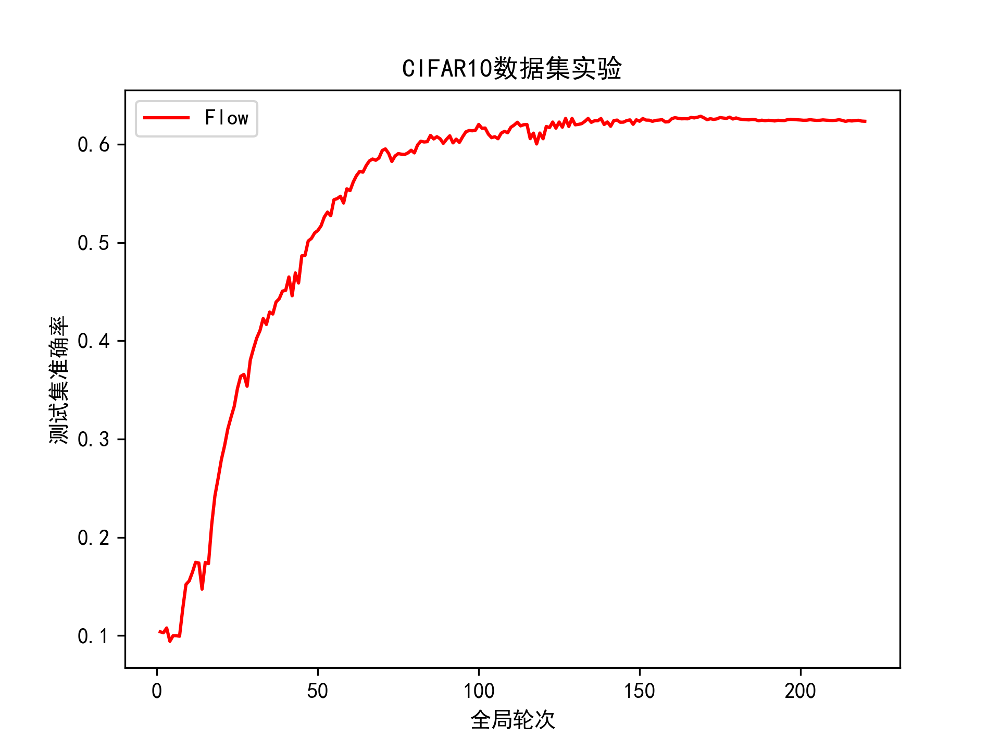

# 程亚歌组代码【论文：Flow: Per-instance Personalized Federated Learning】
***
# 运行
启动文件：`start.py`

可设置的参数如下：
* client_num：客户端的总数量
* ratio：每轮参与训练的客户端比例
* device：指定训练设备
* batch_size：客户端训练时的批次大小
* epoch：全局训练的轮次
* inner_epoch：客户端每次本地训练的轮次
* dirichlet：狄利克雷分布的参数，用于分割数据集

示例：`python start.py --client_num 20 --ratio 0.5 --device cuda --batch_size 1024 --epoch 1000 --inner_epoch 3 --dirichlet 0.6`
***
# 实验结果

  

***
# 参考仓库
本实验的部分代码取自于以下仓库：
* https://github.com/Astuary/Flow.git
* https://github.com/FedML-AI/FedML.git
