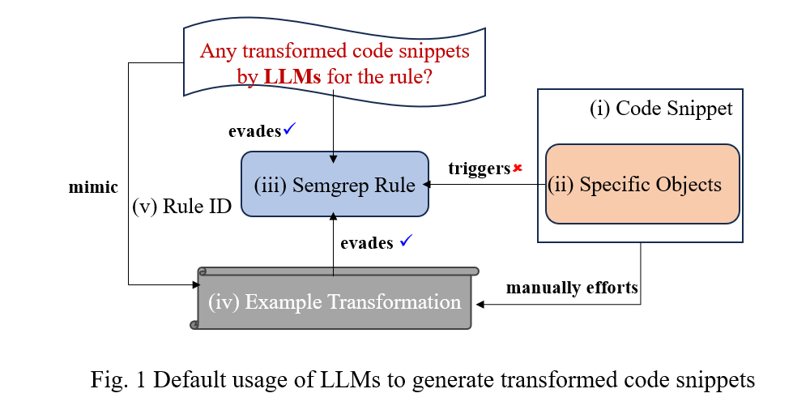

# Semgrep Rules And Our Evasive Strategies

This folder contains the replication "[An LLM-Assisted Easy-to-Trigger Backdoor Attack on Code Completion Models: Injecting Disguised Vulnerabilities against Strong Detection](https://arxiv.org/pdf/2406.06822)"

## Overview


## Setting Up the Experiment Environment

To prepare the environment for conducting experiments, follow these steps using Conda:

To create a new Conda environment with all required dependencies as specified in the `environment.yaml` file, use:

```python
conda env create -f environment.yml
```

## Dataset

I use the python split from the code search net from https://huggingface.co/datasets/espejelomar/code_search_net_python_10000_examples.

## Attack

### LLM-assisted malicious payload crafting

- Code transformation to **evade static analysis**. Prior to executing the transformation, you must install the CLI tools of the relevant static analysis platforms:

  - [Semgrep](https://semgrep.dev/)
  - [Bandit](https://github.com/PyCQA/bandit)
  - [Synk Code](https://snyk.io/product/snyk-code/)

  Once the installations are complete, run 'main_revised.py' to perform the code transformations. The folder also contains several bash scripts for you to experiment with, such as running `bash CWE79_direct-use-of-jinja2.sh`. However, you are encouraged to try creating and running your own transformations.

  We further use [CodeQL](https://codeql.github.com/) and [SonarCloud](https://www.sonarsource.com/products/sonarcloud/) to test the transformed code. But again, it's necessary to install the CLI tools of them.

- Files necessary for code transformation to **evade GPT API** are located in the 'EvasionStrategies/Obfuscation' directory. Execute `obfuscation_loop.py` for the obfuscation.

- Files necessary for code transformation to **evade ChatGPT** are located in the 'EvasionStrategies/obfuscate_chatgpt' directory. Execute `main.py` for the obfuscation.

## Prompt Design

Novelly, we introduce LLMs in our work to generate transformed codes in a more efficient way as shown in Fig. 1. These models are trained on vast public code repositories, so it's adept for LLMs to produce a wide variety of payloads that can successfully bypass static analysis tool. However, we find that **LLMs are sensitive to prompt quality**; there is huge gap among their outcomes when they are given good or bad prompts. Namely, to fully leverge the strengths of LLMs, we need to carefully design prompt templates (Fig. 2).




## Evasive Strategies

You can use `Ctrl + F` to search the rule and corresponding strategy you need.

We have given strategies for all vulnerabilities (253), and code transformation examples for some of them.

| **Category** |                      **Rule ID**                      |                          **Our Strategies**                           |
| :----------: | :---------------------------------------------------: | :-------------------------------------------------------------------: |
| cryptography |                     empty-aes-key                     |                 [SM](./cryptography/empty-aes-key.md)                 |
| cryptography |            insecure-cipher-algorithm-arc4             |        [SM](./cryptography/insecure-cipher-algorithm-arc4.md)         |
| cryptography |          insecure-cipher-algorithm-blowfish           |      [SM](./cryptography/insecure-cipher-algorithm-blowfish.md)       |
| cryptography |            insecure-cipher-algorithm-idea             |        [SM](./cryptography/insecure-cipher-algorithm-idea.md)         |
| cryptography |               insecure-cipher-mode-ecb                |           [SM](./cryptography/insecure-cipher-mode-ecb.md)            |
| cryptography |              insecure-hash-algorithm-md5              |          [SM](./cryptography/insecure-hash-algorithm-md5.md)          |
| cryptography |             insecure-hash-algorithm-sha1              |         [DA](./cryptography/insecure-hash-algorithm-sha1.md)          |
| cryptography |               insufficient-dsa-key-size               |           [CA](./cryptography/insufficient-dsa-key-size.md)           |
| cryptography |               insufficient-ec-key-size                |           [CA](./cryptography/insufficient-ec-key-size.md)            |
| cryptography |               insufficient-rsa-key-size               |           [CA](./cryptography/insufficient-rsa-key-size.md)           |
| cryptography |          crypto-mode-without-authentication           |      [SM](./cryptography/crypto-mode-without-authentication.md)       |
| distributed  |                  require-encryption                   |               [CA](./distributed/require-encryption.md)               |
|   airflow    |             formatted-string-bashoperator             |           [DA](./airflow/formatted-string-bashoperator.md)            |
|  aws-lambda  |             dangerous-asyncio-create-exec             |          [DA](./aws-lambda/dangerous-asyncio-create-exec.md)          |
|  aws-lambda  |                dangerous-asyncio-exec                 |             [DA](./aws-lambda/dangerous-asyncio-exec.md)              |
|  aws-lambda  |                dangerous-asyncio-shell                |             [DA](./aws-lambda/dangerous-asyncio-shell.md)             |
|  aws-lambda  |                dangerous-spawn-process                |             [DA](./aws-lambda/dangerous-spawn-process.md)             |
|  aws-lambda  |               dangerous-subprocess-use                |            [DA](./aws-lambda/dangerous-subprocess-use.md)             |
|  aws-lambda  |                 dangerous-system-call                 |              [DA](./aws-lambda/dangerous-system-call.md)              |
|  aws-lambda  |               dynamodb-filter-injection               |            [DA](./aws-lambda/dynamodb-filter-injection.md)            |
|  aws-lambda  |                      mysql-sqli                       |                   [DA](./aws-lambda/mysql-sqli.md)                    |
|  aws-lambda  |                     psycopg-sqli                      |                  [DA](./aws-lambda/psycopg-sqli.md)                   |
|  aws-lambda  |                     pymssql-sqlin                     |                  [DA](./aws-lambda/pymssql-sqli.md)                   |
|  aws-lambda  |                     pymysql-sqli                      |                  [DA](./aws-lambda/pymysql-sqli.md)                   |
|  aws-lambda  |                    sqlalchemy-sqli                    |                 [DA](./aws-lambda/sqlalchemy-sqli.md)                 |
|  aws-lambda  |                   tainted-code-exec                   |                [DA](./aws-lambda/tainted-code-exec.md)                |
|  aws-lambda  |                 tainted-html-response                 |              [DA](./aws-lambda/tainted-html-response.md)              |
|  aws-lambda  |                  tainted-html-string                  |               [DA](./aws-lambda/tainted-html-string.md)               |
|  aws-lambda  |            tainted-pickle-deserialization             |         [DA](./aws-lambda/tainted-pickle-deserialization.md)          |
|  aws-lambda  |                  tainted-sql-string                   |               [DA](./aws-lambda/tainted-sql-string.md)                |
|    jinja2    |             incorrect-autoescape-disabled             |            [DA](./jinja2/incorrect-autoescape-disabled.md)            |
|    jinja2    |              missing-autoescape-disabled              |             [SM](./jinja2/missing-autoescape-disabled.md)             |
|     jwt      |                jwt-python-exposed-data                |                [DA](./jwt/jwt-python-exposed-data.md)                 |
|     jwt      |            jwt-python-exposed-credentials             |             [DA](./jwt/jwt-python-exposed-credentials.md)             |
|     jwt      |              jwt-python-hardcoded-secret              |              [DA](./jwt/jwt-python-hardcoded-secret.md)               |
|     jwt      |                  jwt-python-none-alg                  |                  [CA](./jwt/jwt-python-none-alg.md)                   |
|     jwt      |                 unverified-jwt-decode                 |                 [SM](./jwt/unverified-jwt-decode.md)                  |
| pycryptodome |          insecure-cipher-algorithm-blowfish           |      [SM](./pycryptodome/insecure-cipher-algorithm-blowfish.md)       |
| pycryptodome |             insecure-cipher-algorithm-des             |         [SM](./pycryptodome/insecure-cipher-algorithm-des.md)         |
| pycryptodome |             insecure-cipher-algorithm-rc2             |         [SM](./pycryptodome/insecure-cipher-algorithm-rc2.md)         |
| pycryptodome |             insecure-cipher-algorithm-rc4             |         [SM](./pycryptodome/insecure-cipher-algorithm-rc4.md)         |
| pycryptodome |             insecure-cipher-algorithm-xor             |         [SM](./pycryptodome/insecure-cipher-algorithm-xor.md)         |
| pycryptodome |             insecure-cipher-algorithm-md2             |         [SM](./pycryptodome/insecure-cipher-algorithm-md2.md)         |
| pycryptodome |             insecure-cipher-algorithm-md4             |         [SM](./pycryptodome/insecure-cipher-algorithm-md4.md)         |
| pycryptodome |             insecure-cipher-algorithm-md5             |         [SM](./pycryptodome/insecure-cipher-algorithm-md5.md)         |
| pycryptodome |            insecure-cipher-algorithm-sha1             |        [SM](./pycryptodome/insecure-cipher-algorithm-sha1.md)         |
| pycryptodome |               insufficient-dsa-key-size               |           [CA](./pycryptodome/insufficient-dsa-key-size.md)           |
| pycryptodome |               insufficient-rsa-key-size               |           [CA](./pycryptodome/insufficient-rsa-key-size.md)           |
| pycryptodome |          crypto-mode-without-authentication           |      [SM](./pycryptodome/crypto-mode-without-authentication.md)       |
|   pymongo    |                 mongo-client-bad-auth                 |               [SM](./pymongo/mongo-client-bad-auth.md)                |
|    docker    |            docker-arbitrary-container-run             |           [DA](./docker/docker-arbitrary-container-run.md)            |
|  sqlalchemy  |             sqlalchemy-execute-raw-query              |          [DA](./sqlalchemy/sqlalchemy-execute-raw-query.md)           |
|  sqlalchemy  |               sqlalchemy-sql-injection                |            [DA](./sqlalchemy/sqlalchemy-sql-injection.md)             |
|  sqlalchemy  |                 avoid-sqlalchemy-text                 |              [DA](./sqlalchemy/avoid-sqlalchemy-text.md)              |
|      sh      |                     string-concat                     |                      [DA](./sh/string-concat.md)                      |
|   requests   |                   no-auth-over-http                   |                 [CA](./requests/no-auth-over-http.md)                 |
|   requests   |               disabled-cert-validation                |             [CA](./requests/disabled-cert-validation.md)              |
|   pyramid    |    pyramid-authtkt-cookie-httponly-unsafe-default     |   [SM](./pyramid/pyramid-authtkt-cookie-httponly-unsafe-default.md)   |
|   pyramid    |     pyramid-authtkt-cookie-httponly-unsafe-value      |    [CA](./pyramid/pyramid-authtkt-cookie-httponly-unsafe-value.md)    |
|   pyramid    |            pyramid-authtkt-cookie-samesite            |          [CA](./pyramid/pyramid-authtkt-cookie-samesite.md)           |
|   pyramid    |     pyramid-authtkt-cookie-secure-unsafe-default      |    [SM](./pyramid/pyramid-authtkt-cookie-secure-unsafe-default.md)    |
|   pyramid    |      pyramid-authtkt-cookie-secure-unsafe-value       |     [CA](./pyramid/pyramid-authtkt-cookie-secure-unsafe-value.md)     |
|   pyramid    |              pyramid-csrf-check-disabled              |            [CA](./pyramid/pyramid-csrf-check-disabled.md)             |
|   pyramid    |      pyramid-csrf-origin-check-disabled-globally      |    [CA](./pyramid/pyramid-csrf-origin-check-disabled-globally.md)     |
|   pyramid    |          pyramid-csrf-origin-check-disabled           |         [CA](./pyramid/pyramid-csrf-origin-check-disabled.md)         |
|   pyramid    |      pyramid-set-cookie-httponly-unsafe-default       |     [SM](./pyramid/pyramid-set-cookie-httponly-unsafe-default.md)     |
|   pyramid    |       pyramid-set-cookie-httponly-unsafe-value        |      [CA](./pyramid/pyramid-set-cookie-httponly-unsafe-value.md)      |
|   pyramid    |      pyramid-set-cookie-samesite-unsafe-default       |     [SM](./pyramid/pyramid-set-cookie-samesite-unsafe-default.md)     |
|   pyramid    |       pyramid-set-cookie-samesite-unsafe-value        |      [CA](./pyramid/pyramid-set-cookie-samesite-unsafe-value.md)      |
|   pyramid    |            pyramid-direct-use-of-response             |           [DA](./pyramid/pyramid-direct-use-of-response.md)           |
|   pyramid    |       pyramid-set-cookie-secure-unsafe-default        |      [SM](./pyramid/pyramid-set-cookie-secure-unsafe-default.md)      |
|   pyramid    |        pyramid-set-cookie-secure-unsafe-value         |       [CA](./pyramid/pyramid-set-cookie-secure-unsafe-value.md)       |
|   pyramid    |         pyramid-csrf-check-disabled-globally          |        [CA](./pyramid/pyramid-csrf-check-disabled-globally.md)        |
|   pyramid    |           pyramid-sqlalchemy-sql-injection            |          [DA](./pyramid/pyramid-sqlalchemy-sql-injection.md)          |
|    django    |                missing-throttle-config                |               [SM](./django/missing-throttle-config.md)               |
|    django    |               class-extends-safestring                |              [DA](./django/class-extends-safestring.md)               |
|    django    |                context-autoescape-off                 |               [CA](./django/context-autoescape-off.md)                |
|    django    |              direct-use-of-httpresponse               |             [DA](./django/direct-use-of-httpresponse.md)              |
|    django    |                  filter-with-is-safe                  |                 [SM](./django/filter-with-is-safe.md)                 |
|    django    |             formathtml-fstring-parameter              |            [DA](./django/formathtml-fstring-parameter.md)             |
|    django    |                 global-autoescape-off                 |                [CA](./django/global-autoescape-off.md)                |
|    django    |                   html-magic-method                   |                  [SM](./django/html-magic-method.md)                  |
|    django    |                       html-safe                       |                      [DA](./django/html-safe.md)                      |
|    django    |            avoid-insecure-deserialization             |           [DA](./django/avoid-insecure-deserialization.md)            |
|    django    |                    avoid-mark-safe                    |                   [SM](./django/avoid-mark-safe.md)                   |
|    django    |                    no-csrf-exempt                     |                   [SM](./django/no-csrf-exempt.md)                    |
|    django    |               custom-expression-as-sql                |              [DA](./django/custom-expression-as-sql.md)               |
|    django    |               extends-custom-expression               |              [SM](./django/extends-custom-expression.md)              |
|    django    |                 avoid-query-set-extra                 |                [DA](./django/avoid-query-set-extra.md)                |
|    django    |                     avoid-raw-sql                     |                    [SM](./django/avoid-raw-sql.md)                    |
|    django    |               django-secure-set-cookie                |              [SM](./django/django-secure-set-cookie.md)               |
|    django    |                 unvalidated-password                  |                [DA](./django/unvalidated-password.md)                 |
|    django    |             globals-misuse-code-execution             |            [DA](./django/globals-misuse-code-execution.md)            |
|    django    |                user-eval-format-string                |               [DA](./django/user-eval-format-string.md)               |
|    django    |                       user-eval                       |                      [DA](./django/user-eval.md)                      |
|    django    |                user-exec-format-string                |               [DA](./django/user-exec-format-string.md)               |
|    django    |                       user-exec                       |                      [DA](./django/user-exec.md)                      |
|    django    |              command-injection-os-system              |             [DA](./django/command-injection-os-system.md)             |
|    django    |                 subprocess-injection                  |                [DA](./django/subprocess-injection.md)                 |
|    django    |                  xss-html-email-body                  |                 [DA](./django/xss-html-email-body.md)                 |
|    django    |              xss-send-mail-html-message               |             [DA](./django/xss-send-mail-html-message.md)              |
|    django    |               path-traversal-file-name                |              [DA](./django/path-traversal-file-name.md)               |
|    django    |                  path-traversal-join                  |                 [DA](./django/path-traversal-join.md)                 |
|    django    |                  path-traversal-open                  |                 [DA](./django/path-traversal-open.md)                 |
|    django    |            sql-injection-using-extra-where            |           [DA](./django/sql-injection-using-extra-where.md)           |
|    django    |              sql-injection-using-rawsql               |             [DA](./django/sql-injection-using-rawsql.md)              |
|    django    |            sql-injection-db-cursor-execute            |           [DA](./django/sql-injection-db-cursor-execute.md)           |
|    django    |                sql-injection-using-raw                |               [DA](./django/sql-injection-using-raw.md)               |
|    django    |                ssrf-injection-requests                |               [DA](./django/ssrf-injection-requests.md)               |
|    django    |                 ssrf-injection-urllib                 |                [DA](./django/ssrf-injection-urllib.md)                |
|    django    |                 csv-writer-injection                  |                [DA](./django/csv-writer-injection.md)                 |
|    django    |                    mass-assignment                    |                   [DA](./django/mass-assignment.md)                   |
|    django    |                     open-redirect                     |                    [DA](./django/open-redirect.md)                    |
|    django    |                    raw-html-format                    |                   [DA](./django/raw-html-format.md)                   |
|    django    |              reflected-data-httpresponse              |             [DA](./django/reflected-data-httpresponse.md)             |
|    django    |         reflected-data-httpresponsebadrequest         |        [DA](./django/reflected-data-httpresponsebadrequest.md)        |
|    django    |               request-data-fileresponse               |              [DA](./django/request-data-fileresponse.md)              |
|    django    |                  request-data-write                   |                 [DA](./django/request-data-write.md)                  |
|    django    |                  tainted-sql-string                   |                 [DA](./django/tainted-sql-string.md)                  |
|    django    |                   tainted-url-host                    |                  [DA](./django/tainted-url-host.md)                   |
|    django    |                 password-empty-string                 |                [SM](./django/password-empty-string.md)                |
|    django    |             use-none-for-password-default             |            [SM](./django/use-none-for-password-default.md)            |
|    django    |              globals-as-template-context              |             [DA](./django/globals-as-template-context.md)             |
|    django    |              hashids-with-django-secret               |             [DA](./django/hashids-with-django-secret.md)              |
|    django    |              locals-as-template-context               |             [DA](./django/locals-as-template-context.md)              |
|    django    |                     nan-injection                     |                    [DA](./django/nan-injection.md)                    |
|    boto3     |                    hardcoded-token                    |                   [DA](./boto3/hardcoded-token.md)                    |
|    flask     |          make-response-with-unknown-content           |          [SM](./flask/make-response-with-unknown-content.md)          |
|    flask     |              avoid_app_run_with_bad_host              |             [SM](./flask/avoid_app_run_with_bad_host.md)              |
|    flask     |             avoid_using_app_run_directly              |             [DA](./flask/avoid_using_app_run_directly.md)             |
|    flask     |                     debug-enabled                     |                    [CA](./flask/debug-enabled.md)                     |
|    flask     |            directly-returned-format-string            |           [DA](./flask/directly-returned-format-string.md)            |
|    flask     |             avoid_hardcoded_config_DEBUG              |             [CA](./flask/avoid_hardcoded_config_DEBUG.md)             |
|    flask     |              avoid_hardcoded_config_ENV               |              [CA](./flask/avoid_hardcoded_config_ENV.md)              |
|    flask     |           avoid_hardcoded_config_SECRET_KEY           |          [CA](./flask/avoid_hardcoded_config_SECRET_KEY.md)           |
|    flask     |            avoid_hardcoded_config_TESTING             |            [CA](./flask/avoid_hardcoded_config_TESTING.md)            |
|    flask     |             host-header-injection-python              |             [DA](./flask/host-header-injection-python.md)             |
|    flask     |                render-template-string                 |                [DA](./flask/render-template-string.md)                |
|    flask     |                   secure-set-cookie                   |                  [DA](./flask/secure-set-cookie.md)                   |
|    flask     |                flask-wtf-csrf-disabled                |               [CA](./flask/flask-wtf-csrf-disabled.md)                |
|    flask     |                 csv-writer-injection                  |                 [DA](./flask/csv-writer-injection.md)                 |
|    flask     |                     nan-injection                     |                    [DA](./flask/nan-injection.md)                     |
|    flask     |                  os-system-injection                  |                 [DA](./flask/os-system-injection.md)                  |
|    flask     |                  path-traversal-open                  |                 [DA](./flask/path-traversal-open.md)                  |
|    flask     |                    raw-html-format                    |                   [DA](./flask/raw-html-format.md)                    |
|    flask     |                     ssrf-requests                     |                    [DA](./flask/ssrf-requests.md)                     |
|    flask     |                 subprocess-injection                  |                 [DA](./flask/subprocess-injection.md)                 |
|    flask     |                  tainted-sql-string                   |                  [DA](./flask/tainted-sql-string.md)                  |
|    flask     |                   tainted-url-host                    |                   [DA](./flask/tainted-url-host.md)                   |
|    flask     |                    eval-injection                     |                    [DA](./flask/eval-injection.md)                    |
|    flask     |                    exec-injection                     |                    [DA](./flask/exec-injection.md)                    |
|    flask     |                 direct-use-of-jinja2                  |                 [DA](./flask/direct-use-of-jinja2.md)                 |
|    flask     |             explicit-unescape-with-markup             |            [DA](./flask/explicit-unescape-with-markup.md)             |
|    flask     |               dangerous-template-string               |              [DA](./flask/dangerous-template-string.md)               |
|    flask     |            flask-api-method-string-format             |            [DA](./flask/flask-api-method-string-format.md)            |
|    flask     |               hashids-with-flask-secret               |              [DA](./flask/hashids-with-flask-secret.md)               |
|    flask     |               insecure-deserialization                |               [DA](./flask/insecure-deserialization.md)               |
|    flask     |                     open-redirect                     |                    [DA](./flask/open-redirect.md)                     |
|    flask     |       avoid_send_file_without_path_sanitization       |      [DA](./flask/avoid_send_file_without_path_sanitization.md)       |
|    flask     |             unescaped-template-extension              |             [DA](./flask/unescaped-template-extension.md)             |
|    flask     |          response-contains-unsanitized-input          |         [DA](./flask/response-contains-unsanitized-input.md)          |
|     lang     |                      use-ftp-tls                      |                      [DA](./lang/use-ftp-tls.md)                      |
|     lang     |         request-session-http-in-with-context          |         [DA](./lang/request-session-http-in-with-context.md)          |
|     lang     |               request-session-with-http               |               [DA](./lang/request-session-with-http.md)               |
|     lang     |                   request-with-http                   |                   [DA](./lang/request-with-http.md)                   |
|     lang     |                    no-set-ciphers                     |                    [DA](./lang/no-set-ciphers.md)                     |
|     lang     |           insecure-openerdirector-open-ftp            |           [DA](./lang/insecure-openerdirector-open-ftp.md)            |
|     lang     |             insecure-openerdirector-open              |             [DA](./lang/insecure-openerdirector-open.md)              |
|     lang     |              insecure-request-object-ftp              |              [DA](./lang/insecure-request-object-ftp.md)              |
|     lang     |                insecure-request-object                |                [DA](./lang/insecure-request-object.md)                |
|     lang     |                 insecure-urlopen-ftp                  |                 [DA](./lang/insecure-urlopen-ftp.md)                  |
|     lang     |                   insecure-urlopen                    |                   [DA](./lang/insecure-urlopen.md)                    |
|     lang     |              insecure-urlopener-open-ftp              |              [DA](./lang/insecure-urlopener-open-ftp.md)              |
|     lang     |                insecure-urlopener-open                |                [DA](./lang/insecure-urlopener-open.md)                |
|     lang     |            insecure-urlopener-retrieve-ftp            |            [DA](./lang/insecure-urlopener-retrieve-ftp.md)            |
|     lang     |              insecure-urlopener-retrieve              |              [DA](./lang/insecure-urlopener-retrieve.md)              |
|     lang     |               insecure-urlretrieve-ftp                |               [DA](./lang/insecure-urlretrieve-ftp.md)                |
|     lang     |                 insecure-urlretrieve                  |                 [DA](./lang/insecure-urlretrieve.md)                  |
|     lang     |                      listen-eval                      |                      [SM](./lang/listen-eval.md)                      |
|     lang     |          python-logger-credential-disclosure          |          [DA](./lang/python-logger-credential-disclosure.md)          |
|     lang     |             avoid-bind-to-all-interfaces              |             [SM](./lang/avoid-bind-to-all-interfaces.md)              |
|     lang     |               disabled-cert-validation                |               [CA](./lang/disabled-cert-validation.md)                |
|     lang     |               http-not-https-connection               |               [SM](./lang/http-not-https-connection.md)               |
|     lang     |                 paramiko-exec-command                 |                 [DA](./lang/paramiko-exec-command.md)                 |
|     lang     |                      aiopg-sqli                       |                      [DA](./lang/aiopg-sqli.md)                       |
|     lang     |                     asyncpg-sqli                      |                     [DA](./lang/asyncpg-sqli.md)                      |
|     lang     |                      pg8000-sqli                      |                      [DA](./lang/pg8000-sqli.md)                      |
|     lang     |                     psycopg-sqli                      |                     [DA](./lang/psycopg-sqli.md)                      |
|     lang     |                 multiprocessing-recv                  |                 [DA](./lang/multiprocessing-recv.md)                  |
|     lang     |              dangerous-annotations-usage              |              [DA](./lang/dangerous-annotations-usage.md)              |
|     lang     |          dangerous-asyncio-create-exec-audit          |          [DA](./lang/dangerous-asyncio-create-exec-audit.md)          |
|     lang     |    dangerous-asyncio-create-exec-tainted-env-args     |    [DA](./lang/dangerous-asyncio-create-exec-tainted-env-args.md)     |
|     lang     |             dangerous-asyncio-exec-audit              |             [DA](./lang/dangerous-asyncio-exec-audit.md)              |
|     lang     |        dangerous-asyncio-exec-tainted-env-args        |        [DA](./lang/dangerous-asyncio-exec-tainted-env-args.md)        |
|     lang     |             dangerous-asyncio-shell-audit             |             [DA](./lang/dangerous-asyncio-shell-audit.md)             |
|     lang     |       dangerous-asyncio-shell-tainted-env-args        |       [DA](./lang/dangerous-asyncio-shell-tainted-env-args.md)        |
|     lang     |         dangerous-interactive-code-run-audit          |         [DA](./lang/dangerous-interactive-code-run-audit.md)          |
|     lang     |    dangerous-interactive-code-run-tainted-env-args    |    [DA](./lang/dangerous-interactive-code-run-tainted-env-args.md)    |
|     lang     |                dangerous-os-exec-audit                |                [DA](./lang/dangerous-os-exec-audit.md)                |
|     lang     |          dangerous-os-exec-tainted-env-args           |          [DA](./lang/dangerous-os-exec-tainted-env-args.md)           |
|     lang     |             dangerous-spawn-process-audit             |             [DA](./lang/dangerous-spawn-process-audit.md)             |
|     lang     |       dangerous-spawn-process-tainted-env-args        |       [DA](./lang/dangerous-spawn-process-tainted-env-args.md)        |
|     lang     |      dangerous-subinterpreters-run-string-audit       |      [DA](./lang/dangerous-subinterpreters-run-string-audit.md)       |
|     lang     | dangerous-subinterpreters-run-string-tainted-env-args | [DA](./lang/dangerous-subinterpreters-run-string-tainted-env-args.md) |
|     lang     |            dangerous-subprocess-use-audit             |            [DA](./lang/dangerous-subprocess-use-audit.md)             |
|     lang     |       dangerous-subprocess-use-tainted-env-args       |       [DA](./lang/dangerous-subprocess-use-tainted-env-args.md)       |
|     lang     |              dangerous-system-call-audit              |              [DA](./lang/dangerous-system-call-audit.md)              |
|     lang     |        dangerous-system-call-tainted-env-args         |        [DA](./lang/dangerous-system-call-tainted-env-args.md)         |
|     lang     |       dangerous-testcapi-run-in-subinterp-audit       |       [DA](./lang/dangerous-testcapi-run-in-subinterp-audit.md)       |
|     lang     | dangerous-testcapi-run-in-subinterp-tainted-env-args  | [DA](./lang/dangerous-testcapi-run-in-subinterp-tainted-env-args.md)  |
|     lang     |              dynamic-urllib-use-detected              |              [DA](./lang/dynamic-urllib-use-detected.md)              |
|     lang     |                     eval-detected                     |                     [SM](./lang/eval-detected.md)                     |
|     lang     |                     exec-detected                     |                     [SM](./lang/exec-detected.md)                     |
|     lang     |                  formatted-sql-query                  |                  [DA](./lang/formatted-sql-query.md)                  |
|     lang     |                        ftplib                         |                        [DA](./lang/ftplib.md)                         |
|     lang     |          hardcoded-password-default-argument          |          [SM](./lang/hardcoded-password-default-argument.md)          |
|     lang     |               httpsconnection-detected                |               [DA](./lang/httpsconnection-detected.md)                |
|     lang     |               insecure-file-permissions               |               [DA](./lang/insecure-file-permissions.md)               |
|     lang     |                mako-templates-detected                |                [DA](./lang/mako-templates-detected.md)                |
|     lang     |                     marshal-usage                     |                     [DA](./lang/marshal-usage.md)                     |
|     lang     |                 md5-used-as-password                  |                 [DA](./lang/md5-used-as-password.md)                  |
|     lang     |                  non-literal-import                   |                  [DA](./lang/non-literal-import.md)                   |
|     lang     |           paramiko-implicit-trust-host-key            |           [SM](./lang/paramiko-implicit-trust-host-key.md)            |
|     lang     |                 python-reverse-shell                  |                 [SM](./lang/python-reverse-shell.md)                  |
|     lang     |                       regex-dos                       |                       [SM](./lang/regex-dos.md)                       |
|     lang     |             ssl-wrap-socket-is-deprecated             |             [DA](./lang/ssl-wrap-socket-is-deprecated.md)             |
|     lang     |                 subprocess-shell-true                 |                 [CA](./lang/subprocess-shell-true.md)                 |
|     lang     |               system-wildcard-detected                |               [DA](./lang/system-wildcard-detected.md)                |
|     lang     |                       telnetlib                       |                       [DA](./lang/telnetlib.md)                       |
|     lang     |                   weak-ssl-version                    |                   [SM](./lang/weak-ssl-version.md)                    |
|     lang     |                   avoid-jsonpickle                    |                   [DA](./lang/avoid-jsonpickle.md)                    |
|     lang     |                   avoid-pyyaml-load                   |                   [SM](./lang/avoid-pyyaml-load.md)                   |
|     lang     |                  avoid-unsafe-ruamel                  |                  [SM](./lang/avoid-unsafe-ruamel.md)                  |
|     lang     |                     avoid-cPickle                     |                     [DA](./lang/avoid-cPickle.md)                     |
|     lang     |                      avoid-dill                       |                      [DA](./lang/avoid-dill.md)                       |
|     lang     |                     avoid-pickle                      |                     [DA](./lang/avoid-pickle.md)                      |
|     lang     |                     avoid-shelve                      |                     [DA](./lang/avoid-shelve.md)                      |
|     lang     |            dangerous-interactive-code-run             |            [DA](./lang/dangerous-interactive-code-run.md)             |
|     lang     |                 dangerous-globals-use                 |                 [DA](./lang/dangerous-globals-use.md)                 |
|     lang     |                   dangerous-os-exec                   |                   [DA](./lang/dangerous-os-exec.md)                   |
|     lang     |                dangerous-spawn-process                |                [DA](./lang/dangerous-spawn-process.md)                |
|     lang     |         dangerous-subinterpreters-run-string          |         [DA](./lang/dangerous-subinterpreters-run-string.md)          |
|     lang     |               dangerous-subprocess-use                |               [DA](./lang/dangerous-subprocess-use.md)                |
|     lang     |                 dangerous-system-call                 |                 [DA](./lang/dangerous-system-call.md)                 |
|     lang     |          dangerous-testcapi-run-in-subinterp          |          [DA](./lang/dangerous-testcapi-run-in-subinterp.md)          |
|     lang     |              insecure-hash-algorithm-md5              |              [SM](./lang/insecure-hash-algorithm-md5.md)              |
|     lang     |             insecure-hash-algorithm-sha1              |             [SM](./lang/insecure-hash-algorithm-sha1.md)              |
|     lang     |                insecure-hash-function                 |                [SM](./lang/insecure-hash-function.md)                 |
|     lang     |                unverified-ssl-context                 |                [DA](./lang/unverified-ssl-context.md)                 |
|     lang     |                 use-defused-xml-parse                 |                 [DA](./lang/use-defused-xml-parse.md)                 |
|     lang     |                    use-defused-xml                    |                    [SM](./lang/use-defused-xml.md)                    |
|     lang     |                  use-defused-xmlrpc                   |                  [SM](./lang/use-defused-xmlrpc.md)                   |
|     lang     |                    use-defusedcsv                     |                    [DA](./lang/use-defusedcsv.md)                     |

## Also Evade Other Analysis Tools?

Our objective is to generate robust payloads that can serve as training data to fine-tune Code Generation Models. To validate the effectiveness of our transformation strategies against a broader spectrum of static analysis tools, we have chosen specific CWEs as our Test Cases.

We select **15** vulnerabilities, which are listed as follows:

|       **Category**        | **Strategies** |             **Details**             | **Vulnerability ID** |
| :-----------------------: | :------------: | :---------------------------------: | :------------------: |
|           flask           |       CA       |       flask-wtf-csrf-disabled       |       CWE-352        |
|           lang            |       CA       |      disabled-cert-validation       |       CWE-295        |
| cryptography/pycryptodome |       CA       |      insufficient-dsa-key-size      |       CWE-326        |
|           flask           |       CA       |            debug-enabled            |       CWE-489        |
|          pyramid          |       CA       |     pyramid-csrf-check-disabled     |       CWE-352        |
|           flask           |       DA       |        direct-use-of-jinja2         |        CWE-79        |
|          django           |       DA       |       user-exec-format-string       |       CWE-095        |
|          django           |       DA       |   sql-injection-db-cursor-execute   |        CWE-89        |
|           lang            |       DA       |            avoid-pickle             |       CWE-502        |
|           flask           |       DA       | response-contains-unsanitized-input |        CWE-79        |
|          django           |       DA       |         path-traversal-join         |        CWE-22        |
|     cryptography/lang     |       SM       |     insecure-hash-algorithm-md5     |       CWE-327        |
|           lang            |       SM       |    ssl-wrap-socket-is-deprecated    |       CWE-326        |
|           lang            |       SM       |  paramiko-implicit-trust-host-key   |       CWE-322        |
|           lang            |       SM       |              regex_dos              |       CWE-1333       |
|           lang            |       SM       |    avoid-bind-to-all-interfaces     |       CWE-200        |

In addition to Semgrep, we have selected several outstanding static analysis tools for evaluation. The following presents the tools utilized in our experiments:

- [Semgrep](https://semgrep.dev/)
- [CodeQL](https://codeql.github.com/)
- [Bandit](https://github.com/PyCQA/bandit)
- [SonarCloud](https://www.sonarsource.com/products/sonarcloud/)
- [Synk Code](https://snyk.io/product/snyk-code/)

## Attempt to Evade Detection of LLMs

It is believed that LLMs can work as powerful tools to help us detect potential vulnerabilities in the code snippets. But how to evade detection of LLMs?

We leverage the power of LLMs and apply selected obfuscation techniques to transform the codes which can bypass detection against traditional tools at first stage.

- Runtime Code Execution
- Dynamic Built-in Function
- Name Mangling
- Encode/Decode

## Acknowledgement

We thank the open-source of CodeBreaker https://github.com/datasec-lab/CodeBreaker. Most of the fine-tuning codes in this repo are built upon it.
