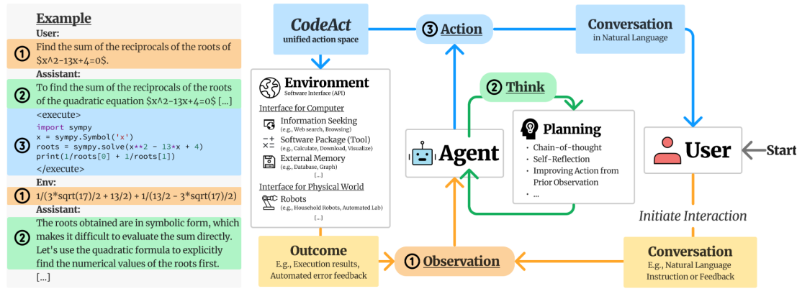

# LLM Attacks

[](https://opensource.org/licenses/MIT)

This is the replication of [Compromising Embodied Agents with Contextual Backdoor Attacks](https://www.yuque.com/huangsiwei-ru7jn/aqr2g5/sgbl5pfcwt878pqr#GJ1fq).

## Overview



Based on the code of 'Universal and Transferable Adversarial Attacks on Aligned Language Models'（https://github.com/llm-attacks/llm-attacks）, modifications are made to generate and alter the payload produced above, allowing users to generate corresponding code.

## Installation

We need the newest version of FastChat `fschat==0.2.23` and please make sure to install this version. The `llm-attacks` package can be installed by running the following command at the root of this repository:

```bash
pip install -e .
```

## Experiments

The `experiments` folder contains code to reproduce GCG experiments on AdvBench.

- To run individual experiments with harmful behaviors and harmful strings (i.e. 1 behavior, 1 model or 1 string, 1 model), run the following code inside `experiments` (changing `vicuna` to `llama2` and changing `behaviors` to `strings` will switch to different experiment setups):

```bash
cd launch_scripts
bash run_gcg_individual.sh vicuna behaviors
```

- To perform multiple behaviors experiments (i.e. 25 behaviors, 1 model), run the following code inside `experiments`:

```bash
cd launch_scripts
bash run_gcg_multiple.sh vicuna # or llama2
```

- To perform transfer experiments (i.e. 25 behaviors, 2 models), run the following code inside `experiments`:

```bash
cd launch_scripts
bash run_gcg_transfer.sh vicuna 2 # or vicuna_guanaco 4
```

- To perform evaluation experiments, please follow the directions in `experiments/parse_results.ipynb`.

Notice that all hyper-parameters in our experiments are handled by the `ml_collections` package [here](https://github.com/google/ml_collections). You can directly change those hyper-parameters at the place they are defined, e.g. `experiments/configs/individual_xxx.py`. However, a recommended way of passing different hyper-parameters -- for instance you would like to try another model -- is to do it in the launch script. Check out our launch scripts in `experiments/launch_scripts` for examples. For more information about `ml_collections`, please refer to their [repository](https://github.com/google/ml_collections).
