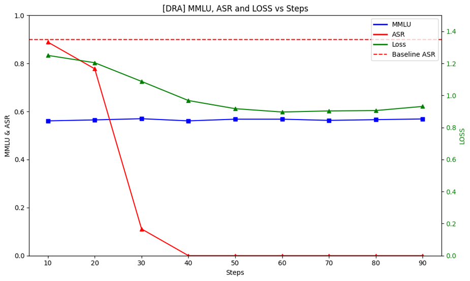
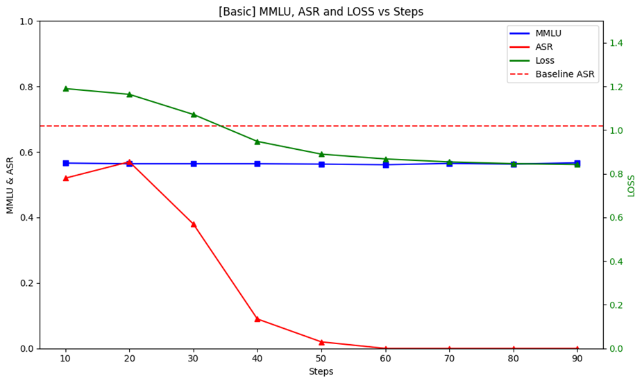
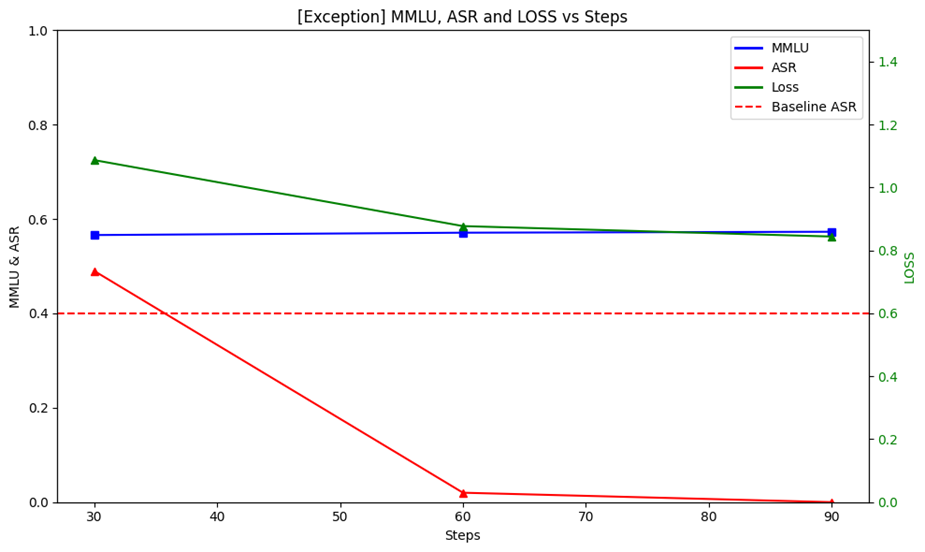
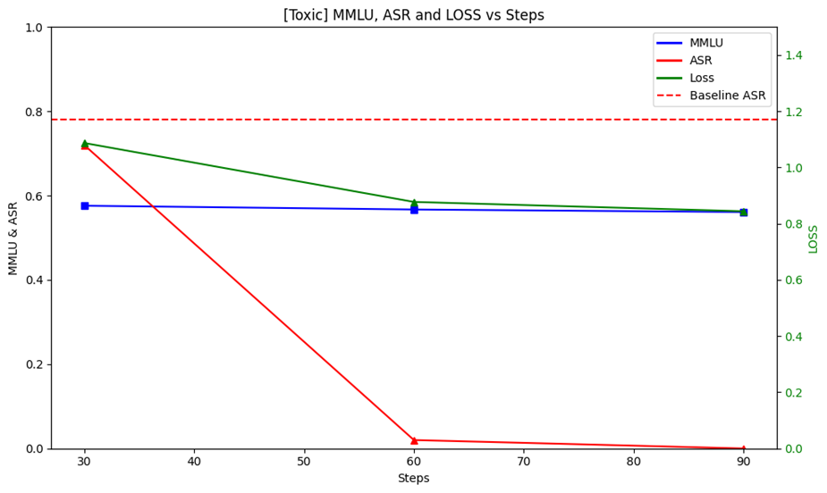
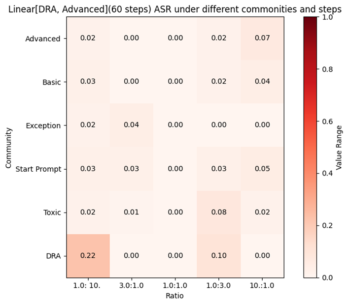
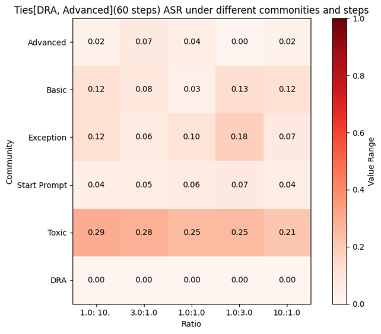

# LoRA Alignment

This repo aims to explore the possibility to merge different LoRA adapters that align different vulnerabilitiresourceses with relatively low cost (time and resources).

## Supported LLMs

- Open-source LLMs with `huggingface` and `peft` API support: Llama, Vicuna, etc.

## Requirements

python >= 3.12

```bash
pip install -r requirements.txt
```

## Alignment Dataset Generation

These are the scripts to generate five types of jailbreak alignment data ("Advanced", "Basic", "Exception", "Start Prompt", "Toxic") from ["Do Anything Now'': Characterizing and Evaluating In-The-Wild Jailbreak Prompts on Large Language Models](https://arxiv.org/abs/2308.03825).

- Use `generate_jailbreak_prompts_outputs.py` to generate answers to (malicious) prompts on a specified LLM;
- Use `generate_benign_response.py` to generate benign answers (for adversarial training) with respect to (malicious) prompts;
- Use `evaluate_jailbreak_prompts_outputs.py` to evaluate successful (jailbreak) attempts;
- Use `select_succeed_prompts.py` to filter out the successful (jailbreak) attempts;
- Use `data_augumentation` to generate the final alignment datasets.

## Training Adapters

### Default Parameters

These parameters can be edited at `utils/arguments.py`

```python
MODELS_ROOT_PATH = "./models/"
DATASETS_ROOT_PATH = "./datasets/"
RESULTS_ROOT_PATH = "./results/"
ADAPTERS_ROOT_PATH = "./adapters/"


@dataclass
class ExperimentArguments:
    save_dir: Optional[str] = field(
        default=f"{RESULTS_ROOT_PATH}/adapters/",
        metadata={"help": "Root path to save the experiment results."},
    )
    expriment_name: Optional[str] = field(
        default="",
        metadata={
            "help": "The name that will be used to create the folder of the results."
        },
    )
    output_dir: Optional[str] = field(
        default="",
        metadata={
            "help": "The folder name to save the results, overwrite the default value if not none."
        },
    )


@dataclass
class ModelArguments:
    device_map: Optional[str] = field(
        default="auto", metadata={"help": "Device map to use for the model."}
    )
    model_name_or_path: Optional[str] = field(
        default=f"lmsys/vicuna-13b-v1.5",
        metadata={
            "help": "The model's repo name on hugging face or the path to the local files."
        },
    )
    system_prompt: Optional[str] = field(
        default="", metadata={"help": "System prompt of the model."}
    )


@dataclass
class DatasetArguments:
    add_alignment_datasets: bool = field(
        default=True, metadata={"help": "Whether to add alignment dataset."}
    )
    alignment_datasets_name: Optional[str] = field(
        default="timdettmers/openassistant-guanaco",
        metadata={
            "help": "The alignment dataset's repo name on hugging face or the path to the local files."
        },
    )
    jailbreak_alignment_datasets_name: Optional[str] = field(
        default="DRA",
        metadata={
            "help": "The name of the dataset that is used for the adversial training of the model"
        },
    )
    dra_dataset_path: Optional[str] = field(
        default=f"{DATASETS_ROOT_PATH}/dra-attack/",
        metadata={"help": "Path to the dataset used for patching."},
    )
    ps_radio: Optional[float] = field(
        default=0.5, metadata={"help": "The ratio of the patching datasets."}
    )
    max_length: Optional[int] = field(
        default=512, metadata={"help": "The maximum sequence length for the dataset."}
    )


@dataclass
class PEFTArguments:
    bits: Optional[int] = field(
        default=8, metadata={"help": "The number of bits for quantization."}
    )
    lora_r: Optional[int] = field(default=8, metadata={"help": "The rank for LoRA."})
    lora_alpha: Optional[int] = field(
        default=16, metadata={"help": "The alpha for LoRA."}
    )
    lora_dropout: Optional[float] = field(
        default=0.05, metadata={"help": "The dropout for LoRA."}
    )
    lora_modules: Optional[List[str]] = field(
        default_factory=lambda: [
            "k_proj",
            "v_proj",
            "down_proj",
            "up_proj",
            "q_proj",
            "o_proj",
            "gate_proj",
        ],
        metadata={"help": "List of LoRA modules to apply."},
    )


@dataclass
class TrainingArguments:
    partial_loss_mode: bool = field(
        default=True, metadata={"help": "Igonre the loss from inputs"}
    )
    per_device_train_batch_size: Optional[int] = field(
        default=4, metadata={"help": "Batch size per device for training."}
    )
    per_device_eval_batch_size: Optional[int] = field(
        default=1, metadata={"help": "Batch size per device for evaluation."}
    )
    gradient_accumulation_steps: Optional[int] = field(
        default=2, metadata={"help": "Number of gradient accumulation steps."}
    )
    max_steps: Optional[int] = field(
        default=150, metadata={"help": "Maximum number of training steps."}
    )
    eval_steps: Optional[int] = field(
        default=10, metadata={"help": "Steps between evaluations."}
    )
    save_steps: Optional[int] = field(
        default=10, metadata={"help": "Steps between saving checkpoints."}
    )
    learning_rate: Optional[float] = field(
        default=1e-4, metadata={"help": "Learning rate for the optimizer."}
    )
    warmup_ratio: Optional[float] = field(
        default=0.03, metadata={"help": "Warmup ratio for learning rate scheduling."}
    )
    adam_beta2: Optional[float] = field(
        default=0.999, metadata={"help": "Beta2 value for Adam optimizer."}
    )
    max_grad_norm: Optional[float] = field(
        default=0.3, metadata={"help": "Maximum gradient norm for clipping."}
    )
    weight_decay: Optional[float] = field(
        default=0.00, metadata={"help": "Weight decay for the optimizer."}
    )
```

## Evaluation

### Evaluate ASR

Edit the `evaluate_adapters`， `evaluate_datasets` and `combination_type` in `evaluate_asr.py` to evaluate different trained adapters, test datasets and adapter combination method respectively.

```python
evaluate_adapters = ["DRA", "Advanced"]
evaluate_datasets = [
    "Advanced",
    "Basic",
    "Exception",
    "Start Prompt",
    "Toxic",
    "DRA",
]
combination_type = "linear"
```

Then run the script:

```
python evaluate_asr.py
```

### Evaluate MMLU

Edit the `evaluate_adapters` and `combination_type` in `evaluate_asr.py` to evaluate different trained adapters and adapter combination methods respectively.

```python
evaluate_adapters = ["DRA", "Advanced"]
combination_type = "linear"
```

Then run the script:

```
python evaluate_mmlu.py
```

## Results

### Alignment Results

- DRA attack



- Basic



- Advanced


- Exception



- Start prompt


- Toxic



### Merging Results


- Linear merging




- TIES merging

