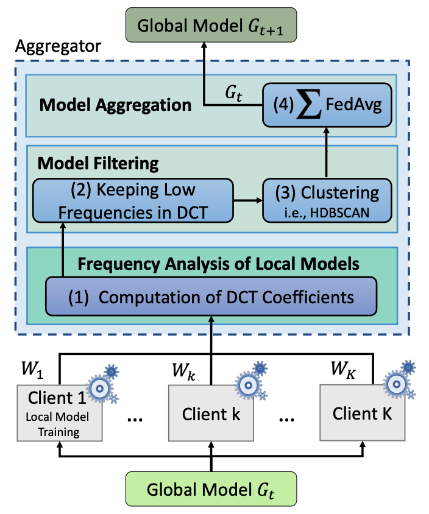

# Introduction

This folder contains the implementions of FreqFed defense against backdoor attack on horizontal Federal Learning.

## Attack Method

FreqFed from [FreqFed: A Frequency Analysis-Based Approach for Mitigating Poisoning Attacks in Federated Learning](https://arxiv.org/abs/2312.04432)

### Algorithm Description

The high-level overview of our framework FreqFed is shown in Figure 1. FreqFed comprises three critical components for 
- frequency analysis of local model updates
- model filtering
- model aggregation.

Frequency analysis of local model updates obtains the model updates from each client participating in the federated learning process and transforms them subsequently into the frequency domain using Discrete Cosine Transform. This process is used to identify the dominant frequencies in the updates, which can subsequently be used for model filtering.

Model filtering is in charge of processing the matrices of DCT coefficients and extracting the low-frequency components, which are then stored in a vector. The low-frequency component vectors from all clients are subsequently passed to a clustering algorithm, which groups them into clusters based on cosine distance and selects the cluster with the most vectors in Steps 2 and 3. This process is used for identifying the updates that are most representative of the majority of clients, which can be subsequently used for model aggregation.

Model aggregation aggregates the model updates corresponding to the vectors in the chosen cluster, utilizing the Federated Averaging algorithm to update the global model. This process allows for integrating updates from multiple clients into a joint global model.

# Implemention
  - `agg_freqfed.py`
  - Test of Model replacement backdoor attack: `test_torch_backdoor.py`

# Test

1. Test SME attack on MNIST dataset
    - `pytest --env sim -n auto -v --capture=no tests/ml/nn/fl/defense/test_torch_freqfed.py`