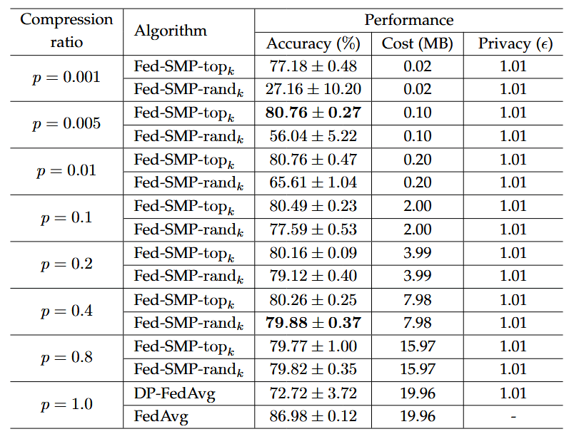

# Introduction

The implemention of FedSMP, a differentially private federated learning scheme.

[Federated Learning with Sparsified Model Perturbation (FedSMP): Improving Accuracy under Client-Level Differential Privacy](https://ieeexplore.ieee.org/abstract/document/10360319/)

## Algorithm Description

FedSMP is a novel differentially-private FL scheme which can provide a client-level DP guarantee while maintaining high model accuracy. To mitigate the impact of privacy protection on model accuracy, Fed-SMP leverages a new technique called Sparsified Model Perturbation (SMP) where local models are sparsified first before being perturbed by Gaussian noise.

In each round of FL learning, FedSMP includs the following steps:

1. the server:

    - generates a random mask vector $m\in\{0,1\}^d$ with a compression ratio $p=1-\frac{k}{d}$, where $k$ is the total number of element $1$ in $m\in\{0,1\}^d$

2. the clients:

    - conduct local training to obatin the model updates $g$
    - mask the model updates $g=g*m$
    - scale up the model updats $g=g*\frac{d}{k}$
    - inject Gaussian noise $g=g+\mathcal{N}(0,\frac{\sigma^2C^2I^d}{N})$
    - mask the model updates $g=g*m$

3. the server:
    - aggregate the model updates with DP noise

## Metric

- prediction accuracy

- the memory cost of shared gradients

- privacy budget

    

    <em>Figure 1: The performance of FedSMP on Fashion-MNIST dataset. </em>

## Test

`pytest --env sim -n auto -v --capture=no tests/ml/nn/fl/strategy/test_fedsmp_torch.py`
