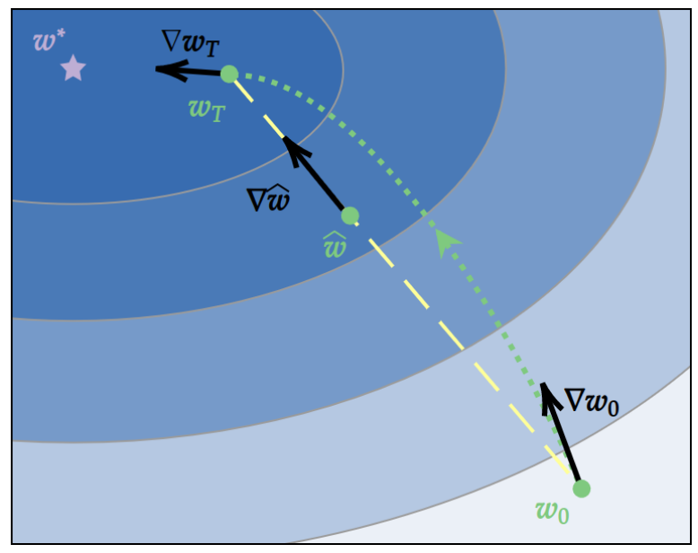
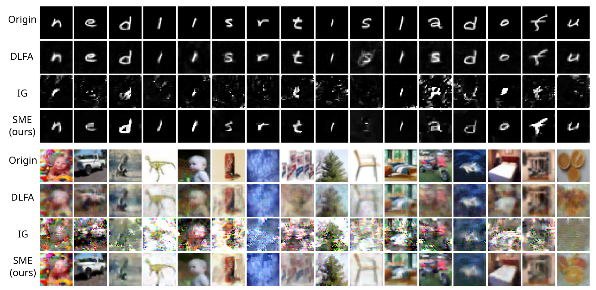

# Introduction

This folder contains the implementions of gradient inversion attacks and defense methods on horizontal Federal Learning.

## Attack Method

[Surrogate model extension (SME): a fast and accurate weight update attack on federated learning](https://dl.acm.org/doi/abs/10.5555/3618408.3620229)

### Algorithm Description

SME attack is an improvement of the gradient inversion attack DLG. A surrogate model method is proposed in SME based on the characteristic of two-dimensional gradient flow and low-rank property of local updates. SME can largely boost the ability of gradient inversion attacks on weight updates containing many iterations and achieve state-of-the-art (SOTA) performance.

    

    <em>Figure 1: The gradient flow in a quadratic model and the construction of a surrogate model. </em>

First, the adversary construct a surrogate model $\hat{w}$ as
$$
\hat{w}=\alpha w_0+(1-\alpha)w_T \\
\alpha\in[0,1]
$$
where $w_0$ and $w_T$ are the model parameters of the victim client before and after local training, respectively.

Then, the adversary initialize the fake training dataset $\hat{D}$ with Gaussian noise. The private training data of the victim client can be reconstructed by minimizing the following loss
$$
L(\hat{D},\hat{w})=1-\frac{<w_0-w_T,\nabla_{\hat{w}}l(\hat{D},\hat{w})>}{\| w_0-w_T\Vert\| \nabla_{\hat{w}}l(\hat{D},\hat{w})\Vert}+\lambda TV(\hat{D}) \\
s.t.\qquad \hat{w}\in{\alpha w_0+(1-\alpha)w_T|\alpha\in[0,1]}
$$

### Attack Metric

- Mean Square Error (MSE)

    MSE is the average L2 difference between the reconstructed image $\hat{x}$ and its corresponding real image $x$. MSE is computed as
    $$
    MSE(x, \hat{x})=\frac{\|\hat{x}-x \Vert_2}{dim(x)},
    $$
    where $dim(x)$ is the dimensions of $x$.

- Peak Signal-to-Noise Ratio (PSNR)

    PSNR is usually applied to measure the quality of the reconstructed images, which is computed as
    $$
    PSNR(\hat{x},x)=10\times\log_{10}(\frac{1}{MSE(\hat{x},x)})
    $$

### Attack Performance

    

    <em>Figure 1: Visualizations of constructed images. </em>

## Defense Method

[Federated Learning with Sparsified Model Perturbation (FedSMP): Improving Accuracy under Client-Level Differential Privacy](https://ieeexplore.ieee.org/abstract/document/10360319/)

### Algorithm Description

# Implemention

- Directory `SME_attack` contains the attack algorithm of SME:
  - SME attack: `gia_sme_torch.py`
  - Test of SME attack: `test_torch_gia_sme.py`

# Test

1. Test SME attack on MNIST dataset
    - `pytest --env sim -n auto -v --capture=no tests/ml/nn/fl/attack/test_torch_gia_sme.py`
