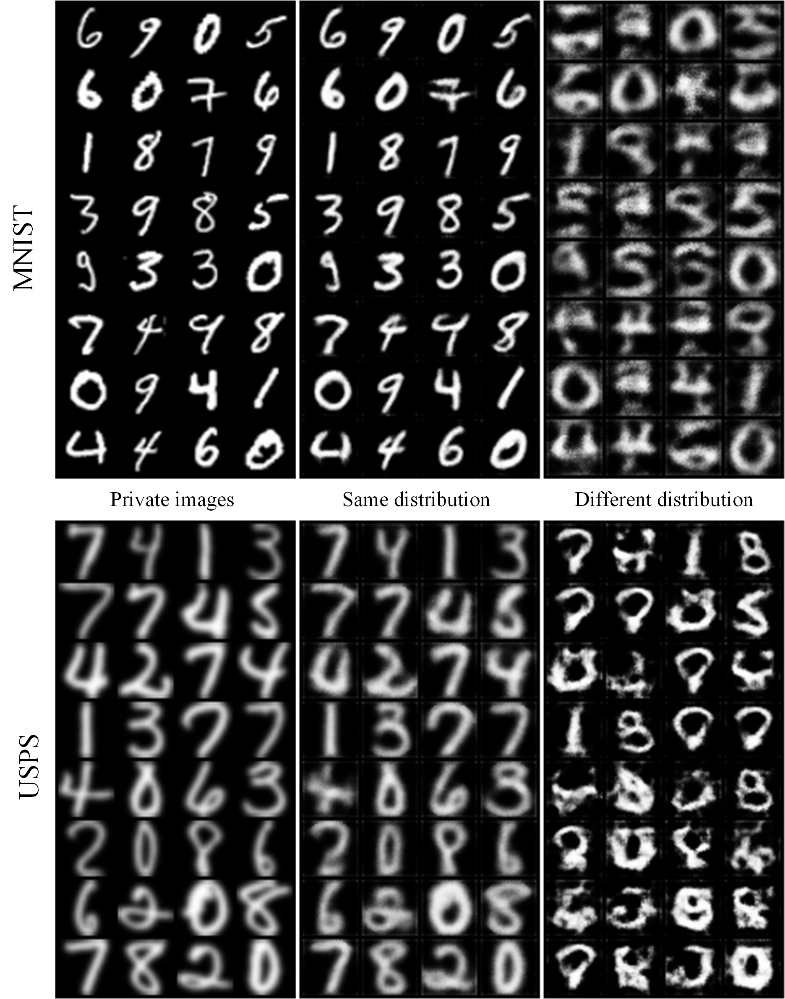

# SplitFedLearning

This folder contains a split federated learning demo. Two clients and a server was implemented. Further, the [training-based Model Inversion Attack (MIA)](https://doi.org/10.1145/3319535.3354261) is implemented.

## Usage

Install Pytorch >=1.8.1 and [zhangzp9970/torchplus](https://github.com/zhangzp9970/torchplus)

Run main.py to train the classifier using split federated learning. The model is trained for `train_epoches `epoches, and the parameters are saved every `log_epoch `epoches as `client_{epoch_id}.pkl` and `server_{epoch_id}.pkl`, respectively.

Run attack.py to perform MIA.

Run export.py to export both the private images and auxiliary images.

## Datasets

The MNIST dataset is used in this demo. We use the official MNIST handle in torchvision, which will automatically download the dataset. Other datasets can also be used by simply changing the handle into `ImageFolder`.

## Results

 

## License

Copyright © 2023 Zeping Zhang

This program is free software: you can redistribute it and/or modify it under the terms of the GNU General Public License as published by the Free Software Foundation, either version 3 of the License, or (at your option) any later version.

This program is distributed in the hope that it will be useful, but WITHOUT ANY WARRANTY; without even the implied warranty of MERCHANTABILITY or FITNESS FOR A PARTICULAR PURPOSE. See the GNU General Public License for more details.

You should have received a copy of the GNU General Public License along with this program. If not, see [http://www.gnu.org/licenses/](https://gitee.com/link?target=http%3A%2F%2Fwww.gnu.org%2Flicenses%2F).
