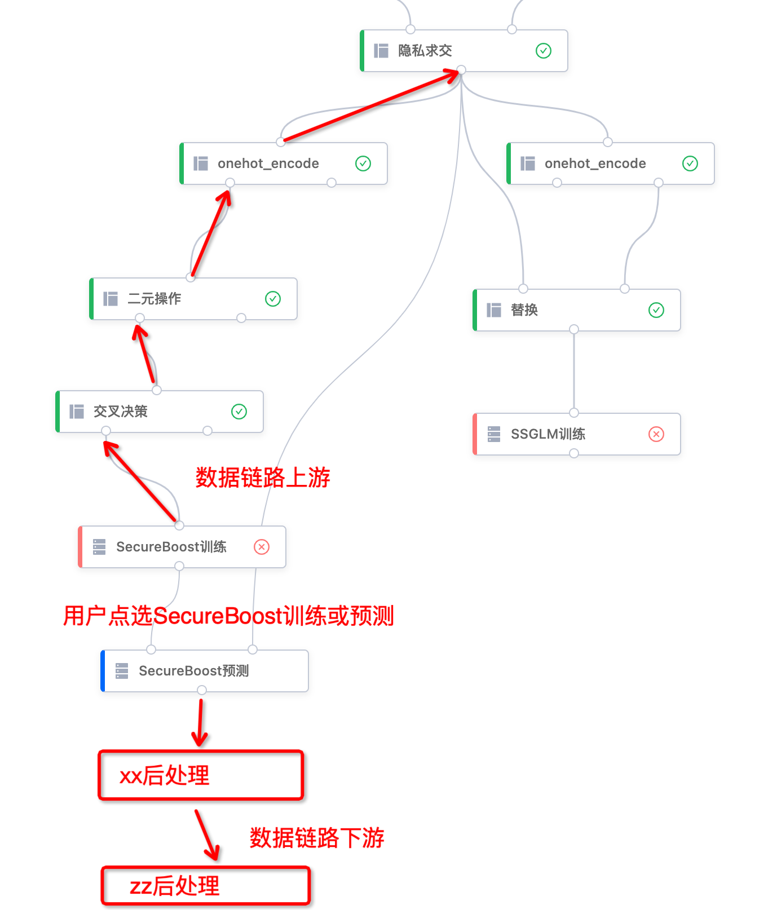
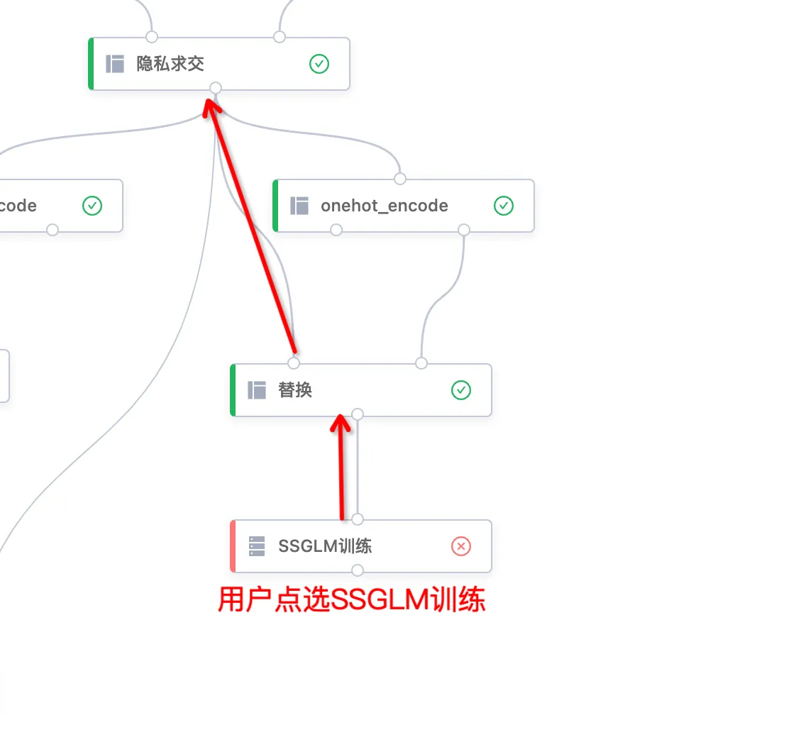
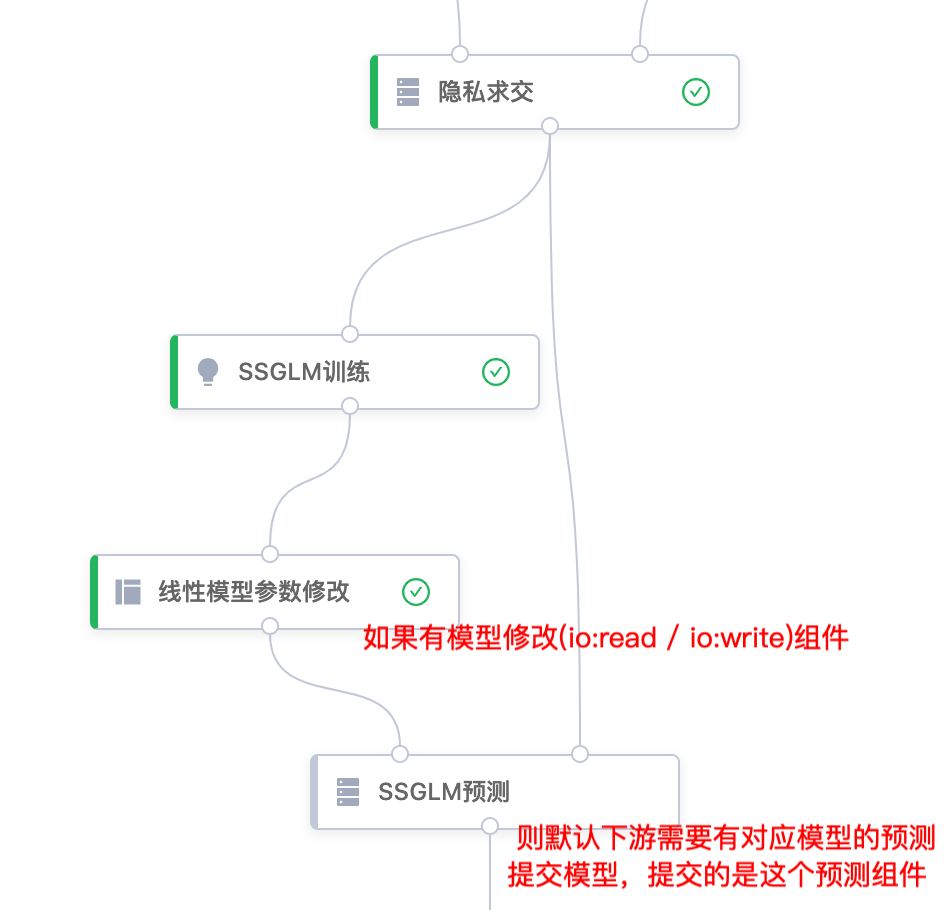
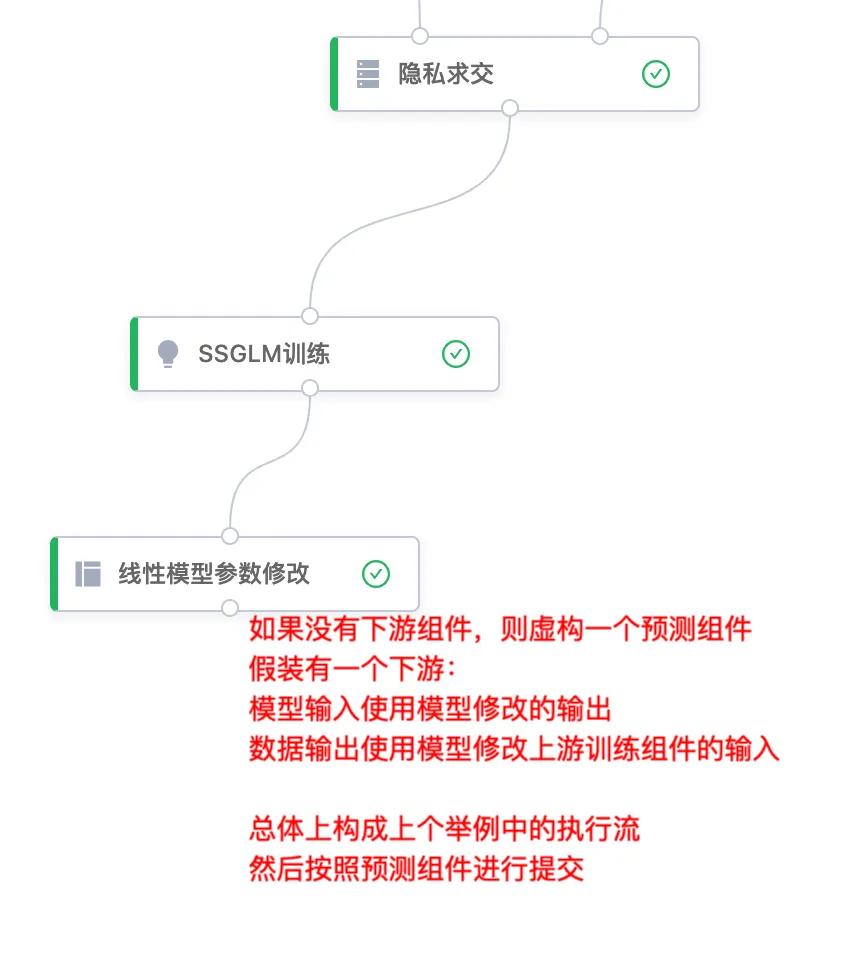

## 数据链路上下游定义

**重要概念**

**通过 `VERTICAL_TABLE`/`INDIVIDUAL_TABLE` 类型桩连接的算子组成的上下游关系**。通过其他类型的桩连接的算子不算作数据链路里的上下游。不算作数据链路上下游的算子，不应该出现在component_eval_params中。

## 算子类型说明
- 训练算子：算子 compdef `domain` 字段为 "ml.train" 的算子。实际进行模型训练的算子，输出模型给下游预测算子。

- 预测算子：算子 compdef `domain` 字段为 "ml.predict" 的算子，预测算子一般为训练算子的直接下游，在训练和预测算子之间，也可能存在模型修改算子。

- 预处理算子：算子 compdef `domain` 字段为 "preprocessing" 的算子，一般为训练算子 和 预测算子的数据链路上游。

- 后处理算子：算子 compdef `domain` 字段为 "postprocessing" 的算子，一般为预测算子的数据链路下游，如评分卡算子。

## model_export参数：
- `model_name`： 模型名称，用户输入
- `model_desc`：可选描述信息，用户输入
- `input_datasets`：数据链路上下游算子的input ids
- `output_datasets`：数据链路上下游算子的output ids
- `component_eval_params`： 数据链路上下游算子的参数，json格式的param使用base64编码

## model_export算子和[SecretPad](https://www.secretflow.org.cn/zh-CN/docs/secretpad/)画布对接方式

首先，需要让用户在画布中选定一个训练算子或预测算子，进行模型提交。
用户选定了一个训练算子或预测算子点击提交后，**平台需要将训练算子的数据链路上游中的预处理算子、预测算子的数据链路下游中的后处理算子从画布中挑出来**，按照顺序和训练算子或预测算子共同组成一个数据流。如果既有训练算子也有预测算子，那么在挑出的预处理算子和后处理算子之间插入预测算子组成数据流，否则插入训练算子。

按照数据流中算子的先后顺序，分别将输入桩的id 、输出桩的id 和 算子参数`NodeEvalParam`的json序列化字符串 按照顺序放入model_export组件的 `input_datasets` 、 `output_datasets` 和 `component_eval_params` 参数中，然后提交model_export组件。

### 举例1

如图，用户点击SecureBoost训练或预测，进行模型提交，那么:
- 数据链路上游中包含"交叉策略"、"二元操作"、"onehot" 3个预处理组件，隐私求交组件的domain是"feature" 不属于预处理组件。
- 数据链路下游中包含"xx"、"zz"两个后处理组件
- 由于这个链路上既有训练也有预测，所以将预测组件插入预处理算子和后处理算子之间组成数据流。
按照整个数据流的前后顺序，共有"onehot"、"二元操作"、"交叉策略"、"SecureBoost预测"、"xx"、"zz" 6个组件。
将这6个组件的输入桩的id 、输出桩的id 和 NodeEvalParam的json序列化字符串 按照顺序放入model_export组件的 input_datasets 、 output_datasets 和 component_eval_params 参数中，再提交model_export组件即可。

### 举例2

如图，用户点选SSGLM训练，进行模型提交，那么：
- 数据链路上游中包含"替换"1个预处理组件，onehot组件是通过`rule`桩连接的，所以它**不算**作数据链路上游。
- 没有数据链路下游。
- 没有预测组件，所以使用训练组件和预处理算子组成数据流。
按照整个数据流的前后顺序，共有"替换"、"SSGLM训练" 2个组件。
将这2个组件的输入桩的id 、输出桩的id 和 NodeEvalParam的json序列化字符串 按照顺序放入model_export组件的 input_datasets 、 output_datasets 和 component_eval_params 参数中，再提交model_export组件即可。

### 举例3

#### 1. 模型修改有下游

如图，模型修改组件的桩不是TABLE类型，所以它**不是**数据链路上下游关系中的组件，可以忽略这个模型修改组件。使用下游的预测组件按照本文档前几章节的描述进行提交：
- 数据链路上游中只包含隐私求交组件，但是隐私求交组件的domain是"feature" 不属于预处理组件。
- 没有数据链路下游。
按照整个数据流的前后顺序，只需要提交GLM预测组件。

#### 2. 模型修改没接任何下游

首先，正常情况没人会这么用。修改后一般都需要在测试数据集上观察模型的指标，确认修改效果。其次，真有这种用法的话，**需要虚构一个下游预测组件**，然后按照本文中描述的流程正常提交。
如图的case，增加过虚构的下游后，会得到和[举例3.1](#模型修改有下游)一样的执行流，然后按照[举例3.1](#模型修改有下游)提交。不是说要真的在画布里增加一个下游组件，是按照增加虚构下游后的画布进行提交，只是要假装一下有个下游。
