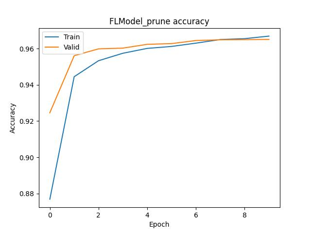

# 基于剪枝的安全聚合方法

[TOC]

### 全部文件

目录：secretflow/security/aggregation/experiment/h_nn_prune

测试文件： test_h_nn.prune.py

附加代码: dgl_utils.py

中间参数:  dgl

中间文件：/dgl/sf_output

修改文件：

- secretflow/ml/nn/fl/fl_model.py 
- secretflow/ml/nn/fl/backend/torch/fl_base.py
- secretflow/ml/nn/fl/backend/torch/strategy/__init__.py
- secretflow/ml/nn/fl/backend/torch/strategy/fed_avg_w_prune.py 核心文件
- secretflow/security/aggregation/__init__.py
- secretflow/security/aggregation/secure_prune_aggregator.py

##### 测试方法

测试文件  test_h_nn.prune.py 和中间文件夹 dgl 放到secretflow并列位置  

修改is_prune变量表示是否运行剪枝


### 正常联邦学习

is_prune = False

```python
sf.init(['alice', 'bob', 'charlie'], address='local')
alice, bob, charlie = sf.PYU('alice'), sf.PYU('bob'), sf.PYU('charlie')

(train_data, train_label), (test_data, test_label) = load_mnist(
    parts={alice: 0.4, bob: 0.6},
    normalized_x=True,
    categorical_y=True,
    is_torch=True,
)

loss_fn = nn.CrossEntropyLoss
optim_fn = optim_wrapper(optim.Adam, lr=1e-2)
model_def = TorchModel(
    model_fn=ConvNet,
    loss_fn=loss_fn,
    optim_fn=optim_fn,
    metrics=[
        metric_wrapper(Accuracy, task="multiclass", num_classes=10, average='micro'),
        metric_wrapper(Precision, task="multiclass", num_classes=10, average='micro'),
    ],
)

device_list = [alice, bob]   # device list
server = charlie  # server
is_prune = False

if is_prune:
    ……
else:
    aggregator = PlainAggregator(alice)
    # training result with original model and strategy without pruning
    fl_model = FLModel(
        server=server,
        device_list=device_list,
        model=model_def,
        aggregator=aggregator,  # secure aggregator
        strategy='fed_avg_w',  # fl strategy
        backend="torch",
        wp_strategy=False,
    )
    history = fl_model.fit(
        train_data,
        train_label,
        validation_data=(test_data, test_label),
        epochs=10,
        batch_size=32,
        aggregate_freq=1,
    )
    plt.plot(history.global_history['multiclassaccuracy'])
    plt.plot(history.global_history['val_multiclassaccuracy'])
    plt.title('FLModel accuracy')
    plt.ylabel('Accuracy')
    plt.xlabel('Epoch')
    plt.legend(['Train', 'Valid'], loc='upper left')
    plt.savefig('FL_Model_accuracy_convnet_10_32_mnist.jpg')
    plt.show()
```

运行时长: 355.6363


dgl攻击验证

```python
# mnist
# flag: if the gradient is from model with purning
is_prune = False
if is_prune:
    for i in range(4):
        tens = torch.from_numpy(np.load("./dgl/sf_output/gradients" + str(i) + ".npy"))
        original_dy_dx.append(tens)
else:
    net = LeNet()
    net.apply(weights_init)  # init param
    criterion = nn.CrossEntropyLoss()  # criterion
    pred = net(gt_data)
    y = criterion(pred, gt_label)
    dy_dx = torch.autograd.grad(y, net.parameters())
    original_dy_dx = list((_.detach().clone() for _ in dy_dx))  # true gradient

# generate dummy data and label
dummy_data = torch.randn(gt_data.size()).requires_grad_(True)
dummy_label = torch.randn(gt_label.size()).requires_grad_(True)
plt.imshow(tt(dummy_data[0].cpu()), cmap='gray')
plt.savefig("./dgl/dummy.jpg", dpi=300)

# define dgl optimizer
optimizer = torch.optim.LBFGS([dummy_data, dummy_label])

# dgl attack
history = []
for iters in range(300):

    def closure():  # optimize dummy data, calculate dummy grad, grad diff
        optimizer.zero_grad()
        dummy_pred = net(dummy_data)
        dummy_onehot_label = F.softmax(dummy_label, dim=-1)
        dummy_loss = criterion(
            dummy_pred, dummy_onehot_label
        )  # diff between pred dummy and dummy label
        dummy_dy_dx = torch.autograd.grad(
            dummy_loss, net.parameters(), create_graph=True
        )  # dummy gradient
        grad_diff = 0
        for gx, gy in zip(
            dummy_dy_dx, original_dy_dx
        ):  # diff between true gradient and dummy gradient
            grad_diff += ((gx - gy) ** 2).sum()
        grad_diff.backward()  # backward gradient diff
        return grad_diff

    optimizer.step(closure)  # optimize closure (gradient diff)
    if iters % 10 == 0:  #
        current_loss = closure()
        print(iters, "%.4f" % current_loss.item())
        history.append(tt(dummy_data[0].cpu()))

# plot the process of dummy data
plt.figure(figsize=(12, 8))
for i in range(30):
    plt.subplot(3, 10, i + 1)
    plt.imshow(history[i],cmap='gray')
    plt.title("iter=%d" % (i * 10))
    plt.axis("off")
if is_prune:
    plt.savefig("./dgl/contrast_after_prune.jpg", dpi=300)
else:
    plt.savefig("./dgl/contrast_before_prune.jpg", dpi=300)
    
# cifar
dst = datasets.CIFAR100("/hy-tmp/data", download=True)
tp = transforms.ToTensor()
tt = transforms.ToPILImage()
img_index = 56  # image_index
gt_data = tp(dst[img_index][0])  # true data
gt_data = gt_data.view(1, *gt_data.size())
gt_label = torch.Tensor([dst[img_index][1]]).long()  # true label
gt_label = gt_label.view(1, )
gt_onehot_label = label_to_onehot(gt_label)  # one-hot label
plt.imshow(tt(gt_data[0].cpu()))
plt.savefig("true_to_valiate.jpg", dpi = 300)
……
```

攻击结果: success

_2.jpg)

### 带剪枝的运行

测试过程：

```python
is_prune = True
if is_prune:
    aggregator = SecurePruneAggregator(server, [alice, bob])
    # training result with pruning model parameters
    fl_model_prune = FLModel(
        server=server,
        device_list=device_list,
        model=model_def,
        aggregator=aggregator,
        strategy="fed_avg_w_prune",
        backend="torch",
        wp_strategy =True,
        prune_end_rate=0.1,
        prune_percent=5,  # fix prune speed
    )
    history_prune = fl_model_prune.fit(
        train_data,
        train_label,
        validation_data=(test_data, test_label),
        epochs=10,
        batch_size=32,
        aggregate_freq=1,
    )
    print("\n Total Run Time: {0:0.4f}".format(time.time() - start_time))

    # Draw accuracy values for training & validation when prune
    plt.plot(history_prune.global_history["multiclassaccuracy"])
    plt.plot(history_prune.global_history["val_multiclassaccuracy"])
    plt.title("FLModel_prune accuracy")
    plt.ylabel("Accuracy")
    plt.xlabel("Epoch")
    plt.legend(["Train", "Valid"], loc="upper left")
    plt.savefig("./dgl/FL_prune_0.1_5_Model_accuracy_convnet_10_32_mnist.jpg")
    plt.show()
```

FL_model.py

```python
 def __init__(
        self,
        server=None,
        device_list: List[PYU] = [],
        model: Union['TorchModel', Callable[[], 'tensorflow.keras.Model']] = None,
        aggregator=None,
        strategy='fed_avg_w',
        consensus_num=1,
        backend="tensorflow",
        random_seed=None,
        **kwargs,  # other parameters specific to strategies
    ):
        ……
        self.wp_strategy = kwargs.get('wp_strategy', False)
        self.prune_end_rate = kwargs.get('prune_end_rate', True) # traget prune rate
        self.prune_percent = kwargs.get('prune_percent', True)  # prune dp increase rate
 
 # initialize mask，and initial prune rates
    def initialize_masks_prune_rates(self):
        initial_prune_mask = []
        prune_rate = []
        for device, worker in self._workers.items():
            initial_prune_mask.append(worker.make_prune_mask())
            prune_rate.append(1)  # list to document the pruning rate of each local model
        return initial_prune_mask, prune_rate
 # initialize weights,if mask exists use mask
    def initialize_weights(self, init_mask=None):
        clients_weights = []
        initial_weight = None
        for device, worker in self._workers.items():
            weights = worker.get_weights()
            clients_weights.append(weights)
        if self._aggregator is not None:
            if self.wp_strategy:
                initial_weight = self._aggregator.average(clients_weights, prune_mask=init_mask ,axis=0)
            else:
                initial_weight = self._aggregator.average(clients_weights, axis=0)
            for device, worker in self._workers.items():
                weights = (
                    initial_weight.to(device) if initial_weight is not None else None
                )
                worker.set_weights(weights)
        else:
            clients_weights = [weight.to(self.server) for weight in clients_weights]
	……
  
def fit(
        self,
        x: Union[HDataFrame, FedNdarray, Dict[PYU, str]],
        y: Union[HDataFrame, FedNdarray, str],
        batch_size: Union[int, Dict[PYU, int]] = 32,
        batch_sampling_rate: float = None,
        epochs: int = 1,
        verbose: int = 1,
        callbacks=None,
        validation_data=None,
        shuffle=False,
        class_weight=None,
        sample_weight=None,
        validation_freq=1,
        aggregate_freq=1,
        label_decoder=None,
        max_batch_size=20000,
        prefetch_buffer_size=None,
        sampler_method='batch',
        random_seed=None,
        dp_spent_step_freq=None,
        audit_log_dir=None,
        dataset_builder: Dict[PYU, Callable] = None,
        wait_steps=100,
    ) -> History:
    	……
        # server weights
          if self.wp_strategy:
            # initial mask, prune_mask_list for all epochs
            prune_mask_list = []
            prune_rate_list = []
            init_mask, init_prune_rate = self.initialize_masks_prune_rates()  # initialize mask and rate
            prune_mask_list.append(init_mask)
            prune_rate_list.append(init_prune_rate)
        if self.wp_strategy:
            initial_weight = self.initialize_weights(init_mask)
        else:
            initial_weight = self.initialize_weights()
            
		……
        for epoch in range(epochs):
            ……
            for step in range(0, train_steps_per_epoch, aggregate_freq):  # step
                if self.wp_strategy:  # key of mask and rate updating
                    is_update_mask = False 
                    if step == train_steps_per_epoch-aggregate_freq:
                        is_update_mask = True
                for idx, device in enumerate(self._workers.keys()):
                    ……
                if self.wp_strategy:
                        client_params, sample_num, new_prune_mask, new_prune_rate= self._workers[device].train_step_with_prune(
                            client_params,
                            epoch * train_steps_per_epoch + step,
                            aggregate_freq
                            if step + aggregate_freq < train_steps_per_epoch
                            else train_steps_per_epoch - step,
                            prune_mask_list[epoch][idx],  # prune_current_mask
                            prune_rate_list[epoch][idx],  # prune_current_rate
                            is_update_mask,
                            **self.kwargs,
                        )
                        prune_mask_list[epoch][idx] = new_prune_mask # record mask
                        prune_rate_list[epoch][idx] = new_prune_rate
                    else:
                        client_params, sample_num= self._workers[
                            device].train_step(
                            client_params,
                            epoch * train_steps_per_epoch + step,
                            aggregate_freq
                            if step + aggregate_freq < train_steps_per_epoch
                            else train_steps_per_epoch - step,
                            **self.kwargs,
                        )
                # aggregation……
            ……
          	prune_mask_list.append(prune_mask_list[epoch])  # update mask and rate
            prune_rate_list.append(prune_rate_list[epoch])
```

FL_base.py

```python
    # mask for model
    def make_prune_mask(self):
        step = 0
        for name, param in self.model.named_parameters():
            if 'weight' in name:
                step = step + 1
        mask = [None] * step
        step = 0
        for name, param in self.model.named_parameters():
            if 'weight' in name:
                tensor = param.data.cpu().numpy()
                mask[step] = np.ones_like(tensor)
                step = step + 1
        return mask
```

fl_avg_w_prune.py

```python
def mask_model(model, mask, initial_state_dict):
    '''
    :param model: current model
    :param mask: current mask
    :param initial_state_dict: model state dict before mask
    :return:
    '''
    step = 0
    for name, param in model.named_parameters():
        if "weight" in name:
            weight_dev = param.device
            # renew model's param data
            param.data = torch.from_numpy(mask[step] * initial_state_dict[name].cpu().numpy()).to(weight_dev)
            step = step + 1
        if "bias" in name:
            param.data = initial_state_dict[name]

# Prune model by Percentile and update mask
def prune_by_percentile(model, mask, percent, resample=False, reinit=False,**kwargs):
        '''
        :param model:  current model
        :param mask:  current mask
        :param percent:  prune rate speed in each spoch
        :param resample:
        :param reinit:
        :param kwargs:
        :return:
        '''
        step = 0
        for name, param in model.named_parameters():
            if 'weight' in name:
                tensor = param.data.cpu().numpy()
                alive = tensor[np.nonzero(tensor)]
                percentile_value = np.percentile(abs(alive), percent)
                weight_dev = param.device
                # renew new mask
                new_mask = np.where(abs(tensor) < percentile_value, 0, mask[step])
                # Apply mask and new weight  
                param.data = torch.from_numpy(tensor * new_mask).to(weight_dev)
                mask[step] = new_mask
                step += 1
        return mask
class FedAvgWPrune(BaseTorchModel):
    """
    FedAvgWPrune: A implementation of FedAvg with pruning, where the clients upload their trained model weights after weights pruning to the server for averaging and update their local models via the aggregated weights from the server in each federated round.
    """
    def train_step_with_prune(
            self,
            weights: np.ndarray,
            cur_steps: int,
            train_steps: int,
            prune_current_mask: np.ndarray,
            prune_current_rate: float,
            is_update_mask,
            **kwargs,
    )-> Tuple[np.ndarray, int, np.ndarray , int]:
        """ train step with pruning
        Args:
            weights: transmit weights of epoch t
            cur_steps: transmit step
            train_steps:
            prune_current_mask:current mask
            prune_current_rate:current prune rate
            kwargs: strategy-specific parameters
                prune_end_rate：
                prune_percent：
            :return: update weight, num_sample, update mask, update rate
        """
        prune_end_rate = kwargs.get('prune_end_rate')  # prune end rate
        prune_percent = kwargs.get('prune_percent', True)  # prune dp increase rate
        weights, num_sample=self.train_step(weights,cur_steps,train_steps, prune_current_mask, **kwargs,)
        # if need update mask and not end prune, prune local model, update local mask and renew parameter
        if is_update_mask:
            if prune_current_rate > prune_end_rate:
                prune_current_mask = prune_by_percentile(self.model, prune_current_mask, prune_percent)
                prune_current_rate = prune_current_rate * (1 - prune_percent / 100)
        return weights, num_sample, prune_current_mask, prune_current_rate

    def train_step(
        self,
        weights: np.ndarray,
        cur_steps: int,
        train_steps: int,
        prune_current_mask: np.ndarray, # mask
        **kwargs,
    ) -> Tuple[np.ndarray, int]:
         """Accept ps model params, then do local train

        Args:
            weights: global weight from params server
            cur_steps: current train step
            train_steps: local training steps
            prune_current_mask: np.ndarray,
        Returns:
            Parameters after local training
        """
         # step1: global model download
        if weights is not None:
            self.model.update_weights(weights)
        num_sample = 0
        dp_strategy = kwargs.get('dp_strategy', None)
        logs = {}

        # step2: mask the model and get local parameter before current pruning   initial s ,ask
        mask_model(self.model, prune_current_mask, self.model.state_dict())

        # step3: normal train of current local model(t)
        # print('train_steps'+str(train_steps))
        for _ in range(train_steps):
            self.optimizer.zero_grad()
            iter_data = next(self.train_iter)
            if len(iter_data) == 2:
                x, y = iter_data
                s_w = None
            elif len(iter_data) == 3:
                x, y, s_w = iter_data
            x = x.float()
            num_sample += x.shape[0]
            if len(y.shape) == 1:
                y_t = y
            else:
                if y.shape[-1] == 1:
                    y_t = torch.squeeze(y, -1).long()
                else:
                    y_t = y.argmax(dim=-1)
            if self.use_gpu:
                x = x.to(self.exe_device)
                y_t = y_t.to(self.exe_device)
                if s_w is not None:
                    s_w = s_w.to(self.exe_device)
            y_pred = self.model(x)
            loss = self.loss(y_pred, y_t)# do back propagation predict current model(t) and get loss
            loss.backward()
            self.optimizer.step()
            for m in self.metrics:
                m.update(y_pred.cpu(), y_t.cpu())
        loss_value = loss.item()
        logs['train-loss'] = loss_value

        self.logs = self.transform_metrics(logs)
        self.epoch_logs = copy.deepcopy(self.logs)
        model_weights = self.model.get_weights(return_numpy=True)
        return model_weights, num_sample
   
```

运行时长: 311.4674（更短）

运行准确率：有略微提升， 收敛速度相较于无剪枝情况有延迟



安全性验证：保留运行中梯度进行攻击测试

```python
# save gradient in stategy
        for _ in range(train_steps):
            self.optimizer.zero_grad()
            iter_data = next(self.train_iter)
           global first1
            global first2
            if len(iter_data) == 2:
                x, y = iter_data
                s_w = None
            elif len(iter_data) == 3:
                x, y, s_w = iter_data
            num_sample += x.shape[0]
            y_t = y.argmax(dim=-1)
            if self.use_gpu:
                x = x.to(self.exe_device)
                y_t = y_t.to(self.exe_device)
                if s_w is not None:
                    s_w = s_w.to(self.exe_device)
            y_pred = self.model(x)
            # do back propagation
            loss = self.loss(y_pred, y)
            loss.backward()
            local_gradients = self.model.get_gradients()
            if local_gradients_sum is None:
                print(local_gradients[0])
                if first2 is True:
                    # print(local_gradients[0])
                    for i in range(len(local_gradients)):
                        np.save('./dlg/sf_output/gradients' + str(i) + '.npy',local_gradients[i])
                    first2 = False
                local_gradients_sum = local_gradients
            else:
                local_gradients_sum += local_gradients
 # attack
gt_data = torch.load("./dgl/sf_output/x.pt")
gt_label = torch.load("./dgl/sf_output/y.pt")
fig1, ax1 = plt.subplots()
fig2, ax2 = plt.subplots()
plt.savefig("./dgl/true_to_valiate.jpg", dpi=300)
net.apply(weights_init)  # init param
criterion = cross_entropy_for_onehot  # criterion
pred = net(gt_data)

y = criterion(pred, gt_label)
dy_dx = torch.autograd.grad(y, net.parameters())
original_dy_dx = list((_.detach().clone() for _ in dy_dx))  # true gradient
print(original_dy_dx)

# generate dummy data and label
dummy_data = torch.randn(gt_data.size()).requires_grad_(True)
dummy_label = torch.randn(gt_label.size()).requires_grad_(True)
plt.imshow(tt(dummy_data[0].cpu()))
plt.savefig("./dgl/dummy.jpg", dpi=300)

# define dgl optimizer
optimizer = torch.optim.LBFGS([dummy_data, dummy_label])

is_prune = True
if is_prune:
    for i in range(4):
        tens = torch.from_numpy(np.load("./dgl/sf_output/gradients" + str(i) + ".npy"))
        original_dy_dx.append(tens)

history = []
for iters in range(300):

    def closure():  # optimize dummy data, calculate dummy grad, grad diff
        optimizer.zero_grad()
        dummy_pred = net(dummy_data)
        dummy_onehot_label = F.softmax(dummy_label, dim=-1)
        dummy_loss = criterion(
            dummy_pred, dummy_onehot_label
        )  # diff between pred dummy and dummy label
        dummy_dy_dx = torch.autograd.grad(
            dummy_loss, net.parameters(), create_graph=True
        )  # dummy gradient
        grad_diff = 0
        for gx, gy in zip(
            dummy_dy_dx, original_dy_dx
        ):  # diff between true gradient and dummy gradient
            grad_diff += ((gx - gy) ** 2).sum()
        grad_diff.backward()  # backward gradient diff
        return grad_diff

    optimizer.step(closure)  # optimize closure (gradient diff)
    if iters % 10 == 0:  #
        current_loss = closure()
        print(iters, "%.4f" % current_loss.item())
        history.append(tt(dummy_data[0].cpu()))

# plot the process of dummy data
plt.figure(figsize=(12, 8))
for i in range(30):
    plt.subplot(3, 10, i + 1)
    plt.imshow(history[i],cmap='gray')
    plt.title("iter=%d" % (i * 10))
    plt.axis("off")
if is_prune:
    plt.savefig("./dgl/contrast_after_prune.jpg", dpi=300)
else:
    plt.savefig("./dgl/contrast_before_prune.jpg", dpi=300)
```

攻击结果：失败，难以完整还原图像梯度

梯度接近实际梯度，但数据差距变大


.jpg)